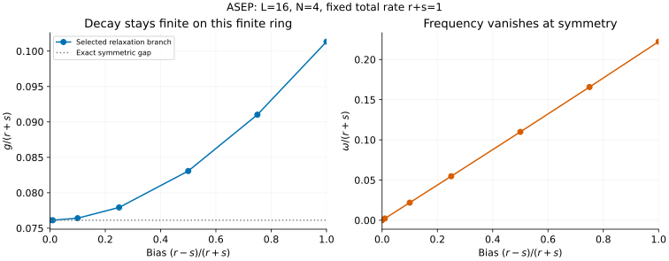

# ASEP: reduce the bias without changing the clock

[All tutorials](index.md) · [Model guide](../asep.md) · [TASEP tutorial](tasep.md)

ASEP allows both right and left hops on a periodic ring, still only into empty
neighbouring sites. What happens to a relaxation mode when the hopping becomes
symmetric? We will scan the bias on a 16-site, four-particle ring while keeping
the **sum of hopping rates fixed**.

The [TASEP tutorial](tasep.md#1-read-the-eigenvalue-with-the-right-sign) introduces
the generator convention. Here too the selected eigenvalue is
$`\lambda=-g+i\omega`$, with positive decay gap g and nonnegative angular
frequency. These are inverse-time rates, not quantum energies.

## 1. Choose a meaningful path through the rates

Write the right/left rates as

```math
r=\frac{R(1+b)}2,\qquad s=\frac{R(1-b)}2,\qquad
R=r+s,\qquad b=\frac{r-s}{r+s}.
```

We set R=1 and vary b from 1 (right-only TASEP) to 0 (symmetric exclusion).
This avoids changing the basic timescale at the same time as the bias.
The frontend accepts r and s directly; they need not sum to one.

```sh
# b=1/2, with r+s=1:
bethe-asep-pbc 16 --particles 4 --right-rate 0.75 --left-rate 0.25 \
  --csv-table relaxation=asep-mode.csv --csv-table roots=asep-roots.csv
```

The result is approximately

```math
\lambda=-0.08307254+0.10992505i.
```

At b=1, the mode exactly matches the corresponding TASEP export. There is no
independently chosen reference energy to subtract: the stationary eigenvalue
is already zero.

## 2. Follow decay and oscillation separately



On this finite ring, the gap decreases toward a **nonzero** symmetric value
while the frequency tends to zero. Consequently the long-time oscillation
disappears, but relaxation remains. The graph does not establish a phase
transition or a thermodynamic exponent: L is fixed, and connecting lines only
guide the eye through the seven calculated biases.

At the symmetric endpoint r=s, every nontrivial filling has the exact gap

```math
g=4r\sin^2\frac\pi L=2R\sin^2\frac\pi L,\qquad \omega=0.
```

For L=16, R=1 this is approximately 0.07612046749. Separate half-filled and
quarter-filled exports agree. As L grows this symmetric gap scales as
$`L^{-2}`$. The asymmetric fixed-density scaling in the TASEP tutorial is
different; a fixed-L bias scan alone is not a controlled study of the
large-L, weak-bias crossover.

There is also a useful analytic one-particle or one-hole result:

```math
\lambda=-2(r+s)\sin^2\frac\pi L
+i|r-s|\sin\frac{2\pi}L.
```

Its real part depends only on the total rate, while its frequency depends on
the bias. Do not apply that one-particle formula to the interacting N=4 curve
away from symmetry; the latter comes from Bethe roots and continuation.

## 3. What is being continued?

The solver starts with the finite-size TASEP relaxation branch and follows it
to the requested ratio $`x=\min(r,s)/\max(r,s)`$. The equations and eigenvalue
conventions follow [Golinelli–Mallick's ASEP review](../../CITATIONS.md#golinelli-mallick-2006),
Eqs. (66) and (69). Full small-ring spectra independently check the branch
selection, but continuation is not an exhaustive proof that no other branch
overtakes it at every size and rate.

Near symmetric hopping, ordinary Bethe coordinates crowd near one. The exported
roots instead use finite scaled coordinates:

```math
\delta=1-x,\qquad
z_j=1+\delta v_j+\mathbf{1}_{j=j_{\mathrm{wave}}}\,w.
```

Metadata supplies the wave-root index and the complex wave base
$`w=e^{\pm2\pi i/L}-1`$. The roots table contains v, **not** z or momenta.
The tutorial script reconstructs z to check the eigenvalue and multiplicative
Bethe equations. This reconstruction is adequate for these examples, whose
smallest nonzero bias is 0.01; it is not a substitute for the native solver's
scaled arithmetic at biases close to machine precision.

At exactly symmetric hopping, and in the one-particle/one-hole cases, the
result is analytic and the roots table has **no rows**. That is an intentional
representation, not a failed export. Empty/full sectors likewise succeed but
have no nonstationary mode: their gap and frequency are absent.

The default arithmetic is fp64; native long-double and optional MPLAPACK fp128
are supported. A converged residual is a numerical diagnostic, not a rigorous
error certificate. Failed continuation cannot be accepted at the last reached
ratio: the frontend exits with failure and leaves physical observables missing.

## 4. Symmetries and non-Hermitian comparisons

Multiplying both rates by two doubles the whole generator spectrum. Swapping
r and s reflects the ring; particle–hole symmetry maps N to L-N. All three
operations are checked in the saved examples. Reflection and particle–hole
symmetry preserve the *reported* nonnegative-frequency representative, not
the propagation direction of a fixed momentum-labelled mode.

For a matrix-product calculation, match the ring boundary, population, total
rate and bias. Compare both parts of the complex eigenvalue; comparing only
its magnitude confounds oscillation with decay. If working with -M instead,
reverse the eigenvalue sign. The supplied energy-like numbers do not provide
biorthogonal matrix elements, mode amplitudes or the overlap of an observable
with the slow mode.

Open reservoirs are another problem: they change the stationary state,
boundary conditions and spectral structure. Neither periodic frontend accepts
reservoir rates or enumerates a full spectrum.

## 5. Reproduce and validate

The fixed-total-rate scan is available as paired exports:

| b | r | s | Relaxation mode | Scaled roots |
| ---: | ---: | ---: | --- | --- |
| 1 | 1 | 0 | [CSV](data/asep-bias1-relaxation.csv) | [CSV](data/asep-bias1-roots.csv) |
| 0.75 | 0.875 | 0.125 | [CSV](data/asep-bias0.75-relaxation.csv) | [CSV](data/asep-bias0.75-roots.csv) |
| 0.5 | 0.75 | 0.25 | [CSV](data/asep-bias0.5-relaxation.csv) | [CSV](data/asep-bias0.5-roots.csv) |
| 0.25 | 0.625 | 0.375 | [CSV](data/asep-bias0.25-relaxation.csv) | [CSV](data/asep-bias0.25-roots.csv) |
| 0.1 | 0.55 | 0.45 | [CSV](data/asep-bias0.1-relaxation.csv) | [CSV](data/asep-bias0.1-roots.csv) |
| 0.01 | 0.505 | 0.495 | [CSV](data/asep-bias0.01-relaxation.csv) | [CSV](data/asep-bias0.01-roots.csv) |
| 0 | 0.5 | 0.5 | [CSV](data/asep-bias0-relaxation.csv) | [empty CSV](data/asep-bias0-roots.csv) |

Additional checks use the same provenance/status format:

| Check | Mode | Roots |
| --- | --- | --- |
| Double both rates | [CSV](data/asep-scaled-relaxation.csv) | [CSV](data/asep-scaled-roots.csv) |
| Reflect the rates | [CSV](data/asep-reflected-relaxation.csv) | [CSV](data/asep-reflected-roots.csv) |
| Particle–hole, N=12 | [CSV](data/asep-holes-relaxation.csv) | [CSV](data/asep-holes-roots.csv) |
| One particle | [CSV](data/asep-single-relaxation.csv) | [empty CSV](data/asep-single-roots.csv) |
| Symmetric half filling | [CSV](data/asep-symmetric-half-relaxation.csv) | [empty CSV](data/asep-symmetric-half-roots.csv) |
| Empty ring | [CSV](data/asep-empty-relaxation.csv) | [empty CSV](data/asep-empty-roots.csv) |
| Full ring | [CSV](data/asep-full-relaxation.csv) | [empty CSV](data/asep-full-roots.csv) |
| L=5, N=2, r=1, s=1/2 | [CSV](data/asep-small-relaxation.csv) | [CSV](data/asep-small-roots.csv) |

From the source checkout, with the [plotting dependencies](requirements.txt):

```sh
python3 scripts/plot_exclusion_tutorial.py --check
python3 scripts/plot_exclusion_tutorial.py
# Optional: regenerate the TASEP and ASEP examples together.
python3 scripts/plot_exclusion_tutorial.py --solver-dir /path/to/bethe/bin
python3 -m unittest discover -s scripts -p 'test_tutorial_exclusion.py'
```

The [shared script](../../scripts/plot_exclusion_tutorial.py) reads native
exports for each point, joins mode/root tables by provenance, and rejects
failed, missing or inconsistent observables. The
[tests](../../scripts/test_tutorial_exclusion.py) also verify a separate
ten-configuration generator at L=5, N=2, the analytic endpoints and all the
symmetries above. The horizontal symmetric-gap guide is explicitly analytic;
the plotted bias scan is not an interpolation of endpoint formulas.
