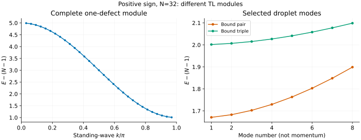
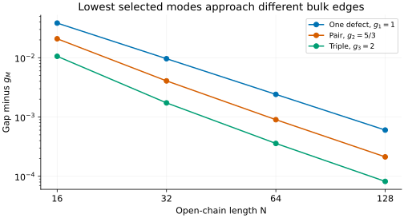
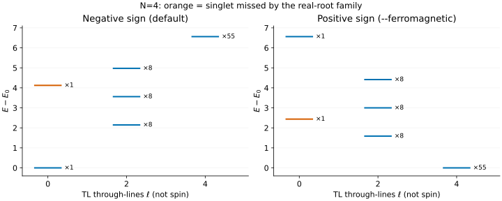

# Ferromagnetic biquadratic chain: defects and bound droplets

What sits above the large ground manifold of the positive pure biquadratic
chain? There is an exact one-defect band, but it is only part of the answer:
several singlet defects can bind, and their levels can interleave scattering
states and levels from other algebraic sectors. This tutorial follows those
excitations without assigning a fictitious momentum to an open chain.

## 1. Fix the vacuum reference, not a single vacuum state

Here `--ferromagnetic` selects

```math
H_+=+\sum_{i=1}^{N-1}(\mathbf S_i\cdot\mathbf S_{i+1})^2
=(N-1)+\sum_i e_i,\qquad e_i=3P_{0,i,i+1}.
```

The spins are 1 and the ends are free. The global ground energy is exactly
$`E_0=N-1`$, and the reported positive gap is measured above the **entire
ground space**, not just the fully polarized representative.

In particular, a physical one-spin lowering of the fully polarized state
stays in that ground space. The positive-energy “one defect” below instead
means one **TL singlet insertion**, with $`M=(N-\ell)/2=1`$. This is not a
count of physical spin flips or a physical total-spin label.

## 2. Start with the exact one-defect band

```sh
build_codex/bethe-biquadratic-obc 32 --ferromagnetic --one-defect
build_codex/bethe-biquadratic-obc 32 --ferromagnetic --one-defect \
  --format csv > one-defect.csv
```

There are N−1 standing-wave modes in the ell=N−2 module:

```math
k_j=\frac{\pi j}{N},\qquad g_j=E_j-E_0=3+2\cos k_j,
\qquad j=1,\ldots,N-1.
```

The `wave_number` column is $`k_j`$, an **open-chain standing-wave coordinate**,
not a translation eigenvalue. The frontend lists decreasing j, hence increasing
energy. It computes the gap directly, rather than subtracting two rounded
extensive energies.



The left panel reads the [N=32 analytic-band export](data/bq-ferro-band-n32-states.csv).
Its lowest level also gives the global positive gap:

```math
\Delta_N=3-2\cos(\pi/N)\longrightarrow1.
```

This is a spectral-gap result, not merely a variational one-defect estimate;
the [reference guide](../biquadratic-ferromagnetic.md#what-the-one-defect-band-means)
explains its TL/XXZ justification. It does not say that the ground manifold
has only one state or that all other excitation families are absent.

## 3. Bind two or three defects

```sh
build_codex/bethe-biquadratic-obc 32 --ferromagnetic --bound-pairs 8
build_codex/bethe-biquadratic-obc 32 --ferromagnetic --bound-triples 8
```

The right panel shows these eight selected modes of each family:
[pairs](data/bq-ferro-pair-n32-states.csv),
[triples](data/bq-ferro-triple-n32-states.csv). Its horizontal axis is a branch
**mode number**, not the standing-wave coordinate of the left panel and not
a common momentum. Do not overlay the two panels as momentum-resolved bands.

The pair solver uses a two-string in ell=N−4; the triple solver uses a
three-string in ell=N−6. These are finite-size Bethe solutions with string
deviations, not ideal-string energies substituted for a finite chain.

Their lowest selected modes approach different thermodynamic edges:

| Excitation family | Limiting gap | Separated objects in the same defect count |
| --- | --- | --- |
| One defect | 1 | — |
| Bound pair | $`5/3`$ | Two single defects: 2 |
| Bound triple | 2 | Pair plus single: $`8/3`$; three singles: 3 |

A triple's limiting gap equals the two-single-defect threshold numerically,
but those states are in different TL modules. Equality of energy is not an
identity of quantum numbers or scattering channels.



This plot subtracts each family's own limiting edge to expose the finite-size
correction. The one-defect gap comes from exact metadata; pair and triple
gaps come from the first converged row of each export. No fit is used.

| N | Bound-pair modes | Bound-triple modes |
| --- | --- | --- |
| 16 | [CSV](data/bq-ferro-pair-n16-states.csv) | [CSV](data/bq-ferro-triple-n16-states.csv) |
| 32 | [CSV](data/bq-ferro-pair-n32-states.csv) | [CSV](data/bq-ferro-triple-n32-states.csv) |
| 64 | [CSV](data/bq-ferro-pair-n64-states.csv) | [CSV](data/bq-ferro-triple-n64-states.csv) |
| 128 | [CSV](data/bq-ferro-pair-n128-states.csv) | [CSV](data/bq-ferro-triple-n128-states.csv) |

N=32 includes eight modes for the earlier plot; the other sizes select only
mode 1. Other modules and scattering families can interleave these levels.
The thermodynamic edges and small-chain validation do not certify the
finite-N global ordering of arbitrary targeted branches.

## 4. Why a real-root scan can miss a low excitation

Sign reversal keeps the auxiliary roots but reverses the physical energies.
The four-site example makes the consequence visible:



In the positive-sign panel, the ground level at energy 3 has 55 physical
states. The first positive level is $`6-\sqrt2`$, with multiplicity 8. The
two-defect singlet at $`(15-\sqrt{17})/2`$ already interleaves the one-defect
band. It is the orange line, missing from this real-root scan:

```sh
build_codex/bethe-biquadratic-obc 4 --ferromagnetic --through-lines 0 --excitations all
build_codex/bethe-biquadratic-obc 4 --ferromagnetic --through-lines 0 --q-spectrum --spin-content
```

The first command returns only the **higher** singlet. The Q-system request
finds both for this small chain. Download the
[real-root comparison](data/bq-ferro-real-l0-states.csv) and the full module tables:

| Module | Levels | Spin content |
| --- | --- | --- |
| ell=0 | [CSV](data/bq-ferro-q-l0-states.csv) | [CSV](data/bq-ferro-q-l0-spin_content.csv) |
| ell=2 | [CSV](data/bq-ferro-q-l2-states.csv) | [CSV](data/bq-ferro-q-l2-spin_content.csv) |
| ell=4 | [CSV](data/bq-ferro-q-l4-states.csv) | [CSV](data/bq-ferro-q-l4-spin_content.csv) |

For corresponding states $`E_+=-E_-`$, but **gaps do not simply change sign**:
each Hamiltonian has a different ground reference. The auxiliary
`reference_energy` is unchanged. Our tests check all of these relationships
and account for all $`3^4=81`$ physical states for either sign.

## 5. Choose the right comparison for an MPS excitation

The ground manifold contains many physical spins. Selecting one MPS ground
state does not guarantee access to every excitation carrying the same TL
multiplicity. The optional `spin_content` tells you which physical SU(2)
multiplets occur, **not their spectral weights** or their matrix elements
from that chosen ground state.

Multiplicity counts use checked uint64 arithmetic. Some N=64 and N=128 CSV
rows have an empty `multiplicity` because the exact count overflows, while
their energies and gaps remain valid. An empty count is not a count of one;
an empty energy or failed convergence status is a different problem.

The commands also make different coverage promises:

- `--one-defect`: the whole one-defect TL module, not the full excited spectrum.
- `--bound-pairs all` / `--bound-triples all`: the supported string labels of
  that family, not all scattering states at that defect count.
- `--q-spectrum`: a numerical search of one module, with explicit discovery
  and completeness diagnostics; an incomplete search is not a lowest-level list.

For the next step, the implementation also offers
[real-root scattering windows](../biquadratic-scattering.md),
[pair-plus-defect states](../biquadratic-pair-defect.md),
[two pairs](../biquadratic-two-pairs.md),
[triple-plus-defect states](../biquadratic-triple-defect.md) and
[bound quartets](../biquadratic-bound-quartets.md). These extend the family
inventory, not a claim of a complete thermodynamic spectral function.
Open-chain branch coordinates still are not lattice momenta.

## 6. Reproduce and check

The [negative-sign tutorial](biquadratic.md#6-reproduce-both-sign-tutorials)
gives the shared plotting/regeneration commands. The tests check exact
four-site levels, physical-spin counting, energy sign reversal, the standing-
wave band, finite-size droplet trends, overflow handling and rejection of
failed calculations. The examples use fp64; long-double and fp128 remain
available when the build supports them.

## Further reading

The positive gap follows from the TL mapping and
[Koma–Nachtergaele](../../CITATIONS.md#koma-nachtergaele-1997). The droplet limits
follow [Nachtergaele–Spitzer–Starr](../../CITATIONS.md#nachtergaele-spitzer-starr-2007)
after converting the energy convention. For implemented finite-string
equations and diagnostics, see the [pair](../biquadratic-bound-pairs.md) and
[triple](../biquadratic-bound-triples.md) guides and their attribution to
[Bajnok et al.](../../CITATIONS.md#bajnok-2020).
