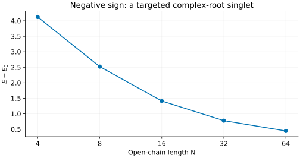

# Negative biquadratic chain: sectors, singlets and missing roots

The free-end spin-1 chain with a negative pure biquadratic interaction is a
useful test of symmetry-resolved MPS excitations. Its Bethe calculation uses
an auxiliary spin-1/2 problem, but the physical multiplicities belong to a
spin-1 chain. This tutorial makes that distinction concrete on four sites,
then follows a complex-root singlet to longer chains.

The [opposite-sign tutorial](biquadratic-ferromagnetic.md) focuses on positive-
energy defects above the ferromagnetic ground manifold.

## 1. Keep the sign and constant explicit

The default frontend Hamiltonian is

```math
H_-=-\sum_{i=1}^{N-1}(\mathbf S_i\cdot\mathbf S_{i+1})^2,
\qquad S=1.
```

There is no bilinear term, added constant or physical boundary field. This
is neither the [ULS](su3-uls.md) nor the [Takhtajan–Babujian](takhtajan-babujian.md)
Hamiltonian. A single bond has energies −4, −1 and −1 in total spin 0, 1 and 2.

```sh
build_codex/bethe-biquadratic-obc 2
build_codex/bethe-biquadratic-obc 4
```

The ground energies should be $`-4`$ and $`-(15+\sqrt{17})/2`$, respectively.
The default ground-state and sector helpers require **even N with free ends**.
Do not infer an odd-chain or periodic-chain result from these commands.

## 2. Through-lines are not total spin

Define the nearest-neighbour singlet projector through

```math
e_i=(\mathbf S_i\cdot\mathbf S_{i+1})^2-1=3P_{0,i,i+1}.
```

These operators generate a Temperley–Lieb (TL) algebra. Its sectors, or
modules, are labelled by a number of **through-lines** $`\ell`$: unpaired
strands in a diagrammatic basis. With $`M`$ singlet arcs,
$`N=\ell+2M`$. This is algebraic bookkeeping, not a count of fixed singlet
bonds in an eigenstate, and $`\ell/2`$ is not the physical total spin.

One eigenvector of a TL module can occur many times in the physical spin-1
Hilbert space. On four sites:

| Through-lines ell | TL eigenvectors | Physical states per eigenvector | Contribution to the Hilbert space |
| --- | --- | --- | --- |
| 0 | 2 | 1 | 2 |
| 2 | 3 | 8 | 24 |
| 4 | 1 | 55 | 55 |

The sum is $`2+24+55=81=3^4`$. In the ell=2 module, those eight physical
states are **one triplet plus one quintet**. They are not eight spin multiplets
or one multiplet of spin ell/2.

`--spin-content` resolves this multiplicity space into physical SU(2)
multiplets. Its `multiplets` column counts irreducible multiplets; its
`magnetic_states` column includes all $`2S+1`$ projections. Join that table to
the level table by `state_id`.

## 3. Find the singlet that real roots miss

Compare two requests in the same ell=0 module:

```sh
build_codex/bethe-biquadratic-obc 4 --through-lines 0 --excitations all
build_codex/bethe-biquadratic-obc 4 --through-lines 0 --q-spectrum --spin-content
```

The first returns only the ground configuration. The second uses a numerical
Q-system search and finds both singlets, including the complex-root level:

```math
E_{\pm}=\frac{-15\pm\sqrt{17}}2,
\qquad E_+-E_-=\sqrt{17}.
```


The left panel is the default negative sign. Orange marks the singlet absent
from the real-root scan; each annotation gives the number of physical states
per TL eigenvector. The ell=2 levels lie at
$`-6-\sqrt2,-6,-6+\sqrt2`$, each eightfold. Some of these excitations lie
below the excited singlet, so “singlet excitation” is not “first excitation
of any spin”.

Download the Q-system results and spin decompositions:

| Module | Levels | Spin content |
| --- | --- | --- |
| ell=0 | [CSV](data/bq-af-q-l0-states.csv) | [CSV](data/bq-af-q-l0-spin_content.csv) |
| ell=2 | [CSV](data/bq-af-q-l2-states.csv) | [CSV](data/bq-af-q-l2-spin_content.csv) |
| ell=4 | [CSV](data/bq-af-q-l4-states.csv) | [CSV](data/bq-af-q-l4-spin_content.csv) |

The [real-root ell=0 export](data/bq-af-real-l0-states.csv) supplies the
comparison. The tests check all four-site energies against the closed forms,
all 81 states, and the full physical-spin count. Ground references computed
by different numerical routes can leave a tiny roundoff offset from zero
in the ground row's gap.

### What does a successful Q-system search establish?

`--q-spectrum` searches **one** module. It reports the expected module
dimension and number of discovered levels. A count match is a numerical
completeness check, not a general mathematical certificate. An incomplete
search returns discoveries that are **not necessarily the lowest levels**,
even if they have been sorted by energy.

The four-site example has independent closed-form checks. Larger searches
need more care; the frontend's spectrum regression coverage extends through
N=8. Increasing `--max-attempts` helps discovery, while higher precision can
help resolve roots. Neither replaces checking the final status.

## 4. Follow a selected singlet without enumerating the spectrum

For longer chains, use the targeted two-string solver:

```sh
build_codex/bethe-biquadratic-obc 64 --singlet-excitation
build_codex/bethe-biquadratic-obc 64 --singlet-excitation \
  --csv-table states=singlet.csv --csv-table reference=ground.csv
```



This selects a positive-deviation two-string above a real-root sea in ell=0.
Its multiplicity is one physical singlet. It reproduces the excited
four-site singlet and continues a selected branch; it does not search every
state or certify the global first excited level on long chains.

| N | Selected singlet | Global ground reference |
| --- | --- | --- |
| 4 | [CSV](data/bq-af-singlet-n4-states.csv) | [CSV](data/bq-af-singlet-n4-reference.csv) |
| 8 | [CSV](data/bq-af-singlet-n8-states.csv) | [CSV](data/bq-af-singlet-n8-reference.csv) |
| 16 | [CSV](data/bq-af-singlet-n16-states.csv) | [CSV](data/bq-af-singlet-n16-reference.csv) |
| 32 | [CSV](data/bq-af-singlet-n32-states.csv) | [CSV](data/bq-af-singlet-n32-reference.csv) |
| 64 | [CSV](data/bq-af-singlet-n64-states.csv) | [CSV](data/bq-af-singlet-n64-reference.csv) |

The gap decreases substantially over these sizes. That trend alone is not
evidence for a gapless thermodynamic limit. Match N and boundary conditions
before judging an MPS error, and treat finite-size extrapolation separately
from arithmetic precision or root-solver convergence.

## 5. Compare physical, not auxiliary, quantum numbers

The auxiliary XXZ model has anisotropy $`\Delta=3/2`$ **and opposite end
fields**. Its energy is converted by

```math
E_-=2E_{\mathrm{ref}}-\frac{7(N-1)}4.
```

Those fields are part of the auxiliary representation, not fields applied to
the physical spin-1 chain. Running the ordinary zero-end-field `bethe-xxz-obc`
at Delta=1.5 and shifting its energy is not equivalent.

For a finite MPS, use the physical `energy`, `gap` and `spin_content`, with the
same free ends. There is no translation momentum. The finite even-chain
ground state is a single singlet: do not attach a factor of two merely
because the bulk phase is dimerized. Energies and spin multiplicities alone
do not specify spectral weights for an operator.

## 6. Reproduce both sign tutorials

With the optional [plotting environment](xxz-spinons.md#5-reproduce-the-figures):

```sh
build_codex/docs-venv/bin/python scripts/plot_biquadratic_tutorial.py
build_codex/docs-venv/bin/python scripts/plot_biquadratic_tutorial.py \
  --solver build_codex/bethe-biquadratic-obc
python3 scripts/plot_biquadratic_tutorial.py --check
python3 -m unittest discover -s scripts -p 'test_tutorial_biquadratic.py'
```

The shared script regenerates both signs, validates every export before
saving, and plots the numerical tables. These examples use fp64; native
long-double and fp128 are available where supported.

## Further reading

The spectral mapping is due to
[Barber–Batchelor](../../CITATIONS.md#barber-batchelor-1989). See
[Albertini](../../CITATIONS.md#albertini-2000) for the open-chain equations and
[Aufgebauer–Klümper](../../CITATIONS.md#aufgebauer-klumper-2010) for modules and
multiplicities. The [model guide](../biquadratic.md),
[physical-spin guide](../biquadratic-spin-content.md) and
[two-string guide](../xxz-open-two-string.md) document the precise implemented
scope and numerical checks.
