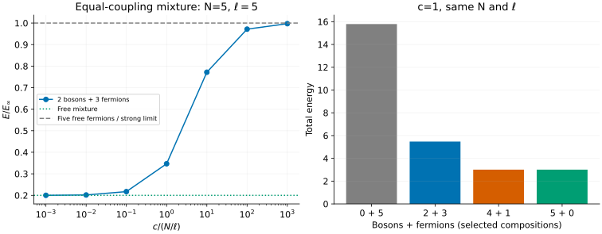

# Bose–Fermi mixtures: change statistics, not just a component label

[All tutorials](index.md) · [Model guide](../bose-fermi.md) · [SU(n) fermion tutorial](su-fermions.md)

This gas contains scalar bosons and spinless fermions of equal mass. Boson–boson
and boson–fermion contact strengths are equal; identical fermions do not feel
the contact interaction. It is a graded integrable model, not another color
of the multicomponent Fermi gas.

We will hold total particle number and circumference fixed, vary the repulsion,
and then compare selected compositions. The outputs are finite-ring ground
states, not excitation dispersions or correlation functions.

## 1. Fix the equal-coupling Hamiltonian

The first-quantized convention is

```math
H=-\sum_j\partial_{x_j}^2+2c\sum_{i\lt j}\delta(x_i-x_j),\qquad
\frac{\hbar^2}{2m}=1,\qquad c\ge0.
```

Particle statistics determine which contact terms survive. Changing either
mass or the ratio of boson–boson to boson–fermion couplings leaves the model
implemented here. The equations follow
[Imambekov–Demler](../../CITATIONS.md#imambekov-demler-2006-applications),
Eqs. (3), (28)–(34).

Choose two bosons and three fermions on a circumference-five ring:

```sh
bethe-bose-fermi-pbc --bosons 2 --fermions 3 --length 5 --c 1 \
  --csv-table states=bf-state.csv --csv-table charge_roots=bf-charge.csv \
  --csv-table auxiliary_roots=bf-auxiliary.csv
```

The total density is one, energy is approximately 5.47425839, and momentum is
zero. Length is a physical circumference, not five lattice sites.

## 2. Sweep repulsion, then compare compositions



The left panel divides by the finite-size impenetrable limit

```math
E_\infty=\frac{\pi^2N(N^2-1)}{3\ell^2}
=\frac{8\pi^2}{5}\quad(N=\ell=5).
```

This also equals the energy of five free spinless fermions on this odd-particle
ring. The c=0 mixture instead has all bosons at k=0 and fermions in integer
modes -1,0,1, giving E approximately 3.15827341. Its initial slope is

```math
E-E_{\mathrm{free}}=
\frac{cN_b(N_b-1)+2cN_bN_f}{\ell}+O(c^2)=\frac{14}{5}c+O(c^2).
```

The first term counts boson–boson contacts and the second boson–fermion
contacts. At c=0.001 the shift is about 0.00279940. At c=1000 the energy is
15.74575939, approaching the strong-coupling reference 15.79136704. Markers are
native solutions; connecting lines do not replace a thermodynamic calculation.

The right panel changes the composition at **fixed N=5, circumference 5 and
c=1**. Five fermions have no interacting contacts, whereas five bosons have
the Lieb–Liniger energy 3.00678253. Four bosons plus one fermion have the
same spatial ground energy: one fermion introduces no exchange antisymmetry
between identical fermions. The native mixture and separate Lieb–Liniger
exports agree in their charge roots as well as energy.

This equality does not identify species-resolved observables or correlation
functions. Nor does a four-bar finite-size comparison establish a demixing
phase diagram. Only energies of the displayed supported compositions are shown.

## 3. The auxiliary roots count bosons

The mixed branch has N charge momenta and **N_b auxiliary rapidities**:

```math
\begin{aligned}
\ell k_j+\sum_a2\arctan\frac{2(k_j-\lambda_a)}c&=2\pi I_j,\\{}
\sum_j2\arctan\frac{2(\lambda_a-k_j)}c&=2\pi J_a,\\{}
E&=\sum_j k_j^2.
\end{aligned}
```

Our two-boson, three-fermion example therefore exports five charge roots and
two auxiliaries. There is **no auxiliary–auxiliary scattering term**, unlike
the spin equations of an SU(n) Fermi gas. The labels J use the sign convention
in our guide; they are opposite to the paper's auxiliary logarithmic labels.
Only charge momenta contribute directly to the energy.

The pure-boson path delegates to Lieb–Liniger and has an empty auxiliary table.
At c=0, or with no bosons, the frontend instead returns species-labelled free
occupations. Repeated boson k=0 rows are valid occupations, not accidentally
duplicated interacting roots.

## 4. Shell restrictions and useful benchmarks

With c>0 and both species present, the centered periodic branch requires
**odd N_f**; N_b may be odd or even. That is why the composition plot shows
0+5, 2+3, 4+1 and 5+0, but not 1+4 or 3+2. Those omitted mixtures are physical
states whose shells are not implemented. Pure species, vacuum and c=0 accept
arbitrary counts.

Free even-fermion shells choose the positive-current representative. The
saved c=0 example with two bosons, two fermions and circumference 1 has boson
modes 0,0 and fermion modes 0,1. Its momentum is $`2\pi`$, not zero: continuum
momentum is not folded modulo $`2\pi`$.

Further checks make the numerical conventions explicit:

- One boson plus one fermion at circumference 1 and c=$`\pi`$ has
  $`E=\pi^2/2`$, from the two-body contact condition.
- Doubling circumference and halving c keeps the dimensionless interaction
  fixed: physical roots halve and energy is divided by four.
- Pure bosons and the one-fermion example agree with a separately run
  Lieb–Liniger frontend at the same N, circumference and c.

For a continuum MPS discretization, match species statistics, masses and both
interaction coefficients before comparing energies. Bosonic occupation
truncation and lattice spacing are additional approximation controls; the
Bethe residual does not measure either error. Excitations, unequal couplings,
attraction, traps and open boundaries are outside this frontend's scope.

## 5. Reproduce and validate

| c, N_b=2 and N_f=3 | State | Charge roots | Auxiliary roots |
| ---: | --- | --- | --- |
| 0.001 | [CSV](data/bf-c0.001-states.csv) | [CSV](data/bf-c0.001-charge_roots.csv) | [CSV](data/bf-c0.001-auxiliary_roots.csv) |
| 0.01 | [CSV](data/bf-c0.01-states.csv) | [CSV](data/bf-c0.01-charge_roots.csv) | [CSV](data/bf-c0.01-auxiliary_roots.csv) |
| 0.1 | [CSV](data/bf-c0.1-states.csv) | [CSV](data/bf-c0.1-charge_roots.csv) | [CSV](data/bf-c0.1-auxiliary_roots.csv) |
| 1 | [CSV](data/bf-c1-states.csv) | [CSV](data/bf-c1-charge_roots.csv) | [CSV](data/bf-c1-auxiliary_roots.csv) |
| 10 | [CSV](data/bf-c10-states.csv) | [CSV](data/bf-c10-charge_roots.csv) | [CSV](data/bf-c10-auxiliary_roots.csv) |
| 100 | [CSV](data/bf-c100-states.csv) | [CSV](data/bf-c100-charge_roots.csv) | [CSV](data/bf-c100-auxiliary_roots.csv) |
| 1000 | [CSV](data/bf-c1000-states.csv) | [CSV](data/bf-c1000-charge_roots.csv) | [CSV](data/bf-c1000-auxiliary_roots.csv) |

| Other interacting case | State | Charge roots | Auxiliary roots |
| --- | --- | --- | --- |
| Five bosons | [CSV](data/bf-bosons-states.csv) | [CSV](data/bf-bosons-charge_roots.csv) | [empty CSV](data/bf-bosons-auxiliary_roots.csv) |
| Four bosons, one fermion | [CSV](data/bf-one-fermion-states.csv) | [CSV](data/bf-one-fermion-charge_roots.csv) | [CSV](data/bf-one-fermion-auxiliary_roots.csv) |
| Rescaled 2+3 | [CSV](data/bf-scaled-states.csv) | [CSV](data/bf-scaled-charge_roots.csv) | [CSV](data/bf-scaled-auxiliary_roots.csv) |
| Two-body contact | [CSV](data/bf-contact-states.csv) | [CSV](data/bf-contact-charge_roots.csv) | [CSV](data/bf-contact-auxiliary_roots.csv) |

Free cases have different tables:

| Case | State | Species-labelled occupations |
| --- | --- | --- |
| c=0, 2+3 | [CSV](data/bf-free-states.csv) | [CSV](data/bf-free-free_modes.csv) |
| Five fermions | [CSV](data/bf-fermions-states.csv) | [CSV](data/bf-fermions-free_modes.csv) |
| Free even shell | [CSV](data/bf-free-shell-states.csv) | [CSV](data/bf-free-shell-free_modes.csv) |
| Vacuum | [CSV](data/bf-vacuum-states.csv) | [empty CSV](data/bf-vacuum-free_modes.csv) |

The independent Lieb–Liniger run supplies a [state](data/ref-ll5-states.csv)
and [roots](data/ref-ll5-roots.csv). All exports retain provenance and status.

With the [plotting dependencies](requirements.txt), from the source checkout:

```sh
python3 scripts/plot_multicomponent_tutorial.py --check
python3 scripts/plot_multicomponent_tutorial.py
# Optional: regenerate this and the SU(n) tutorial, including reference runs.
python3 scripts/plot_multicomponent_tutorial.py --solver-dir /path/to/bethe/bin
python3 -m unittest discover -s scripts -p 'test_tutorial_multicomponent.py'
```

The [script](../../scripts/plot_multicomponent_tutorial.py) validates species,
root counts, labels, equations, energy and unwrapped momentum. Its
[tests](../../scripts/test_tutorial_multicomponent.py) check model reductions,
weak/strong limits, units, free shells and corrupted exports. Failed solves
must be rejected, not plotted as zero energy. These examples use native fp64;
long-double and optional MPLAPACK fp128 use the same equations and sector rules.
