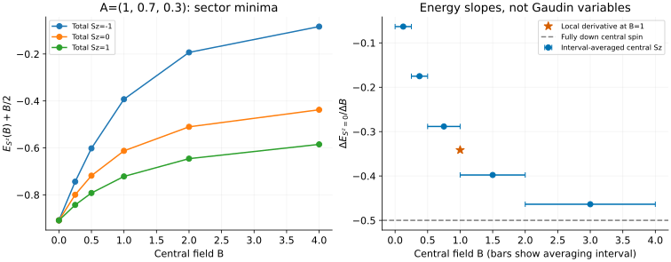

# Central spin: sector energies and field response

[All tutorials](index.md) · [Model guide](../central-spin.md) · [Richardson tutorial](richardson.md)

One spin coupled to an inhomogeneous bath makes a useful long-range MPS
benchmark. Here we compare fixed-magnetization ground energies, verify the
zero-field multiplet and infer a central-spin response from energy differences.
The solver supplies energies and regular Gaudin variables, not time evolution
or wavefunctions.

## 1. Specify the star, not a spatial chain

Our Hamiltonian is

```math
H=BS_0^z+\sum_{j=1}^{N_b}A_j\,\mathbf S_0\cdot\mathbf S_j.
```

Every spin is 1/2. B acts **only on the central spin**; there are no bath
fields or bath–bath couplings. The positive sign of B means a large positive
field favours a down central spin. The Gaudin conventions follow
[Faribault–Schuricht](../../CITATIONS.md#faribault-schuricht-2013), with bath
field zero. Their dynamical calculations require capabilities beyond this
ground-energy frontend.

Choose three bath couplings 1,0.7,0.3, central field 1 and total Sz=0:

```sh
bethe-central-spin --couplings 1,0.7,0.3 --field 1 --sz 0 \
  --csv-table states=central-state.csv --csv-table variables=central-variables.csv
```

The energy is approximately **-1.11248592**. `--sz` includes the central spin,
so four total spins allow sectors -2,-1,0,1,2. A sector minimum is not
automatically the global minimum. Repeating this command with `--sz 1` gives
-1.22153504, already lower at this field.

Couplings can have either sign, but must be nonzero and distinct. Input order
is preserved for reporting and does not change the energy. Repeated couplings
and decoupled zero-coupling bath spins require different sector bookkeeping;
do not approximate them by silent perturbations.

## 2. Compare sectors across field



The left panel plots **E+B/2** to remove the leading central-down Zeeman
term visually. The CSV files contain the absolute Hamiltonian energy E;
this display shift is not an extra term in the Hamiltonian and must be
removed before differentiating the plotted quantity.

At B=0, the Sz=-1,0,+1 minima agree at approximately -0.90870128.
They are components of a zero-field SU(2) multiplet, not evidence that an
Sz=0 calculation found a singlet. A finite central-only field splits them.
The completely polarized sectors provide a separate exact check:

```math
E_{\pm}=\frac14\sum_j A_j\pm\frac B2.
```

Do not assume that a fixed-sector energy decreases from B=0: the Sz=-1
branch initially increases, before bending down. The relevant general check
is **concavity** of the lowest energy in each fixed sector, since H depends
linearly on B. Energies from different sectors should not be spliced together
when estimating that sector's response.

Spin reversal gives another useful identity:

```math
E(B,S^z;\{A_j\})=E(-B,-S^z;\{A_j\}).
```

The downloads verify it at B=±1, as well as coupling permutation and a common
factor-two scaling of all A and B. These are normalization checks, not a
claim that the central spin and bath spins are interchangeable.

## 3. Estimate central polarization from energies

For a normalized, nondegenerate eigenstate in a fixed sector, the
Hellmann–Feynman relation reads

```math
\frac{\partial E_{S^z}}{\partial B}=\langle S_0^z\rangle.
```

The right panel uses the **unshifted** Sz=0 energies. Each blue marker is a
secant slope, with a horizontal bar spanning the two sampled fields:

```math
\frac{E(B_2)-E(B_1)}{B_2-B_1}
=\frac1{B_2-B_1}\int_{B_1}^{B_2}\langle S_0^z\rangle_B\,dB.
```

It is an **interval average**, not the exact magnetization at the midpoint.
The bars are averaging intervals, not statistical error bars. Their values
lie between -1/2 and +1/2 and decrease with field, consistently with concavity.

To obtain a local estimate at B=1, the starred point uses centered differences:

| Field step h | $`[E(1+h)-E(1-h)]/(2h)`$ |
| ---: | ---: |
| 0.01 | -0.34140475 |
| 0.005 | -0.34140757 |

The difference is about $`2.8\times10^{-6}`$. The refined estimate agrees
within $`2\times10^{-6}`$ with a direct small-matrix expectation value in the
optional validation. Neither agreement nor the solver residual is a rigorous
derivative error bar. Smaller h reduces finite-difference truncation but
eventually amplifies energy roundoff; test h and precision together.

At large positive field the central spin approaches -1/2. The extra B=100
run checks the high-field product-state energy for this sector, with the two
largest bath couplings carrying up spins. With mixed-sign couplings, “largest”
means algebraically largest, not largest absolute value.

## 4. Gaudin variables are not magnetizations

The implementation uses the quadratic-variable strategy of
[Faribault et al.](../../CITATIONS.md#faribault-2011), also used in the
[pairing tutorial](richardson.md). The physical Hamiltonian and state-selection
seed are different; selecting a Richardson ground state is not a shortcut to
selecting this central-spin ground state.

For the B=1, Sz=0 example the central variable is approximately -0.74165728,
and the first bath variable is approximately 1.00008328. Neither is a spin
projection or occupation probability. The central polarization from the
energy derivative is instead approximately -0.341408.

At B=0 the solver evaluates the exact zero-field equations, not a tiny-field
substitute. The compactified variables stay finite and sum to zero there;
that does **not** say there are no up spins. At negative B they describe the
spin-reversed computational frame. The reported physical field and total Sz
retain their requested signs.

For analytic polarized or isolated-spin cases, variable entries are missing
because no continuation variables are needed. A missing variable is not zero.
On incomplete continuation an energy, if present, belongs to `reached_field`,
not necessarily `requested_field`; the initial infinite-field seed has no
finite reached field or energy at all. Reject those runs before plotting a
target-field curve.

For MPS comparisons use the same star Hamiltonian and total-Sz sector. Mapping
the bath to an MPS ordering changes the representation, not the couplings.
There is no lattice momentum, PBC/OBC switch or homogeneous iMPS dispersion
here. Excitation spectra, form factors, bath dynamics and higher local spins
are not implemented in this frontend.

## 5. Reproduce and validate

Native field-scan exports (each cell links the state and regular variables):

| B | Total Sz=-1 | Total Sz=0 | Total Sz=+1 |
| ---: | --- | --- | --- |
| 0 | [state](data/central-s-1-b0-states.csv) / [variables](data/central-s-1-b0-variables.csv) | [state](data/central-s0-b0-states.csv) / [variables](data/central-s0-b0-variables.csv) | [state](data/central-s1-b0-states.csv) / [variables](data/central-s1-b0-variables.csv) |
| 0.25 | [state](data/central-s-1-b0.25-states.csv) / [variables](data/central-s-1-b0.25-variables.csv) | [state](data/central-s0-b0.25-states.csv) / [variables](data/central-s0-b0.25-variables.csv) | [state](data/central-s1-b0.25-states.csv) / [variables](data/central-s1-b0.25-variables.csv) |
| 0.5 | [state](data/central-s-1-b0.5-states.csv) / [variables](data/central-s-1-b0.5-variables.csv) | [state](data/central-s0-b0.5-states.csv) / [variables](data/central-s0-b0.5-variables.csv) | [state](data/central-s1-b0.5-states.csv) / [variables](data/central-s1-b0.5-variables.csv) |
| 1 | [state](data/central-s-1-b1-states.csv) / [variables](data/central-s-1-b1-variables.csv) | [state](data/central-s0-b1-states.csv) / [variables](data/central-s0-b1-variables.csv) | [state](data/central-s1-b1-states.csv) / [variables](data/central-s1-b1-variables.csv) |
| 2 | [state](data/central-s-1-b2-states.csv) / [variables](data/central-s-1-b2-variables.csv) | [state](data/central-s0-b2-states.csv) / [variables](data/central-s0-b2-variables.csv) | [state](data/central-s1-b2-states.csv) / [variables](data/central-s1-b2-variables.csv) |
| 4 | [state](data/central-s-1-b4-states.csv) / [variables](data/central-s-1-b4-variables.csv) | [state](data/central-s0-b4-states.csv) / [variables](data/central-s0-b4-variables.csv) | [state](data/central-s1-b4-states.csv) / [variables](data/central-s1-b4-variables.csv) |

| Derivative run | State | Variables |
| --- | --- | --- |
| B=0.99 | [CSV](data/central-deriv-minus-states.csv) | [CSV](data/central-deriv-minus-variables.csv) |
| B=1.01 | [CSV](data/central-deriv-plus-states.csv) | [CSV](data/central-deriv-plus-variables.csv) |
| B=0.995 | [CSV](data/central-deriv-half-minus-states.csv) | [CSV](data/central-deriv-half-minus-variables.csv) |
| B=1.005 | [CSV](data/central-deriv-half-plus-states.csv) | [CSV](data/central-deriv-half-plus-variables.csv) |

| Additional check | State | Variables |
| --- | --- | --- |
| One bath spin, A=B=1 | [CSV](data/central-two-states.csv) | [CSV](data/central-two-variables.csv) |
| One bath spin, B=0 | [CSV](data/central-two-zero-states.csv) | [CSV](data/central-two-zero-variables.csv) |
| Spin-reversed field/sector | [CSV](data/central-reversed-states.csv) | [CSV](data/central-reversed-variables.csv) |
| Permuted bath inputs | [CSV](data/central-permuted-states.csv) | [CSV](data/central-permuted-variables.csv) |
| All energy scales doubled | [CSV](data/central-scaled-states.csv) | [CSV](data/central-scaled-variables.csv) |
| Polarized up | [CSV](data/central-up-states.csv) | [nulls](data/central-up-variables.csv) |
| Polarized down | [CSV](data/central-down-states.csv) | [nulls](data/central-down-variables.csv) |
| Isolated spin | [CSV](data/central-isolated-states.csv) | [null](data/central-isolated-variables.csv) |
| Mixed-sign bath, B=0 | [CSV](data/central-mixed-zero-states.csv) | [CSV](data/central-mixed-zero-variables.csv) |
| Mixed-sign bath, B=2 | [CSV](data/central-mixed-states.csv) | [CSV](data/central-mixed-variables.csv) |
| High field B=100 | [CSV](data/central-high-states.csv) | [CSV](data/central-high-variables.csv) |

With the [plotting dependencies](requirements.txt), from the source checkout:

```sh
python3 scripts/plot_gaudin_tutorial.py --check
python3 scripts/plot_gaudin_tutorial.py
# Optional: regenerate this and the Richardson tutorial.
python3 scripts/plot_gaudin_tutorial.py --solver-dir /path/to/bethe/bin
# Optional independent matrices and central-polarization check; requires NumPy.
python3 scripts/plot_gaudin_tutorial.py --check --oracle
python3 -m unittest discover -s scripts -p 'test_tutorial_gaudin.py'
```

The [script](../../scripts/plot_gaudin_tutorial.py) checks every quadratic
equation, number constraint, input/variable join and energy reconstruction.
Its optional oracle independently builds and diagonalizes each saved spin
sector; no Bethe equations enter those matrices. The
[tests](../../scripts/test_tutorial_gaudin.py) also cover the exact two-spin
energy, analytic null variables, zero-field degeneracy, reversal, scaling,
concavity and rejection of incomplete or corrupted outputs. Native long-double
and optional MPLAPACK fp128 provide precision controls without changing the model.
