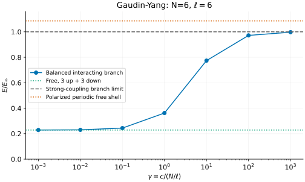
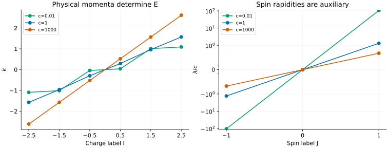

# Gaudin–Yang: repulsion, spin roots and finite-ring shells

[All tutorials](index.md) · [Model guide](../gaudin-yang.md) · [Lieb–Liniger tutorial](lieb-liniger.md)

The Gaudin–Yang gas contains two species of continuum fermions with a contact
interaction. Unlike spinless fermions, opposite spins can meet, so repulsion
changes the energy. A second set of Bethe roots describes the spin structure.
Here we follow six particles around a ring from weak to strong repulsion and
check exactly what the exported roots and units mean.

## 1. Fix particles, circumference and units

The convention is

```math
H=-\sum_j\partial_{x_j}^2+2c\sum_{i\lt j}\delta(x_i-x_j),\qquad
\frac{\hbar^2}{2m}=1,\qquad E=\sum_j k_j^2.
```

The positional argument is **particle number**, not the number of lattice
sites. We choose N=6, three particles of each spin, and circumference
$`\ell=6`$, so density $`n=N/\ell=1`$. The dimensionless interaction is
$`\gamma=c/n`$, numerically equal to c in this example.

```sh
build/bethe-gaudin-yang-pbc 6 --length 6 --c 1 \
  --csv-table states=gy-state.csv --csv-table charge_roots=gy-charge.csv \
  --csv-table spin_roots=gy-spin.csv
```

This gives E approximately 6.95064374 and total momentum zero. Same-spin
contact terms vanish by antisymmetry; the interaction acts between the two
populations. The original solutions are [Gaudin](../../CITATIONS.md#gaudin-1967)
and [Yang](../../CITATIONS.md#yang-1967). The finite-ring branch and limits used
here follow [Oelkers et al.](../../CITATIONS.md#oelkers-2006), Sec. 5.

## 2. Increase the repulsion

The reproduction script runs c=0, 0.001, 0.01, 0.1, 1, 10, 100 and 1000.
The positive-c results appear on a logarithmic axis; c=0 supplies the green
reference line rather than an artificial logarithmic coordinate.



The normalization is the **finite-N strong-coupling limit of this branch**,

```math
E_\infty=\frac{\pi^2N(N^2-1)}{3\ell^2}
=\frac{35\pi^2}{18}\quad(N=\ell=6).
```

The balanced free energy is $`4\pi^2/9\simeq4.38649084`$. At small c,

```math
E-E_{\mathrm{free}}=\frac{2cN_\uparrow N_\downarrow}{\ell}+O(c^2)=3c+O(c^2).
```

At c=0.001 the exported shift is about 0.00299950; at c=1000 the energy is
19.13596659, approaching $`E_\infty\simeq19.19089745`$ from below. The connecting
line is a guide through finite calculations, not a thermodynamic interpolation.

The orange line is an independently exported **fully polarized** six-particle
state on the same ring. It is free at every c, but its even-particle periodic
shell has energy $`19\pi^2/9\simeq20.83583151`$. It is not equal to the
interacting branch's strong-coupling limit. Calling both limits “spinless”
without matching their finite-ring shell conventions would hide this difference.
It becomes a finite-size issue rather than a different bulk energy density.

## 3. Read two families of roots



The six charge roots are **physical momenta k**; their squares sum to E.
The three spin roots are auxiliary rapidities, not additional particles whose
squares should be included in the energy. Their natural strong-coupling scale
grows with c, so the right panel plots $`\lambda/c`$.
Its vertical scale is symmetric-logarithmic (linear near zero), so the weak-
and strong-coupling values can both be distinguished.

The two sets of labels are different: I are half-odd integers and J are
integers for this centered branch. Joining rows merely by their array index
would conflate distinct root families. The script checks both their labels
and the original rational Bethe equations, not just the reported residual.

Physical momentum is $`P=\sum_j k_j`$. It is **not reduced modulo** $`2\pi`$:
this is a continuum ring, with no lattice Brillouin zone. On a free branch,
the frontend instead exports occupied integer modes. For example, N=4,
two particles of each spin, c=0 and $`\ell=1`$ selects modes 0 and 1 for each
spin, giving P=$`4\pi`$. Reflected choices have the same energy; the positive-current
shell is a convention, not a unique free ground state.

## 4. Which calculations are supported?

The interacting centered branch requires **both spin populations odd**. Our
3+3 example satisfies this; 2+2 at c>0 does not. The rejected population is
physically meaningful, but its periodic shell is not implemented. Do not
change spin or labels silently to make a requested benchmark run.

Exact c=0 and fully polarized states are exceptions and allow arbitrary
populations. Spin reversal is supported; the 5+3 and 3+5 saved examples have
equal energies while keeping their physical population labels distinct.

The frontend does not yet compute attractive interactions, excitation lines,
hard walls or thermodynamic integral equations. These are fixed-population
ground-state benchmarks for finite systems, not spinon or holon dispersions.

Two particularly useful normalization checks are included:

- Two opposite-spin particles at $`\ell=1,c=\pi`$ obey the independent contact
  condition $`q\tan(q/2)=c/2`$. The positive root is $`q=\pi/2`$, giving
  $`E=\pi^2/2`$.
- Doubling the circumference and halving c preserves $`\gamma`$ at fixed N.
  All physical roots halve and the energy becomes one quarter. The saved
  $`\ell=12,c=0.5`$ example checks this against $`\ell=6,c=1`$.

For a lattice MPS approximation to this continuum theory, match physical
length, density, kinetic normalization and the coefficient **2c** before
comparing energies. Lattice-spacing errors are separate from root convergence.
The [model guide](../gaudin-yang.md#validation-and-useful-limits) describes a
controlled dilute-Hubbard comparison; a finite Hubbard ring is not literally
the same Hamiltonian.

## 5. Reproduce and validate

The interacting scan's paired root tables and state exports are available here:

| c | State | Charge roots | Spin roots |
| ---: | --- | --- | --- |
| 0.001 | [CSV](data/gy-c0.001-states.csv) | [CSV](data/gy-c0.001-charge_roots.csv) | [CSV](data/gy-c0.001-spin_roots.csv) |
| 0.01 | [CSV](data/gy-c0.01-states.csv) | [CSV](data/gy-c0.01-charge_roots.csv) | [CSV](data/gy-c0.01-spin_roots.csv) |
| 0.1 | [CSV](data/gy-c0.1-states.csv) | [CSV](data/gy-c0.1-charge_roots.csv) | [CSV](data/gy-c0.1-spin_roots.csv) |
| 1 | [CSV](data/gy-c1-states.csv) | [CSV](data/gy-c1-charge_roots.csv) | [CSV](data/gy-c1-spin_roots.csv) |
| 10 | [CSV](data/gy-c10-states.csv) | [CSV](data/gy-c10-charge_roots.csv) | [CSV](data/gy-c10-spin_roots.csv) |
| 100 | [CSV](data/gy-c100-states.csv) | [CSV](data/gy-c100-charge_roots.csv) | [CSV](data/gy-c100-spin_roots.csv) |
| 1000 | [CSV](data/gy-c1000-states.csv) | [CSV](data/gy-c1000-charge_roots.csv) | [CSV](data/gy-c1000-spin_roots.csv) |

The exact free c=0 path has a [state](data/gy-c0-states.csv) and separate
[up](data/gy-c0-free_up.csv) / [down](data/gy-c0-free_down.csv) occupations.
Likewise, the polarized reference has a [state](data/gy-polarized-states.csv),
[up occupations](data/gy-polarized-free_up.csv) and an
[empty down table](data/gy-polarized-free_down.csv). These are deliberately not
interacting charge/spin tables.

| Additional check | State | Charge roots | Spin roots |
| --- | --- | --- | --- |
| Rescaled units | [CSV](data/gy-scaled-states.csv) | [CSV](data/gy-scaled-charge_roots.csv) | [CSV](data/gy-scaled-spin_roots.csv) |
| 5 up + 3 down | [CSV](data/gy-imbalanced-states.csv) | [CSV](data/gy-imbalanced-charge_roots.csv) | [CSV](data/gy-imbalanced-spin_roots.csv) |
| 3 up + 5 down | [CSV](data/gy-reversed-states.csv) | [CSV](data/gy-reversed-charge_roots.csv) | [CSV](data/gy-reversed-spin_roots.csv) |
| Two-body contact | [CSV](data/gy-two-body-states.csv) | [CSV](data/gy-two-body-charge_roots.csv) | [CSV](data/gy-two-body-spin_roots.csv) |

The free-current example has [state](data/gy-free-shell-states.csv),
[up](data/gy-free-shell-free_up.csv) and [down](data/gy-free-shell-free_down.csv)
exports. All files retain invocation, precision, build provenance and status.

With the [plotting dependencies](requirements.txt) installed, from the repository root:

```sh
python3 scripts/plot_fermion_tutorial.py --check
python3 scripts/plot_fermion_tutorial.py
# Optional: regenerate the Gaudin–Yang and t–J examples together.
python3 scripts/plot_fermion_tutorial.py --solver-dir build
python3 -m unittest discover -s scripts -p 'test_tutorial_fermion.py'
```

The [script](../../scripts/plot_fermion_tutorial.py) validates root counts,
equations, energy reconstruction, physical momentum and completed continuation
at the **requested** c. Its [tests](../../scripts/test_tutorial_fermion.py) add
the contact oracle, weak/strong limits, unit scaling and corrupted exports.
A residual tolerance is not an energy-error bound; failed continuation can
leave an estimate that must not be used as a converged state. Examples use
fp64, with native long-double and optional MPLAPACK fp128 available in the CLI.
