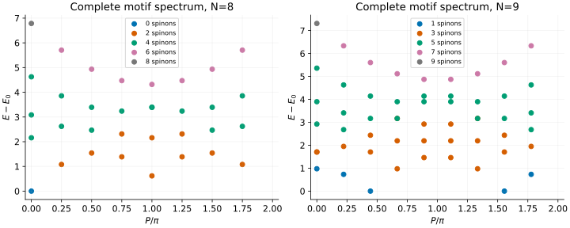
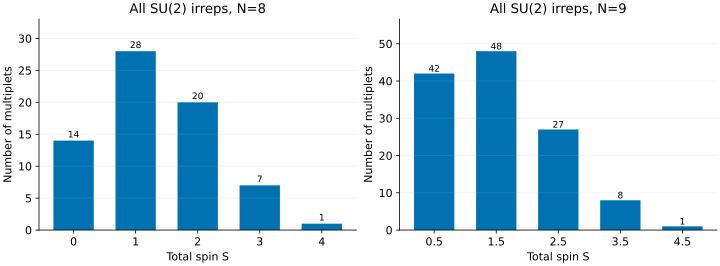

# Haldane–Shastry: counting a complete spin spectrum

How many states does a dot in a spectrum represent? For the Haldane–Shastry
chain it can represent more than one ordinary spin multiplet. This tutorial
uses small rings to connect motif labels, energy–momentum plots and SU(2)
counting. The result is a useful finite-MPS benchmark: we can check both
energies and the number of states that should occur at each total spin.

Unlike [nearest-neighbour XXX](xxx.md), this model has long-range exchange.
Unlike the [Sutherland gas](sutherland.md), its degrees of freedom are spins
on fixed lattice sites, not mobile continuum particles.

## 1. Match the exchange normalization

For spin-1/2 operators, lattice spacing one and $`J=1`$, our Hamiltonian is

```math
H=\left(\frac\pi N\right)^2\sum_{i\lt j}
\frac{\mathbf S_i\cdot\mathbf S_j}{\sin^2[\pi(i-j)/N]}.
```

Every unordered pair appears once. At large $`N`$, the nearest-neighbour
coupling approaches one; at finite $`N`$ the actual inverse-chord coefficient
must be used. If an MPO approximates the long-range interaction by a sum of
exponentials, its approximation error is separate from the MPS error.

Start with all motifs of an eight-site ring:

```sh
bethe-haldane-shastry-pbc 8 --levels all --spin-content
bethe-haldane-shastry-pbc 8 --levels all --precision fp64 \
  --csv-table levels=hs-levels.csv --csv-table spin_content=hs-spins.csv
```

`--spin-content` asks for the extra table on screen. Requesting its named CSV
export computes and writes that table independently; it does not require
showing the spin decomposition on screen.

## 2. Read the motif plot



These are full motif enumerations at N=8 and N=9:

| Ring | Energy/momentum table | Spin decomposition |
| --- | --- | --- |
| N=8 | [34 motifs](data/hs-n8-levels.csv) | [SU(2) content](data/hs-n8-spin_content.csv) |
| N=9 | [55 motifs](data/hs-n9-levels.csv) | [SU(2) content](data/hs-n9-spin_content.csv) |

A motif is an ascending list of occupied positions between 1 and $`N-1`$,
with no adjacent occupied positions. For example, `1,3,6` is allowed at N=8;
`1,2` is not. It is a **spectral label**, not a pattern of up and down spins
on physical sites. An empty motif is allowed too.

Each table row is one *Yangian multiplet*: a group of states tied together by
the model's enlarged symmetry. Different motifs can also share an energy and
momentum, so dots can overlap. Neither the row count nor the number of visible
dots is the Hilbert-space dimension.

For a motif containing $`M`$ positions, the exported spinon count is $`N-2M`$
and the maximum ordinary total spin is $`S_{\max}=(N-2M)/2`$. The colours label
that spinon count; they do not assign a unique total spin to every state in
the row.

The plot uses the lattice momentum $`P\pmod{2\pi}`$ and the gap above the
global ground state of the same ring. All even-ring motifs have even spinon
count; odd rings have odd spinon count. Here the N=8 ground motif is a singlet
at zero momentum. The N=9 ground level occurs at two opposite momenta, with a
spin-1/2 multiplet at each: four ground states altogether.

## 3. One motif can contain both a singlet and a triplet

Select the first excited motif of the eight-site example:

```sh
bethe-haldane-shastry-pbc 8 --motif 2,4,6 --spin-content
```

It has two spinons and $`S_{\max}=1`$, but its dimension is **four**, not
three. Its SU(2) content is one singlet plus one triplet, all at the same
energy and momentum. Thus `s_max` is not a substitute for `spin_content` when
comparing a symmetry-resolved MPS spectrum.

The `levels` and `spin_content` tables join by `state_id`. A spin-content row
with spin $`S`$ and multiplicity $`m_S`$ means $`m_S`$ ordinary irreducible
multiplets, each containing $`2S+1`$ spin projections. Consequently,

```math
d_{\mathrm{motif}}=\sum_S m_S(2S+1).
```

Do not multiply the exported motif `degeneracy` by $`2S_{\max}+1`$: the
degeneracy already counts all states and all projections in that motif.
Likewise, `--sz` chooses a sector minimum but does not change the reported
motif dimension into a fixed-projection count.

## 4. Account for the whole Hilbert space



These bars sum the exported SU(2) multiplicities over all motifs. For N=8,
there are 14 singlets, 28 triplets, 20 quintets, 7 spin-3 multiplets and one
spin-4 multiplet. Weighting by their dimensions gives

```math
14\times1+28\times3+20\times5+7\times7+1\times9=256=2^8.
```

The N=9 data similarly sum to $`512=2^9`$. This is more informative than a
successful energy calculation: it tests whether all spin states have been
accounted for. Independently, the number of spin-$`S`$ irreps in $`N`$
spin-1/2 sites follows from subtracting adjacent spin-projection counts:

```math
m_S=\binom{N}{N/2-S}-\binom{N}{N/2-S-1}.
```

Here an out-of-range lower binomial index contributes zero. The tutorial tests
compare these spin-word counts against every exported spin multiplicity.

This is a case where `--levels all` really does cover the full finite
spectrum—**if the enumeration and spin decomposition succeed**. The number of
motifs is $`F_{N+1}`$, so it still grows exponentially. A `--max-motifs` refusal
publishes no claimed lowest levels. An exhausted `--max-spin-updates` budget
can leave valid energies but incomplete spin counts; do not treat that as a
complete symmetry-resolved spectrum.

## 5. Use the results in an MPS comparison

For a finite ring, compare the same inverse-chord couplings, length and total
spin. Within a motif, degeneracy between different spins is real, not a
roundoff accident. A variational algorithm can converge to a different member
of that degenerate space without changing its energy.

For an infinite MPS, these small-ring energies are not yet a thermodynamic
dispersion. This frontend provides finite spectral rules, not wavefunctions,
form factors or spectral weights; it also does not implement open-chain
Haldane–Shastry variants. Use the finite sizes here for checks rather than
silently reinterpreting their gaps as infinite-chain excitation energies.

The `exact spectral rules` status refers to the closed spectral construction.
Numerical energies are still evaluated in fp64, long-double or fp128, as
selected. Integer counting and floating-point energy accuracy are distinct.

## 6. Reproduce the figures

With the optional [plotting environment](xxz-spinons.md#5-reproduce-the-figures):

```sh
python3 scripts/plot_haldane_shastry_tutorial.py
# Also regenerate the four named-table exports:
python3 scripts/plot_haldane_shastry_tutorial.py \
  --solver bethe-haldane-shastry-pbc
python3 scripts/plot_haldane_shastry_tutorial.py --check
python3 -m unittest discover -s scripts -p 'test_tutorial_haldane_shastry.py'
```

The checks validate every admissible motif, energy reference, table join,
spin decomposition and Hilbert-space count. Ground and fully polarized
energies also have independent closed-form checks. The plots themselves use
frontend exports, not a substitute implementation of the spectral rules.

## Further reading

Start with the original papers by [Haldane](../../CITATIONS.md#haldane-1988)
and [Shastry](../../CITATIONS.md#shastry-1988). The recent
[Jiang–Lamers–Miao review and construction](../../CITATIONS.md#jiang-lamers-miao-2026)
explains motifs and Yangian spin content. Their Hamiltonian convention differs
from ours; the [reference guide](../haldane-shastry.md) gives the conversion,
spectral formulas and precise enumeration limits.
