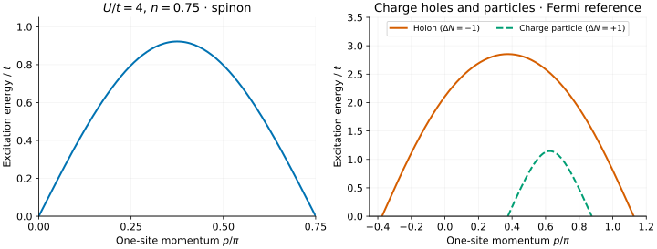
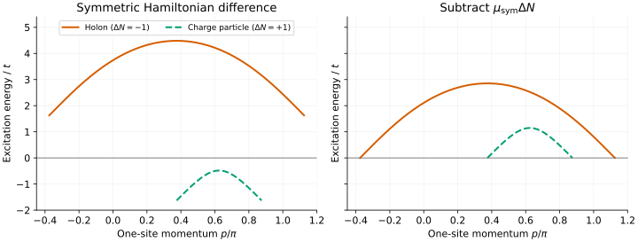

# Doping the Hubbard chain

At half filling we found gapless spinons but a charge gap. Now set
$`n=N/L=0.75`$, retaining $`U/t=4`$, $`t=1`$, zero field and zero temperature.
This tutorial shows the doped elementary branches and how to choose the
energy zero for an iMPS calculation of $`H-\mu N`$.

Start with the [half-filled tutorial](hubbard-half-filled.md) for Hamiltonian
normalization and the meaning of spinons and holons. This calculation uses
the same executable; there is no finite chain length to choose.

## 1. Solve at a fixed density

```sh
build/bethe-hubbard-dispersion --u 4 --density 0.75 --points 129 \
  --convention symmetric --reference fermi --csv hubbard-doped-symmetric.csv
```

The solver determines the occupied charge sea and chemical potential from
the requested density, then reuses that background for every point. It does
not assume that the half-filled chemical potential still applies.

For this example the metadata gives

```math
\mu_{\mathrm{unshifted}}\simeq0.370439775\,t,\qquad
\mu_{\mathrm{sym}}\simeq-1.629560225\,t.
```

These differ by U/2 as expected. If your iMPS calculation uses a chemical
potential to obtain this density, compare it with the value in the matching
Hamiltonian convention.

## 2. Read the three branches



[Open the full-size figure](figures/hubbard-doped-lines.svg).

All three branches have zero **Fermi-referenced** energy at their endpoints.
The momenta are unwrapped one-site momenta, in this frontend's fixed convention:

| Branch | $`\Delta N`$ | Spin | General interval $`p/\pi`$ | At n=0.75 |
| --- | ---: | ---: | --- | --- |
| `spinon` | 0 | 1/2 | $`[0,n]`$ | [0, 0.75] |
| `holon` | −1 | 0 | $`[-n/2,3n/2]`$ | [−0.375, 1.125] |
| `charge-particle` | +1 | 0 | $`[n/2,2-3n/2]`$ | [0.375, 0.875] |

The `charge-particle` adds a real charge root outside the occupied sea. It is
**not the half-filled antiholon**: different branches are selected by
`--branch all` at density one and below density one. The tool does not include
the doped gapped string branches.

Use the `p_over_pi` column, not `parameter`, for these plots. In particular,
the charge-particle's bare parameter jumps from π to −π in the middle of
its grid, while its dressed physical momentum and energy remain continuous.

## 3. Separate the two energy choices

`--convention` chooses the interaction; `--reference` chooses whether to
subtract the chemical-potential cost. They are independent options:

```math
\begin{aligned}
E_{\mathrm{Fermi}}&=\Delta E_{\mathrm{sym}}-\mu_{\mathrm{sym}}\Delta N,\\{}
&=\Delta E_{\mathrm{unshifted}}-\mu_{\mathrm{unshifted}}\Delta N.
\end{aligned}
```

Unlike at half filling, the symmetric Hamiltonian difference alone is **not**
Fermi-referenced. Its chemical potential is nonzero. The CSV includes both
`symmetric_energy` and `fermi_energy`, so we can plot that difference directly:



[Open the full-size energy-reference comparison](figures/hubbard-doped-reference.svg).

At the charge-particle endpoints, the symmetric Hamiltonian cost is
$`\mu_{\mathrm{sym}}`$, approximately −1.62956 t. At the holon endpoints it
is $`-\mu_{\mathrm{sym}}`$, approximately +1.62956 t. Subtracting
$`\mu_{\mathrm{sym}}\Delta N`$ brings **both** to zero. Spinons have
$`\Delta N=0`$ and are unchanged.

As a consistency check, export with the other interaction convention:

```sh
build/bethe-hubbard-dispersion --u 4 --density 0.75 --points 129 \
  --convention unshifted --reference fermi --csv hubbard-doped-unshifted.csv
```

Its `energy` values agree with the first export: a consistently
Fermi-referenced spectrum is convention-independent. The tutorial tests check
this point by point, not just at the endpoints.

## 4. Avoid misleading momentum comparisons

The holon grid extends beyond π. That is intentional: the branch has a
continuous unwrapped momentum coordinate. Keep it that way when first
comparing with the exported plot.

If your MPS code reports the phase of translation by a cell of length
$`\ell`$, the conversion is

```math
q_{\mathrm{cell}}=\ell p\pmod{2\pi}.
```

When plotting a folded curve, **split it where the folded coordinate wraps**;
do not connect a jump across the zone or sort distinct folded branches into
one line. Also check the domain-wall momentum gauge and choice of Fermi-point
spectators. A universal momentum offset cannot be inferred from the cell
length alone.

These lines supply elementary reference energies. They are not electron
spectral functions or complete multiparticle thresholds; matching quantum
numbers is essential before identifying an iMPS excitation with one of them.

## 5. Approach half filling with care

The limit from below is subtle. As $`n\to1^-`$, the background chemical
potential approaches the **lower edge** of the Mott plateau. At exactly
$`n=1`$, the half-filled tool chooses the plateau's **middle** instead.
Comparing two Fermi-referenced plots without accounting for this different
chemical potential can look like a discontinuity in the wrong quantity.

The real charge-particle interval also shrinks to a point:

```math
\frac{\Delta p_{\mathrm{particle}}}{\pi}=2(1-n)\longrightarrow0.
```

It does not turn into the gapped antiholon band. Use the half-filled frontend
mode for that branch, rather than extrapolating the doped particle curve.

## Reproduce and extend

Download the [symmetric](data/hubbard-doped-symmetric.csv) and
[unshifted](data/hubbard-doped-unshifted.csv) exports. Both use the Fermi reference.
The [shared Hubbard plotting script](../../scripts/plot_hubbard_tutorial.py)
reproduces this tutorial and the half-filled one:

```sh
# Use the Python environment set up in the half-filled tutorial.
build_codex/tutorial-venv/bin/python scripts/plot_hubbard_tutorial.py
python3 scripts/plot_hubbard_tutorial.py --check
python3 -m unittest discover -s scripts -p 'test_tutorial_hubbard.py'
```

The checks need no C++ build or Matplotlib. They verify branch labels,
momentum ranges, convergence, chemical-potential shifts and gapless endpoints.
The numerical exports retain their precision; conversion to Python float is
only for plotting and these fp64 example checks.

For your own U or density, inspect `Background status` and every row's `status`.
Do not plot empty failed-energy cells as zero. Weak coupling or extreme
densities can require larger mesh budgets or higher precision; see the
[doped solver guide](../hubbard-doped.md#accuracy-budgets-and-failure).

The background and dressed-energy equations follow
[Essler](../../CITATIONS.md#essler-2010); particle/hole branch conventions are
discussed by [Luo–Pu–Guan](../../CITATIONS.md#luo-pu-guan-2024).
The [reference guide](../hubbard-doped.md) fixes the precise momentum definitions.
