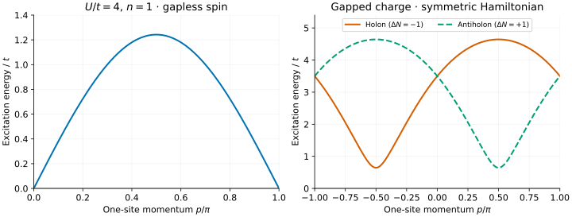
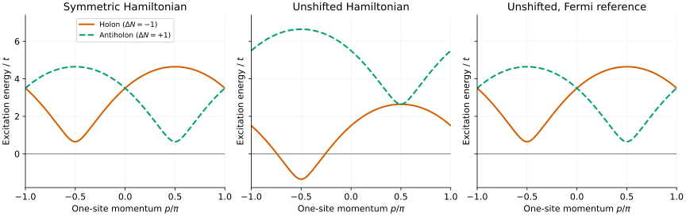

# Hubbard spinons, holons and energy conventions

An infinite, half-filled Hubbard chain is a useful reference for an iMPS
excitation calculation: its spin excitations are gapless, while its charge
excitations are gapped. This tutorial plots the elementary lines at
$`U/t=4`$, then shows exactly how the energies change between interaction
conventions. A [second tutorial](hubbard-doped.md) moves away from half filling.

The figures and CSVs are included. To generate your own, [build](../building.md)
`bethe-hubbard-dispersion`; no Python is needed to run the solver. The commands
below assume the executable is on `PATH`; see [running the programs](../building.md#run-the-programs).
All calculations here use default fp64.

## 1. Choose a Hamiltonian

We set hopping $`t=1`$, density $`n=N/L=1`$, zero field and zero temperature.
The default interaction is symmetric:

```math
H_{\mathrm{sym}}=-t\sum_{j,\sigma}
\left(c^\dagger_{j,\sigma}c_{j+1,\sigma}+\mathrm{h.c.}\right)
+U\sum_j\left(n_{j,\uparrow}-\frac12\right)
\left(n_{j,\downarrow}-\frac12\right).
```

This is the SO(4)-symmetric convention. The unshifted convention instead uses
$`U n_{j,\uparrow}n_{j,\downarrow}`$. They differ by a particle-number term
and a constant, so their eigenstates agree but **charge-changing excitation
energies do not**. We will keep that distinction visible in the plots.

## 2. Export the elementary lines

```sh
bethe-hubbard-dispersion --u 4 --density 1 --points 129 \
  --convention symmetric --reference hamiltonian --csv hubbard-half-symmetric.csv
```

The default `--branch all` writes three families into the `dispersion` table:

| Branch | Particle change $`\Delta N`$ | Spin | Exported momentum $`p/\pi`$ |
| --- | ---: | ---: | --- |
| `spinon` | 0 | 1/2 | [0, 1] |
| `holon` | −1 | 0 | [−1, 1] |
| `antiholon` | +1 | 0 | [−1, 1] |

Use `p_over_pi` on the horizontal axis and `energy` on the vertical axis.
The grid is uniform in **physical dressed momentum**, not the Bethe parameter.
Each branch has 129 points, including endpoints. The charge endpoints −π
and π represent the same Brillouin-zone point.



[Open the full-size figure](figures/hubbard-half-lines.svg).

The spinon energy vanishes at both ends and reaches about **1.242281 t** at
$`p=\pi/2`$. The charge branches have the same minimum, **0.643364 t**, at
$`p=-\pi/2`$ for the holon and $`p=+\pi/2`$ for the antiholon. Their momenta
at equal bare charge parameter differ by π modulo 2π.

Do not confuse a single-charge minimum with the full charge gap:

```math
\Delta_c=E_0(N+1)+E_0(N-1)-2E_0(N)
\simeq 1.286727\,t.
```

Here each symmetric charge minimum is $`\Delta_c/2`$. The value of
$`\Delta_c`$ is unchanged by switching interaction convention.

## 3. Understand the energy shifts

At fixed number of sites, the two Hamiltonians and their excitation energies obey

```math
\begin{aligned}
H_{\mathrm{sym}}&=H_{\mathrm{unshifted}}-\frac U2N+\frac U4L,\\{}
\Delta E_{\mathrm{unshifted}}&=\Delta E_{\mathrm{sym}}+\frac U2\Delta N.
\end{aligned}
```

For U=4, the spinon is unchanged, the holon shifts **down by 2**, and the
antiholon shifts **up by 2**. Export the second convention and a
chemical-potential-subtracted version:

```sh
bethe-hubbard-dispersion --u 4 --points 129 \
  --convention unshifted --reference hamiltonian --csv hubbard-half-unshifted.csv
bethe-hubbard-dispersion --u 4 --points 129 \
  --convention unshifted --reference fermi --csv hubbard-half-fermi.csv
```



[Open the full-size comparison](figures/hubbard-half-conventions.svg).

A negative unshifted holon energy is **not** a numerical failure or evidence
that the fixed-density ground state is unstable. Removing an electron also
removes its chemical-potential contribution. For a comparison with an MPS
calculation of $`H-\mu N`$, use

```math
E_{\mathrm{Fermi}}=\Delta E_H-\mu_H\Delta N.
```

At half filling, the tool chooses the **middle** of the Mott plateau:
$`\mu_{\mathrm{sym}}=0`$ and $`\mu_{\mathrm{unshifted}}=U/2`$. Consequently,
the first and third panels coincide, with a nonzero charge gap remaining.
The columns `symmetric_energy` and `fermi_energy` keep their respective meanings
regardless of the choice for `energy`.

## 4. Compare with an excitation ansatz

These are fractional elementary excitations, not isolated electron levels
on a finite ring. A single spinon or holon needs a compatible
domain-wall/topological excitation sector. A local electron changes both
charge and spin; its spectral function is not simply one of these curves.

For a useful comparison:

- Match hopping, U, particle change and spin before aligning curves.
- Match the Hamiltonian convention **and** whether μ has been subtracted.
- Match the momentum origin of the domain-wall construction. Enlarged cells
  fold one-site momenta; there is no universal additional gauge shift.
- Treat these as elementary lines, not guaranteed lowest energies in every
  sector. Multiparticle states can lie below an elementary line at the same
  total momentum. No intensity or spectral weight is plotted.

For neutral pairs, the separate [Hubbard continuum tool](../hubbard-continuum.md)
provides half-filled two-spinon bounds.

### An elementary line inside a continuum

[Osborne–McCulloch](../../CITATIONS.md#osborne-mcculloch-2025), Secs. III D and
IV B and Fig. 5, demonstrates this distinction at **U=5t**, half filling, with
the symmetric interaction. A chargon can overlap a chargon–two-spinon continuum
in the same charge and spin-projection sector. Energy minimization then favours
lower continuum states, not the elementary chargon.

Instead, the paper follows the chargon by minimizing its **excitation energy
variance**, using the previous momentum's optimized state to initialize the
next. For a normalized finite-system state, the underlying diagnostic is

```math
\sigma_H^2=\langle H^2\rangle-\langle H\rangle^2.
```

The infinite-MPS construction isolates the excitation contribution from the
background; do not directly subtract two divergent extensive expectations.
Small variance tests eigenstate quality, not whether an energy is the sector
minimum. Branch continuity and quantum numbers remain important.

To obtain Bethe reference lines at the paper's coupling:

```sh
bethe-hubbard-dispersion --u 5 --density 1 --points 129 \
  --convention symmetric --reference hamiltonian --csv hubbard-u5.csv
```

Align the domain-wall momentum origin and unit-cell convention before comparing
with Fig. 5; its quoted crossing momentum is not automatically our `p`.
This command supplies elementary energies, **not** MPS variances or the
three-particle continuum. The figures above remain U=4 examples, not a
reproduction of the paper's numerical MPS data.

## 5. Reproduce and check

Download the exports: [symmetric Hamiltonian](data/hubbard-half-symmetric.csv),
[unshifted Hamiltonian](data/hubbard-half-unshifted.csv), and
[unshifted with Fermi reference](data/hubbard-half-fermi.csv).

From the source checkout:

```sh
python3 -m venv .venv
. .venv/bin/activate
python3 -m pip install -r docs/tutorials/requirements.txt
python3 scripts/plot_hubbard_tutorial.py
# Optional: regenerate the data for both Hubbard tutorials before plotting.
python3 scripts/plot_hubbard_tutorial.py \
  --solver bethe-hubbard-dispersion
```

The [script](../../scripts/plot_hubbard_tutorial.py) uses exported columns for
every curve. It rejects failed runs, missing/non-finite energies, incomplete
momentum grids and unexpected conventions. Infinite **spin rapidities** at
the gapless endpoints are valid; infinite energies are not. Preserve the
leading and trailing `#` comments, which record provenance and run success.
`--check` validates the saved data without importing Matplotlib.

The [dispersion guide](../hubbard-dispersion.md) explains error estimates,
precision controls and numerical limits. The half-filled formulas are recorded
in [Essler–Korepin](../../CITATIONS.md#essler-korepin-1999); their interaction
parameter is our U/4. Run `bethe-hubbard-dispersion --references` for the full
tool bibliography.

Next: [dope the chain and follow its gapless charge branches](hubbard-doped.md).
