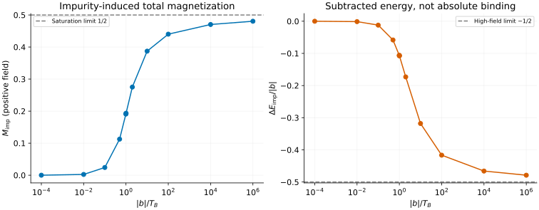

# Kondo response: subtract the host and calibrate the scale

[All tutorials](index.md) · [Model guide](../kondo.md) · [Central-spin tutorial](central-spin.md)

A lattice impurity calculation and a continuum Bethe-ansatz energy cannot
always be compared directly. This tutorial chooses a well-defined universal
quantity: the **change in impurity-induced energy under a uniform field**,
together with its conjugate magnetization.

## 1. Specify what is being subtracted

The frontend describes the isotropic, antiferromagnetic, single-channel,
spin-1/2 Kondo model at zero temperature in its scaling limit. The field acts
on the impurity **and host**, with equal g factors:

```math
H_{\mathrm{field}}=-b(S_{\mathrm{imp}}^z+S_{\mathrm{host}}^z).
```

b is the full Zeeman splitting in energy units. Define

```math
\begin{aligned}
E_{\mathrm{imp}}(b)&=E_{\mathrm{with\ impurity}}(b)-E_{\mathrm{clean\ host}}(b),\\{}
\Delta E_{\mathrm{imp}}(b)&=E_{\mathrm{imp}}(b)-E_{\mathrm{imp}}(0),\\{}
M_{\mathrm{imp}}&=-\frac{d\Delta E_{\mathrm{imp}}}{db}.
\end{aligned}
```

The two host calculations must use the same field and host convention.
The response includes the host magnetization change induced by the impurity;
it is not simply the local expectation $`\langle S_{\mathrm{imp}}^z\rangle`$.
The distinction and the limits of absolute-energy comparisons are discussed
by [Barcza et al.](../../CITATIONS.md#barcza-2020), Sec. VII.

```sh
bethe-kondo-response --field 2 --scale 1 --csv-table response=kondo.csv
```

This gives approximately $`\Delta E_{\mathrm{imp}}=-0.34629170`$ and
$`M_{\mathrm{imp}}=0.27516364`$. The command does not take a bare exchange,
bandwidth, chain length or boundary condition; it is not a finite-band solver.

## 2. Calibrate T_B before overlaying data

The positive `--scale` parameter is the energy $`T_B`$, not an unspecified
“Kondo temperature”. Its zero-field susceptibility fixes the convention:

```math
a_0=\frac1{\sqrt{2\pi e}},\qquad
\chi_0=\left.\frac{dM_{\mathrm{imp}}}{db}\right|_0=\frac{a_0}{T_B},
\qquad T_\chi=\frac1{4\chi_0},\qquad T_B=4a_0T_\chi.
```

Thus a susceptibility measured with the same field/host subtraction gives
$`T_B=a_0/\chi_0`$. For T_B=1 the native output is χ₀≈0.2419707245.
In the source paper's Eqs. (124)–(126), b=2B and T_B=2T₁. Missing either
factor of two changes the susceptibility or energy derivative.

For an MPS benchmark:

1. Compute the impurity-induced total response using a uniform field and a
   matching clean host, not just the impurity site's polarization.
2. Check finite-size/bond-dimension convergence and determine χ₀ in the same
   units. It calibrates T_B without an assumed bare-exchange conversion.
3. Plot against $`x=|b|/T_B`$ and compare the subtracted energy and response.

The scaling comparison requires both b and T_B to remain small relative to
the host bandwidth. The very large x values below illustrate the continuum
curve; they are not a promise that a chosen lattice bandwidth supports them.

## 3. Follow the crossover and slow saturation



All markers are native fp64 evaluations, including both sides of x=1.
The line segments connect them; no interpolation supplies additional solver
values. At small field,

```math
M_{\mathrm{imp}}=a_0\frac b{T_B}+O((b/T_B)^3),\qquad
\Delta E_{\mathrm{imp}}=-\frac{a_0b^2}{2T_B}+O(b^4/T_B^3).
```

At b=0 both observables are exactly zero, while χ₀ remains finite; that point
is included in the downloads but omitted from the logarithmic axes.
Magnetization is odd in b, whereas energy change is even.

The high-field approach is slow: even at x=10⁶ the magnetization is only
0.48054872, not 1/2. The energy ratio is about -0.47880412, approaching -1/2.
There is no finite-x saturation threshold in this universal curve.

The crossover x=1 is not a phase boundary. The implementation switches
between accelerated series and Fourier-integral representations; the latter
has a conditionally convergent tail at x=1. The
[numerical guide](../kondo.md#native-numerical-implementation) explains why
a naive finite-cutoff integral can be misleading there.

## 4. Check signs, units and numerical errors

The downloads include b=-2 and the scale-transformed point b=6, T_B=3:
the latter has the same x=2 and magnetization, three times the energy change,
and one third the zero-field susceptibility.

Centered finite differences around b=1 and 2 verify the **minus sign** in
$`M_{\mathrm{imp}}=-d\Delta E_{\mathrm{imp}}/db`$. This differs from the
central-spin tutorial's positive field term and derivative convention.

The exported `magnetization_error` is absolute in M; `scaled_energy_error`
is absolute in $`\Delta E_{\mathrm{imp}}/|b|`$, **not** in the physical energy
or in $`\Delta E_{\mathrm{imp}}/T_B`$. Away from zero field, multiply the latter
estimate by |b| to express it in energy units. These estimates are convergence
diagnostics, not rigorous interval enclosures.

Incomplete runs omit all physical observables and exit 2. Reject them rather
than plotting missing responses as zero. Native long-double and optional
MPLAPACK fp128 are available; neither changes the field convention or makes
this a finite-temperature, multichannel, anisotropic or finite-band calculation.

## 5. Reproduce and validate

The `response` exports use T_B=1 unless stated otherwise:

| Region | Native CSV files |
| --- | --- |
| Zero/low field | [0](data/kondo-b0-response.csv), [0.0001](data/kondo-b0.0001-response.csv), [0.01](data/kondo-b0.01-response.csv), [0.1](data/kondo-b0.1-response.csv), [0.5](data/kondo-b0.5-response.csv) |
| Crossover | [0.99](data/kondo-b0.99-response.csv), [1](data/kondo-b1-response.csv), [1.01](data/kondo-b1.01-response.csv), [2](data/kondo-b2-response.csv) |
| High field | [10](data/kondo-b10-response.csv), [100](data/kondo-b100-response.csv), [10000](data/kondo-b10000-response.csv), [1000000](data/kondo-b1000000-response.csv) |
| Symmetry/scaling | [b=-2](data/kondo-negative-response.csv), [b=6, T_B=3](data/kondo-scaled-response.csv) |
| Derivative at b=1 | [0.999](data/kondo-deriv1-minus-response.csv), [1.001](data/kondo-deriv1-plus-response.csv) |
| Derivative at b=2 | [1.999](data/kondo-deriv2-minus-response.csv), [2.001](data/kondo-deriv2-plus-response.csv) |

With the [plotting dependencies](requirements.txt), from the source checkout:

```sh
python3 scripts/plot_kondo_ladder_tutorial.py --check
python3 scripts/plot_kondo_ladder_tutorial.py
# Optional: regenerate this and the ladder tutorial from native tools.
python3 scripts/plot_kondo_ladder_tutorial.py --solver-dir /path/to/bethe/bin
python3 -m unittest discover -s scripts -p 'test_tutorial_kondo_ladder.py'
# Optional independent Kondo oracle; requires mpmath.
python3 scripts/reference_kondo.py --digits 25 --points 0.5 1 2
```

The [plotting script](../../scripts/plot_kondo_ladder_tutorial.py) retains native
provenance and validates units, convergence and response bounds. The
[tests](../../scripts/test_tutorial_kondo_ladder.py) compare independent
high-precision references, energy derivatives, field reversal, scale covariance
and low/high-field limits. The separate mpmath oracle agrees across its series
and integral representations at x=1; it is not used to generate the plotted
native data.
