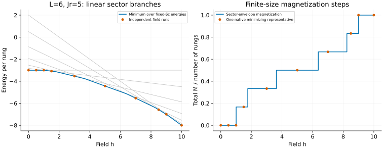

# Integrable ladder: reconstruct a finite-size magnetization curve

[All tutorials](index.md) · [Model guide](../ladder.md) · [SU(3)/ULS tutorial](su3-uls.md)

This example uses fixed-magnetization energies to build a field-dependent
ground-state envelope. It also explains why a ladder's physical singlet/triplet
populations are not always the highest-weight labels of its Bethe roots.

## 1. Include the required four-spin interaction

This is [Wang's integrable ladder](../../CITATIONS.md#wang-1999), not the
ordinary two-leg Heisenberg ladder. There are L rungs, each with two spin-1/2
operators S and T:

```math
\begin{aligned}
H={}&\sum_j\left[\mathbf S_j\cdot\mathbf S_{j+1}+\mathbf T_j\cdot\mathbf T_{j+1}
+4(\mathbf S_j\cdot\mathbf S_{j+1})(\mathbf T_j\cdot\mathbf T_{j+1})\right]\\{}
&+J_r\sum_j\mathbf S_j\cdot\mathbf T_j-h\sum_j(S_j^z+T_j^z).
\end{aligned}
```

The coefficients 1,1,4 are fixed. The field has the usual negative Zeeman
sign, and translation is by **one rung**, not one spin. Periodic L=2 counts
the closing bond separately. Arbitrary four-spin coefficients and open ends
are not implemented.

A rung has one singlet s and three triplets t+,t0,t-. Its leg interaction
equals a four-color permutation minus 1/4, so

```math
E=E_{\mathrm{perm}}-\frac L4+J_r\left(\frac L4-N_s\right)-hM,
\qquad M=N_{t+}-N_{t-}.
```

The energy constants matter when comparing an MPO to the solver. M is total
magnetization, not M/L. The paper's permutation convention uses J_r=2J;
our guide restores the physical ladder constants above.

## 2. Obtain one energy per total-Sz sector

Choose six rungs and J_r=5. For example, the M=2 calculation is

```sh
build/bethe-ladder-pbc 6 --rung 5 --sz 2 \
  --csv-table states=ladder-m2.csv \
  --csv-table representations=ladder-representations.csv \
  --csv-table roots=ladder-roots.csv
```

It minimizes the singlet count and triplet populations compatible with M=2,
giving N_s=4 and energy -15.23606798. Repeating for M=0,…,6 yields:

| M | Minimizing N_s | E at h=0 |
| ---: | ---: | ---: |
| 0 | 6 | -18 |
| 1 | 5 | -17 |
| 2 | 4 | -15.23606798 |
| 3 | 3 | -11.60555128 |
| 4 | 2 | -5.23606798 |
| 5 | 1 | 3 |
| 6 | 0 | 12 |

At fixed M, h only adds -hM: it does not change the minimizing roots or N_s.
Negative-M zero-field energies follow by spin reversal. These are minima of
Sz sectors, not prescribed total-spin S and not excited-state enumeration.

## 3. Take the minimum of the linear branches

For positive h, construct

```math
E_{\mathrm{ground}}(h)=\min_{M=0,\ldots,L}\{E_M(0)-hM\}.
```



The grey lines use the seven native zero-field energies; the blue curve is
their minimum. Orange markers are **separate native field calculations**
without `--sz`, for example:

```sh
build/bethe-ladder-pbc 6 --rung 5 --field 3
```

At h=3 this returns M=2 and E=-21.23606798. The second panel divides total M
by L. For these data every M appears; in general, some finite-size sectors
can be skipped by the lower envelope and must not be forced into a staircase.

Adjacent crossings here occur at h approximately 1, 1.76393202, 3.63051670,
6.36948330, 8.23606798 and 9. Exactly at a crossing the magnetization is not
unique. At h=9 the native analytic path returns M=6, while the plotting
envelope's tie rule selects M=5; both have E=-42. This is a choice of degenerate
representative, not a disagreement or a thermal average.

The all-singlet product has $`E_s=3L(1-J_r)/4`$. It is a ground state whenever
J_r-|h|≥4; the fully polarized triplet product is a ground state when
|h|≥4+max(J_r,0). These sufficient bounds explain the outer parts of this
example, not every finite-ring transition in every parameter regime.

The minimum one-triplet cost above the singlet product is

```math
\Delta E_{1t}=J_r-|h|-4\sin^2\left(\frac{\pi\lfloor L/2\rfloor}{L}\right).
```

At J_r=5,h=0 this gives 1 for L=6 but approximately 1.38196601 for L=5.
The odd ring cannot put the triplet exactly at momentum π. Both cases are
included as native finite-size checks; there is no thermodynamic extrapolation
hidden in the field plot.

## 4. Do not identify physical populations with root labels

Now change to J_r=0 and constrain four singlet rungs:

```sh
build/bethe-ladder-pbc 6 --rung 0 --singlets 4 --roots
```

The report distinguishes two vectors:

| Meaning | Four entries |
| --- | --- |
| Physical populations (s,t+,t0,t-) | (4,1,1,0) |
| SU(4) highest-weight rows | (4,2,0,0) |

The physical state is a **descendant** of the latter multiplet. Its permutation
energy is $`1-\sqrt5`$ and physical ladder energy is
$`-1/2-\sqrt5\simeq-2.73606798`$. Solving only the packed sea of the physical
population's own highest weight would instead give permutation energy -1,
missing the lower state. The frontend compares compatible highest weights.

Only the highest-weight representative's finite roots are exported. Lowering
operators change populations without changing that permutation energy;
the program does not fabricate finite roots for the descendant.

At zero field the displayed triplets are a balanced representative with M=1,
not a unique magnetization. An arbitrarily small positive field selects M=2
inside this multiplet: at h=0.125 the populations are (4,2,0,0), and the energy
drops by 0.25, **not** 0.125. Negative h swaps t+ and t-. The saved examples
also shift J_r from 0 to 1 at fixed N_s=4, lowering E by 2.5 without changing
the representative roots.

This matters for symmetry-aware MPS comparisons: match physical M and N_s,
use rung momentum, and keep the highest-weight label separate. An incomplete
scan reports a candidate upper bound, not a completed sector minimum.
Convergence of this real-sea ground-state construction is not a general
completeness theorem for all nested Bethe eigenstates.

## 5. Reproduce and validate

Each calculation has three native tables:

| Fixed M, J_r=5,h=0 | State | Representations | Roots |
| ---: | --- | --- | --- |
| 0 | [CSV](data/ladder-m0-states.csv) | [CSV](data/ladder-m0-representations.csv) | [CSV](data/ladder-m0-roots.csv) |
| 1 | [CSV](data/ladder-m1-states.csv) | [CSV](data/ladder-m1-representations.csv) | [CSV](data/ladder-m1-roots.csv) |
| 2 | [CSV](data/ladder-m2-states.csv) | [CSV](data/ladder-m2-representations.csv) | [CSV](data/ladder-m2-roots.csv) |
| 3 | [CSV](data/ladder-m3-states.csv) | [CSV](data/ladder-m3-representations.csv) | [CSV](data/ladder-m3-roots.csv) |
| 4 | [CSV](data/ladder-m4-states.csv) | [CSV](data/ladder-m4-representations.csv) | [CSV](data/ladder-m4-roots.csv) |
| 5 | [CSV](data/ladder-m5-states.csv) | [CSV](data/ladder-m5-representations.csv) | [CSV](data/ladder-m5-roots.csv) |
| 6 | [CSV](data/ladder-m6-states.csv) | [CSV](data/ladder-m6-representations.csv) | [CSV](data/ladder-m6-roots.csv) |

| Unconstrained h, J_r=5 | State | Representations | Roots |
| ---: | --- | --- | --- |
| 0 | [CSV](data/ladder-h0-states.csv) | [CSV](data/ladder-h0-representations.csv) | [CSV](data/ladder-h0-roots.csv) |
| 0.5 | [CSV](data/ladder-h0.5-states.csv) | [CSV](data/ladder-h0.5-representations.csv) | [CSV](data/ladder-h0.5-roots.csv) |
| 1 | [CSV](data/ladder-h1-states.csv) | [CSV](data/ladder-h1-representations.csv) | [CSV](data/ladder-h1-roots.csv) |
| 1.5 | [CSV](data/ladder-h1.5-states.csv) | [CSV](data/ladder-h1.5-representations.csv) | [CSV](data/ladder-h1.5-roots.csv) |
| 3 | [CSV](data/ladder-h3-states.csv) | [CSV](data/ladder-h3-representations.csv) | [CSV](data/ladder-h3-roots.csv) |
| 5 | [CSV](data/ladder-h5-states.csv) | [CSV](data/ladder-h5-representations.csv) | [CSV](data/ladder-h5-roots.csv) |
| 7 | [CSV](data/ladder-h7-states.csv) | [CSV](data/ladder-h7-representations.csv) | [CSV](data/ladder-h7-roots.csv) |
| 8.5 | [CSV](data/ladder-h8.5-states.csv) | [CSV](data/ladder-h8.5-representations.csv) | [CSV](data/ladder-h8.5-roots.csv) |
| 9 | [CSV](data/ladder-h9-states.csv) | [CSV](data/ladder-h9-representations.csv) | [CSV](data/ladder-h9-roots.csv) |
| 10 | [CSV](data/ladder-h10-states.csv) | [CSV](data/ladder-h10-representations.csv) | [CSV](data/ladder-h10-roots.csv) |

| Additional check | State | Representations | Roots |
| --- | --- | --- | --- |
| Descendant at zero field | [CSV](data/ladder-descendant-states.csv) | [CSV](data/ladder-descendant-representations.csv) | [CSV](data/ladder-descendant-roots.csv) |
| Positive field within multiplet | [CSV](data/ladder-desc-plus-states.csv) | [CSV](data/ladder-desc-plus-representations.csv) | [CSV](data/ladder-desc-plus-roots.csv) |
| Negative field within multiplet | [CSV](data/ladder-desc-minus-states.csv) | [CSV](data/ladder-desc-minus-representations.csv) | [CSV](data/ladder-desc-minus-roots.csv) |
| Shift J_r at fixed N_s | [CSV](data/ladder-desc-rung-states.csv) | [CSV](data/ladder-desc-rung-representations.csv) | [CSV](data/ladder-desc-rung-roots.csv) |
| Fixed M=2, h=3 | [CSV](data/ladder-fixed-field-states.csv) | [CSV](data/ladder-fixed-field-representations.csv) | [CSV](data/ladder-fixed-field-roots.csv) |
| Reversed field and M | [CSV](data/ladder-reversed-states.csv) | [CSV](data/ladder-reversed-representations.csv) | [CSV](data/ladder-reversed-roots.csv) |
| Two-rung closing bonds | [CSV](data/ladder-two-states.csv) | [CSV](data/ladder-two-representations.csv) | [CSV](data/ladder-two-roots.csv) |
| Four-rung SU(4) singlet | [CSV](data/ladder-four-states.csv) | [CSV](data/ladder-four-representations.csv) | [CSV](data/ladder-four-roots.csv) |
| Even one-triplet ring | [CSV](data/ladder-triplet-even-states.csv) | [CSV](data/ladder-triplet-even-representations.csv) | [CSV](data/ladder-triplet-even-roots.csv) |
| Odd one-triplet ring | [CSV](data/ladder-triplet-odd-states.csv) | [CSV](data/ladder-triplet-odd-representations.csv) | [CSV](data/ladder-triplet-odd-roots.csv) |

With the [plotting dependencies](requirements.txt), from the repository root:

```sh
python3 scripts/plot_kondo_ladder_tutorial.py --check
python3 scripts/plot_kondo_ladder_tutorial.py
# Optional: regenerate this and the Kondo tutorial.
python3 scripts/plot_kondo_ladder_tutorial.py --solver-dir build
# Optional independent permutation matrices; requires NumPy.
OPENBLAS_NUM_THREADS=1 python3 scripts/plot_kondo_ladder_tutorial.py --check --oracle
python3 -m unittest discover -s scripts -p 'test_tutorial_kondo_ladder.py'
```

The [script](../../scripts/plot_kondo_ladder_tutorial.py) checks representation
joins, dominance, nested roots/labels, every logarithmic equation, rung momentum
and energy reconstruction. Its optional oracle minimizes independent color-word
Hamiltonians over **all** allowed physical populations for every saved case.
[Tests](../../scripts/test_tutorial_kondo_ladder.py) cover the field envelope,
crossing ties, descendants, exact products and corrupted tables. Native
long-double and optional MPLAPACK fp128 retain the same conventions and scan scope.
