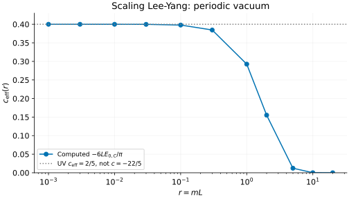
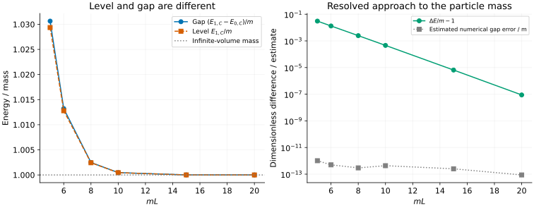

# Scaling Lee–Yang: a negative central charge and a positive particle gap

[All tutorials](index.md) · [Model and numerical guide](../lee-yang.md) ·
[Sine-Gordon comparison](sine-gordon.md)

The scaling Lee–Yang model is a particularly clean nonunitary example: it has
one massive particle, yet its ultraviolet conformal theory has **negative**
central charge. Here we calculate the periodic vacuum energy across scales,
then follow a selected one-particle gap toward its infinite-volume mass.

These are continuum field-theory calculations. The tools do not construct a
finite non-Hermitian spin chain, compute left/right eigenvectors, or measure
matrix elements. Real energies in this example do not imply a unitary theory.

## 1. Which energy does the vacuum tool return?

Use particle mass m=1, circumference L and velocity=1:

```sh
bethe-lee-yang-vacuum --mass 1 --length 0.1 \
  --csv-table vacuum=ly-vacuum.csv
```

The useful dimensionless variable is $`r=mL`$. The output separates the
bulk-subtracted energy and its scaling function,

```math
E_{0,C}=E_0-L e_{\mathrm{bulk}},\qquad
Y(r)=LE_{0,C},\qquad c_{\mathrm{eff}}(r)=-\frac{6Y(r)}{\pi}.
```

The tool does not supply an absolute bulk energy density. At r=0.1, it returns
$`Y\simeq-0.20835016`$ and $`c_{\mathrm{eff}}\simeq0.39791949`$.
Since L=0.1 here, the energy itself is approximately -2.08350158, not -0.20835.
The columns `casimir_energy` and `scaling_function` deliberately keep these
quantities separate.

## 2. Why does the plot approach +0.4 instead of -4.4?



The ultraviolet CFT is $`M(2,5)`$, with central charge $`c=-22/5`$ and lowest
left/right conformal weight $`h_{\min}=\bar h_{\min}=-1/5`$. On a periodic
circle, the lowest energy samples that **negative-weight sector**, not the
identity sector:

```math
E_{0,C}\sim\frac{2\pi}{L}\left(2h_{\min}-\frac{c}{12}\right)
=-\frac{\pi c_{\mathrm{eff}}^{\mathrm{UV}}}{6L},\qquad
c_{\mathrm{eff}}^{\mathrm{UV}}=c-24h_{\min}=\frac25.
```

Thus the positive coefficient extracted from the lowest energy is the
**effective** central charge. To recover c, one also needs the conformal-sector
information: $`c=2/5+24(-1/5)=-22/5`$. Neither the sign of the vacuum energy nor
a fit to its coefficient alone determines c. The finite-r curve is a computed
scaling diagnostic, not a central charge at every circumference.

The model and finite-volume conventions are developed by
[Bajnok–el Deeb–Pearce](../../CITATIONS.md#bajnok-el-deeb-pearce-2015), especially
Eqs. (151)–(152), (212) and (218). In the small-r limit,
$`Y\to-\pi/15`$; at large r, the bulk-subtracted vacuum energy tends to zero.
The markers are eleven separately converged TBA solves, not values from an
interpolation formula. At r=0.001 the effective charge is within
$`3\times10^{-7}`$ of 0.4; that remaining finite-r difference is not solver noise.

## 3. Follow one massive excitation

The excited-state tool is a separate TBA calculation with quantized sources.
For now it supports one **zero-momentum** regular branch at $`5\le mL\le30`$:

```sh
bethe-lee-yang-excited --mass 1 --length 5 \
  --csv-table levels=ly-levels.csv --csv-table source=ly-source.csv \
  --csv-table gap=ly-gap.csv
```

The `levels` table contains the vacuum and one-particle Casimir energies. The
quantity to compare with an excitation calculation is instead

```math
\Delta E=E_{1,C}-E_{0,C},\qquad \Delta E/m\longrightarrow1
\quad\text{as }mL\longrightarrow\infty.
```

At m=1, L=5, the vacuum Casimir energy is about -0.0012816882 and the
one-particle Casimir energy is 1.0293562331. Their difference is **1.0306379213**.
Replacing the gap by the excited row would lose a visible vacuum correction.



The right panel separates the physical finite-size correction from the
estimated numerical error. At mL=20 the gap is still above m by roughly
$`8.8\times10^{-8}m`$, while the exported error estimate is about
$`8.7\times10^{-14}m`$. The estimate is not a rigorous interval bound, but these
scales are well separated. Connecting lines merely guide the eye; no
exponential fit or extrapolated mass is needed for this comparison.

[Dorey–Tateo](../../CITATIONS.md#dorey-tateo-1996), Eqs. (2.3)–(2.7), derive the
excited-state source construction by analytic continuation. Our implementation
uses its regular infrared branch. The source table reports the imaginary
source coordinate $`\beta`$, its displacement from $`\pi/6`$, and its
quantization diagnostics. This beta is **not** sine-Gordon's coupling.

Do not continue the plotted curve toward the UV by ignoring the tool's domain
check. The source configuration changes at smaller volume; the current solver
does not implement that continuation. The vacuum UV calculation above is
supported independently. Nor does changing a parameter in the source-free
vacuum equation generate an excited level.

## 4. Match a non-Hermitian MPS calculation

The first figure is a finite-size energy benchmark, and the second a gap
benchmark. For a lattice realization approaching this scaling theory:

- Identify the periodic sector and the lowest conformal weight before extracting
  c from finite-size energies. The coefficient alone gives an effective value.
- Match the physical mass, velocity and circumference. The exported theory uses
  velocity=1; a lattice energy scale and correlation length must be converted
  consistently before identifying r.
- Subtract the same ground-state energy when forming a gap. A fitted bulk
  energy density cancels between levels, but the finite-size vacuum term does not.
- Treat lattice corrections, finite-bond-dimension errors and TBA numerical
  estimates as separate sources of discrepancy. These energy tools supply no
  biorthogonal spectral weights or ordinary positive-norm interpretation.

A simple units test is m=2, L=1/2 versus m=1, L=1: r is unchanged, Y is
unchanged, and the Casimir energy doubles. Likewise, the one-particle gap at
m=2, L=2.5 is twice that at m=1, L=5. Saved exports check both transformations.
The frontends support fp64, native long-double and optional MPLAPACK fp128;
the tutorial uses fp64 throughout.

## 5. Reproduce and validate

Download the vacuum scans:
[0.001](data/ly-vacuum-l0.001-vacuum.csv),
[0.003](data/ly-vacuum-l0.003-vacuum.csv),
[0.01](data/ly-vacuum-l0.01-vacuum.csv),
[0.03](data/ly-vacuum-l0.03-vacuum.csv),
[0.1](data/ly-vacuum-l0.1-vacuum.csv),
[0.3](data/ly-vacuum-l0.3-vacuum.csv),
[1](data/ly-vacuum-l1-vacuum.csv), [2](data/ly-vacuum-l2-vacuum.csv),
[5](data/ly-vacuum-l5-vacuum.csv), [10](data/ly-vacuum-l10-vacuum.csv),
[20](data/ly-vacuum-l20-vacuum.csv), and the
[m=2, L=1/2 units check](data/ly-vacuum-scaled-vacuum.csv).

| mL (m=1) | Levels | Source | Gap |
| ---: | --- | --- | --- |
| 5 | [CSV](data/ly-excited-l5-levels.csv) | [CSV](data/ly-excited-l5-source.csv) | [CSV](data/ly-excited-l5-gap.csv) |
| 6 | [CSV](data/ly-excited-l6-levels.csv) | [CSV](data/ly-excited-l6-source.csv) | [CSV](data/ly-excited-l6-gap.csv) |
| 8 | [CSV](data/ly-excited-l8-levels.csv) | [CSV](data/ly-excited-l8-source.csv) | [CSV](data/ly-excited-l8-gap.csv) |
| 10 | [CSV](data/ly-excited-l10-levels.csv) | [CSV](data/ly-excited-l10-source.csv) | [CSV](data/ly-excited-l10-gap.csv) |
| 15 | [CSV](data/ly-excited-l15-levels.csv) | [CSV](data/ly-excited-l15-source.csv) | [CSV](data/ly-excited-l15-gap.csv) |
| 20 | [CSV](data/ly-excited-l20-levels.csv) | [CSV](data/ly-excited-l20-source.csv) | [CSV](data/ly-excited-l20-gap.csv) |

The rescaled one-particle example also has separate
[levels](data/ly-excited-scaled-levels.csv), [source](data/ly-excited-scaled-source.csv)
and [gap](data/ly-excited-scaled-gap.csv) tables.

From the source checkout, with the [plotting dependencies](requirements.txt):

```sh
python3 scripts/plot_field_theory_tutorial.py --check
python3 scripts/plot_field_theory_tutorial.py
# Optional: regenerate both field-theory tutorials using native executables.
python3 scripts/plot_field_theory_tutorial.py --solver-dir /path/to/bethe/bin
python3 -m unittest discover -s scripts -p 'test_tutorial_field_theory.py'
```

The shared [script](../../scripts/plot_field_theory_tutorial.py) preserves the
individual runs' metadata, joins levels/source/gap from the same invocation,
checks convergence and refinement diagnostics, and reconstructs the gap to
catch energy-reference mistakes. Missing observables, non-finite values and
failed statuses are rejected. The [tests](../../scripts/test_tutorial_field_theory.py)
check UV/IR behaviour, mass scaling, a value from the independent vacuum oracle,
and corrupted exports. The [reference guide](../lee-yang.md#reproducible-independent-oracle)
describes the independent quadrature and the meaning of each error estimate.
