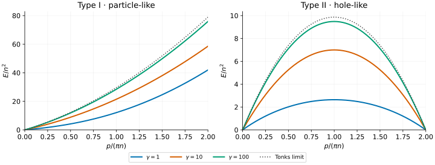
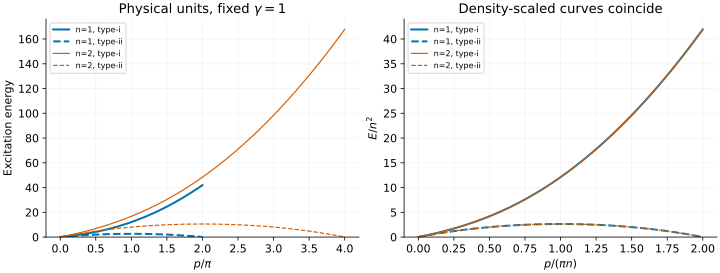

# Lieb–Liniger: particle and hole branches

What happens to the excitation spectrum of a one-dimensional Bose gas as
repulsion increases? This tutorial plots the two Lieb branches, then changes
the density to show which parts of a comparison are physics and which are
units. The results are useful benchmarks for continuum MPS calculations or
for a lattice discretization approaching the continuum limit.

We use the zero-temperature, repulsive gas on an infinite line. The
[reference guide](../lieb-liniger-thermo.md) gives the integral equations;
the [finite-ring guide](../lieb-liniger.md) covers individual finite-size states.

## 1. Fix the units before choosing a coupling

The Hamiltonian and dimensionless interaction are

```math
H=-\sum_j\partial_{x_j}^2+2c\sum_{i\lt j}\delta(x_i-x_j),
\qquad n=N/L,\qquad \gamma=c/n,\qquad c\gt0.
```

Here $`\hbar=2m=1`$. The number supplied to `--c` is **not** the dimensionless
interaction unless the density is one. Momentum has units of inverse length
and energy of inverse length squared. There is no lattice Brillouin zone.

For a build containing `bethe-lieb-liniger-dispersion`, start with:

```sh
bethe-lieb-liniger-dispersion --c 1 --density 1 --points 129
bethe-lieb-liniger-dispersion --c 1 --density 1 --points 129 \
  --precision fp64 --format csv > ll-c1-n1.csv
```

The CSV includes the background solution, numerical status and provenance as
comments. Its `energy` column contains **fixed-particle-number excitation gaps**,
not total energies and not particle-addition energies. Do not add a chemical
potential to these curves.

## 2. Two ways to excite the Bethe sea



The coloured curves are solver exports at $`n=1`$:
[c = 1](data/ll-c1-n1.csv), [c = 10](data/ll-c10-n1.csv) and
[c = 100](data/ll-c100-n1.csv).

- **Type I:** move a particle from the right edge of the occupied rapidity sea
  to a rapidity outside it. The physical momentum starts at zero and is
  unbounded. The right edge of this plot is only a plotting cutoff.
- **Type II:** make a hole inside the sea and put the particle at the right
  edge. Its momentum runs from zero to $`2\pi n`$, with a maximum energy at
  $`\pi n`$ and zero energy at both endpoints.

Both processes keep $`N`$ fixed. “Particle” and “hole” describe rearrangements
of Bethe rapidities, not a change of bosonic statistics. The exported
`rapidity` is also not the physical momentum `p`.

The dotted curves are explicitly **analytic limiting references**, not extra
solver data. In the impenetrable, or Tonks–Girardeau, limit:

```math
E_{\mathrm I}(p)=p(2\pi n+p),\qquad
E_{\mathrm{II}}(p)=p(2\pi n-p).
```

The finite-coupling curves approach these limits as $`\gamma`$ grows; even
$`\gamma=100`$ is not the limit itself. At smaller coupling the type-II
branch lies much lower, making it a particularly useful test of an excitation
calculation beyond a simple particle-like approximation.

To extend only the type-I grid, choose a larger physical momentum cutoff:

```sh
bethe-lieb-liniger-dispersion --c 1 --density 1 --p-max 12 --points 257
```

### Why is there a second zero without momentum periodicity?

On a ring, boosting every particle by $`2\pi/L`$ gives a total momentum
$`2\pi n`$ but an energy cost $`4\pi^2 n/L`$ above the zero-momentum ground
state. That cost vanishes in the thermodynamic limit. This explains the second
type-II zero; it does **not** identify momenta modulo $`2\pi n`$ or make the
unbounded type-I branch periodic.

## 3. Double the density without changing the dimensionless problem

Compare $`(c,n)=(1,1)`$ with $`(2,2)`$. Both have $`\gamma=1`$.

```sh
bethe-lieb-liniger-dispersion --c 2 --density 2 --points 129 \
  --precision fp64 --format csv > ll-c2-n2.csv
```



The left panel uses physical units; the right plots the same data using
$`p/(\pi n)`$ and $`E/n^2`$. Both branches collapse. Download the
[second-density export](data/ll-c2-n2.csv) to check this directly.

At fixed $`\gamma`$, the scaling rules are:

| Exported quantity | Density dependence |
| --- | --- |
| Momentum and Fermi rapidity | $`n`$ |
| Excitation energy and chemical potential | $`n^2`$ |
| Ground energy **per length** | $`n^3`$ |

Confusing energy per length with energy per particle introduces an extra
factor of density. The tutorial tests check all three powers, not only the
visual collapse.

## 4. Comparing with an excitation ansatz

Match the kinetic-energy coefficient, density and $`c/n`$ first. For a lattice
approximation, convert lattice momentum and energy using the lattice spacing
before taking a continuum limit. A finite-spacing lattice dispersion is not
expected to match an unbounded continuum curve at arbitrary momentum.

These lines supply energies, **not spectral weights**. This figure does not
shade or enumerate a complete multiparticle continuum. A visible numerical
branch and a strong peak in a particular correlation function are different
claims.

Check the background and each row's status before plotting. A failed mesh or
momentum inversion is not a zero-energy excitation. The default fp64 data are
adequate for these examples; `--precision long-double` and `--precision fp128`
are available when supported by the build. Very small $`\gamma`$ may require
larger numerical meshes as well as additional precision.

## 5. Reproduce the figures

Install the optional plotting dependencies as in the
[first tutorial](xxz-spinons.md#5-reproduce-the-figures), then run:

```sh
python3 scripts/plot_lieb_liniger_tutorial.py
# Regenerate the four exports with your chosen executable as well:
python3 scripts/plot_lieb_liniger_tutorial.py \
  --solver bethe-lieb-liniger-dispersion
python3 scripts/plot_lieb_liniger_tutorial.py --check
python3 -m unittest discover -s scripts -p 'test_tutorial_lieb_liniger.py'
```

The script validates schemas, conventions, convergence and momentum grids.
The tests also check type-II reflection symmetry, the approach to the Tonks
limit and density scaling. Plotting reads the saved frontend exports; only
the labelled Tonks reference curves use analytic formulas.

## Further reading

The original [Lieb–Liniger ground-state paper](../../CITATIONS.md#lieb-liniger-1963)
and [Lieb's excitation paper](../../CITATIONS.md#lieb-1963-excitations) introduce
the model and its two branches. Jean-Sébastien Caux's
[integrability.org notes](https://integrability.org/g_l.html) offer a useful
pedagogical continuation. Our [reference guide](../lieb-liniger-thermo.md)
documents the numerical conventions and supported scope.
