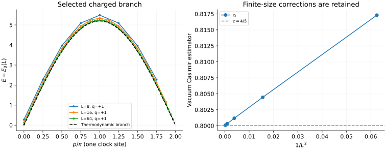

# Three-state Potts: charged levels and finite-size CFT

[All tutorials](index.md) · [Model guide](../potts.md) · [Non-Hermitian XXZ tutorial](xxz-nonhermitian.md)

The critical Potts chain provides a discrete-symmetry benchmark for MPS:
resolve a Z₃ charge, follow an excitation around the Brillouin zone, and
compare finite-ring gaps with conformal scaling. This tutorial uses native
finite-size Bethe solutions, not CFT formulas substituted for numerical data.

## 1. Match the clock Hamiltonian

On L periodic three-state sites, our normalization is

```math
H=-\sum_{j=1}^{L}\left(X_j+X_j^\dagger+
Z_jZ_{j+1}^\dagger+Z_j^\dagger Z_{j+1}\right),\qquad Z_{L+1}=Z_1,
```

where $`X|a\rangle=|a+1\pmod3\rangle`$ and
$`Z|a\rangle=e^{2\pi ia/3}|a\rangle`$. Both the exchange and critical field
are one. The two oriented bonds are both retained for L=2.

```sh
bethe-potts-pbc 16 --csv-table levels=potts-l16.csv
```

The output contains the neutral vacuum and a **selected charged one-hole
family**, with charges q=+1,-1 and momenta $`p=2\pi k/L`$. Charge means the
eigenvalue $`e^{2\pi iq/3}`$ of the global clock rotation, not a spin projection.
L is the number of **clock sites**; momentum uses translation by one clock site.

This is the critical ferromagnetic model discussed by
[Dasmahapatra et al.](../../CITATIONS.md#dasmahapatra-kedem-mccoy-melzer-1994),
with their energy normalization multiplied by $`\sqrt3/2`$. The exact bulk
energy density and velocity in our units are

```math
e_\infty=-\frac43-\frac{2\sqrt3}{\pi},\qquad v=\frac{3\sqrt3}{2}.
```

Do not reuse the velocity of a differently normalized Potts or Pauli Hamiltonian.

## 2. Plot the selected charged branch



The left panel plots q=+1; q=-1 lies exactly on top of it. Every gap subtracts
the **same-length** independently solved vacuum, not the extensive estimate
$`Le_\infty`$. The dashed curve is the thermodynamic limit

```math
\epsilon(p)=3\sqrt3\sin(p/2),\qquad 0\le p\le2\pi.
```

It is a reference curve, not a fit to the finite-size data. In particular,
the finite ring has a positive charged gap at k=0, whereas the limiting
branch is gapless. The sampled momenta stop at k=L-1: k=L would duplicate k=0.

Two different symmetries are visible:

- Charge conjugation pairs q=+1 with q=-1 at the **same k**.
- Reflection pairs k with L-k within a given charge.

At even L, k=L/2 is its own reflection partner. There are still two charge
rows there, not four. The export has **2L+1 rows**, including the vacuum,
not the full $`3^L`$-dimensional spectrum.

To calculate only the first charged momentum of one charge:

```sh
bethe-potts-pbc 64 --branch charged --charge 1 --momentum-index 1 \
  --csv-table levels=potts-first-descendant.csv
```

The vacuum is still solved for subtraction even though its row is not shown.
No spectral weights are supplied: an energy line alone does not tell us how
strongly a local clock operator couples to it.

## 3. Extract finite-size estimators, not exact finite-size dimensions

The right panel uses the vacuum energy:

```math
c_L=-\frac{6L(E_0-Le_\infty)}{\pi v},\qquad
x_L=\frac{L(E-E_0)}{2\pi v}.
```

The first estimator approaches c=4/5. The charged k=0 level approaches
x=2/15; k=1 and L-1 approach the first descendants, x=17/15.

| L | Vacuum $`c_L`$ | Charged k=0 $`x_L`$ | Charged k=1 $`x_L`$ |
| ---: | ---: | ---: | ---: |
| 8 | 0.80445927 | 0.13508379 | 1.11427066 |
| 16 | 0.80117268 | 0.13417582 | 1.13057791 |
| 32 | 0.80031294 | 0.13377638 | 1.13382789 |
| 64 | 0.80008476 | 0.13357746 | 1.13414224 |
| Limit | 0.8 | 0.13333333 | 1.13333333 |

Finite-size corrections need not approach their limit monotonically: the
k=1 values already illustrate that. Plotting against $`1/L^2`$ is a useful
display, not a claim that a single quadratic correction fits every level.
The Bethe residual measures equation convergence, not the difference from CFT.

For an MPS comparison, first reproduce the finite-L energy in the matching
charge/momentum sector. Only then study scaling with L or bond dimension.
An enlarged MPS unit cell folds physical momenta; the exported k still refers
to the original one-clock-site translation.

## 4. Why this is not an arbitrary XXZ spectrum

Internally, the solver uses L real roots of a twisted auxiliary XXZ chain
with **2L spin-half sites** and $`\Delta=\sqrt3/2`$. The energy map is

```math
E_{\mathrm{Potts}}=2\sqrt3\,E_{\mathrm{XXZ}}+\frac L2.
```

The vacuum and charged family have different auxiliary twists and selected
labels. Their physical identification is essential: a converged arbitrary
twisted-XXZ solution need not occur in the Potts spectrum. The representations
of the shared Temperley–Lieb algebra are different; see
[Fukai et al.](https://arxiv.org/abs/2309.07472) and the
[selection audit](../potts.md#physical-root-selection-and-counting-audit).

`--branch all` means all **supported families**, not all excitations. Neutral
excited states, other charged families and generic complex-root enumeration
are not implemented. These roots are also not the direct Potts paper's
complex-root and ghost-species bookkeeping.

## 5. Reproduce and validate

Download the native `levels` exports:
[L=2](data/potts-l2-levels.csv), [L=4](data/potts-l4-levels.csv),
[L=8](data/potts-l8-levels.csv), [L=16](data/potts-l16-levels.csv),
[L=32](data/potts-l32-levels.csv), [L=64](data/potts-l64-levels.csv).

With the [plotting dependencies](requirements.txt), from the source checkout:

```sh
python3 scripts/plot_potts_qg_tutorial.py --check
python3 scripts/plot_potts_qg_tutorial.py
# Optional: regenerate this and the non-Hermitian XXZ tutorial.
python3 scripts/plot_potts_qg_tutorial.py --solver-dir /path/to/bethe/bin
# Optional independent clock/spin matrices; requires NumPy.
python3 scripts/plot_potts_qg_tutorial.py --check --oracle
python3 -m unittest discover -s scripts -p 'test_tutorial_potts_qg.py'
```

The [script](../../scripts/plot_potts_qg_tutorial.py) checks provenance,
convergence, both symmetries, row counts, momentum and gap normalization.
The [tests](../../scripts/test_tutorial_potts_qg.py) add exact L=2 energies,
scaling limits and deliberately corrupted/missing data. The optional oracle
builds independent L=2,4 clock Hamiltonians and resolves charge and momentum;
it does not use the Bethe equations or the CFT predictions.

Exports with failed levels or failed vacuum subtraction must not enter the
plot. Native long-double and optional MPLAPACK fp128 are available when
precision matters, but higher precision does not remove finite-size corrections
or extend the selected physical family.
