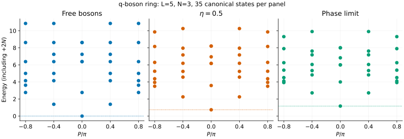
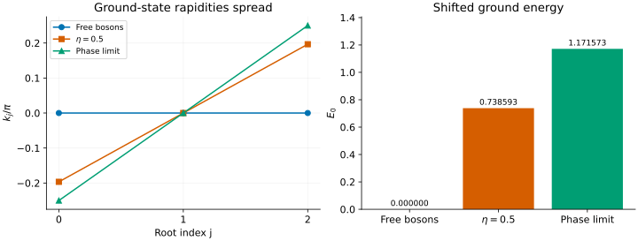

# q-bosons: deforming the hopping, not adding a Hubbard U

The q-boson chain offers a small, controlled benchmark for a bosonic MPS:
keep particle number fixed, change the hopping matrix elements, and follow
the spectrum from free bosons to the phase model. It is **not** the ordinary
Bose–Hubbard chain, and its strong-deformation limit does not forbid double
occupancy.

We will use three particles on five periodic sites, small enough to enumerate
every canonical mode pattern and inspect the Bethe roots too.

## 1. Build the right local operator

The Hamiltonian and lowering matrix elements are

```math
H=-\sum_j\left(B_j^\dagger B_{j+1}+B_{j+1}^\dagger B_j-2N_j\right),
\qquad B|n\rangle=\sqrt{[n]_q}\,|n-1\rangle,
```

```math
[n]_q=\frac{1-e^{-2\eta n}}{1-e^{-2\eta}},\qquad q=e^\eta,\qquad\eta\geq0.
```

Hopping and lattice spacing are one. $`N_j`$ is the ordinary occupation
operator, not $`B_j^\dagger B_j`$. The deformation changes hopping amplitudes
according to the local occupations; it does not introduce an on-site
$`U n_j(n_j-1)/2`$ term.

- At eta=0, take the continuous limit $`[n]_q=n`$: ordinary free bosons.
- At finite eta, occupation-dependent hopping gives an interacting integrable
  model.
- `--phase` selects the exact infinite-eta limit, with $`[n]_q=1`$ for
  $`n\gt0`$. Occupations 2, 3 and higher are still allowed.

For a fixed total of three particles, an MPS local basis `0,1,2,3` is enough
to represent the whole sector. Truncating it to `0,1` would solve a different,
hard-core model. For larger particle numbers, revisit that local cutoff.

## 2. Scan a small sector at three deformations

```sh
build_codex/bethe-q-boson-pbc 5 --particles 3 --eta 0 --excitations all
build_codex/bethe-q-boson-pbc 5 --particles 3 --eta 0.5 --excitations all
build_codex/bethe-q-boson-pbc 5 --particles 3 --phase --excitations all
```



Each panel contains 35 canonical states; degenerate dots can overlap. The
dotted horizontal line is the ground energy. The vertical axis shows
**absolute energy including the frontend's +2N shift**, not the gap.
At fixed particle number, subtracting $`2N=6`$ converts these energies to a
Hamiltonian with only the hopping terms. Excitation gaps within this sector
are unchanged by that subtraction.

Download the three tables for each calculation:

| Deformation | States | Ground reference | Roots |
| --- | --- | --- | --- |
| Free | [CSV](data/q-boson-free-states.csv) | [CSV](data/q-boson-free-reference.csv) | [CSV](data/q-boson-free-roots.csv) |
| eta=0.5 | [CSV](data/q-boson-eta05-states.csv) | [CSV](data/q-boson-eta05-reference.csv) | [CSV](data/q-boson-eta05-roots.csv) |
| Phase | [CSV](data/q-boson-phase-states.csv) | [CSV](data/q-boson-phase-reference.csv) | [CSV](data/q-boson-phase-roots.csv) |

The physical momentum is reported in $`(-\pi,\pi]`$. On five sites its allowed
values give the five vertical columns in each plot. Root momenta use a
different, lifted convention; do not confuse them with the total momentum.

## 3. See the ground roots spread

Export auxiliary tables without requiring a root table on screen:

```sh
build_codex/bethe-q-boson-pbc 5 --particles 3 --eta 0.5 --excitations all \
  --csv-table states=states.csv --csv-table reference=reference.csv \
  --csv-table roots=roots.csv
```

Join tables through `state_id`. The ground `reference` has its own ID, distinct
from the ranked copy of the ground state in `states`; its root rows occur in
the same `roots` export. `root_index` orders roots within each state.



All ground roots coincide at zero in the free limit. At finite deformation
they spread symmetrically, even though the total momentum remains zero.
The interacting roots are spectral coordinates, not the occupation numbers
of bare momentum orbitals.

In the phase limit the ground roots have a particularly simple form:

```math
k_j=\frac{2\pi I_j}{L+N},\qquad I_j=j-\frac{N-1}{2}.
```

For $`L=5,N=3`$, they are $`-\pi/4,0,\pi/4`$. Using the spectral energy rule
$`E=\sum_j4\sin^2(k_j/2)`$ gives $`E_0=4-2\sqrt2\simeq1.171573`$.
The finite eta=0.5 export lies between the free and phase ground energies,
at approximately 0.738593. These values are useful normalization checks for
an independently constructed MPO.

## 4. What has been enumerated?

Canonical states are labelled by sorted integer modes
$`0\le m_0\le\cdots\le m_{N-1}\lt L`$. Repeated modes are allowed. Their
number is

```math
\binom{L+N-1}{N}=\binom{7}{3}=35
```

for this example—the same as the fixed-N bosonic occupation-space dimension.
Hard-core bosons would have only $`\binom{5}{3}=10`$ states, underscoring why the
phase limit must not be interpreted as a hard-core constraint.

The Bethe labels are $`I_j=m_j+j-(N-1)/2`$. At eta=0 the roots are simply
$`2\pi m_j/L`$; at nonzero eta they deform continuously. The `m` and `deviation`
columns preserve that representation even when very weakly split roots would
round to the same printed `k`.

`--excitations all` visits every canonical pattern, but a matching candidate
count alone is not proof that a numerical calculation succeeded. Check the
converged count, aggregate outcome, row statuses and ground reference. A
failed candidate is excluded from the ranked table and makes the scan
incomplete. A missing gap is not zero.

Our small-sector implementation is checked against independent occupation-
basis diagonalization in the [model tests](../q-boson.md). The tutorial adds
checks of canonical labels, the free and phase formulas, and the first two
spectral moments computed directly from the occupation-basis hopping. Those
moments provide a separate test of the Hamiltonian normalization.

The enumeration grows rapidly. `--excitations 5` retains five levels but
still solves the whole family; `--max-candidates` limits that work. This tool
does not calculate form factors, spectral weights, quenches or open boundaries.

## 5. Reproduce the figures

With the optional [plotting environment](xxz-spinons.md#5-reproduce-the-figures):

```sh
build_codex/docs-venv/bin/python scripts/plot_q_boson_tutorial.py
# Regenerate all nine named-table exports:
build_codex/docs-venv/bin/python scripts/plot_q_boson_tutorial.py \
  --solver build_codex/bethe-q-boson-pbc
python3 scripts/plot_q_boson_tutorial.py --check
python3 -m unittest discover -s scripts -p 'test_tutorial_q_boson.py'
```

These examples use fp64. Long-double and fp128 can help resolve weak
deformations, but neither higher precision nor a small residual repairs an
incorrect local operator or Hilbert-space truncation.

## Further reading

[Pozsgay](../../CITATIONS.md#pozsgay-2014-q-boson) gives the normalization used
here; [Bogoliubov–Izergin–Kitanine](../../CITATIONS.md#bogoliubov-1997) discusses
the q-boson and phase models with a different overall energy convention.
See the [reference guide](../q-boson.md) for equations and numerical controls.
For continuum bosons instead, try the [Lieb–Liniger tutorial](lieb-liniger.md).
