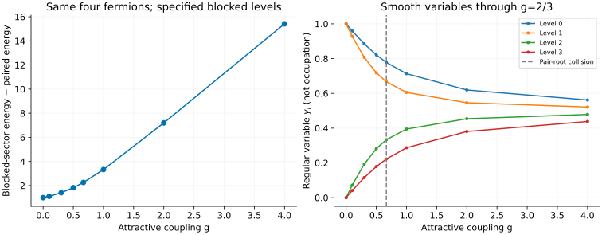

# Richardson pairing: blocking and a smooth root collision

[All tutorials](index.md) · [Model guide](../richardson.md) · [Central-spin tutorial](central-spin.md)

The reduced BCS model is a useful finite-system benchmark for an MPS written
in an orbital basis. It has collective pair hopping, not a nearest-neighbour
chain dispersion. We will compare two sectors with the **same four fermions**
and follow regular solver variables through a collision of Bethe pair roots.

## 1. Distinguish single-particle levels from pair energies

The Hamiltonian is

```math
H=\sum_i\epsilon_i(n_{i\uparrow}+n_{i\downarrow})
-g\sum_{i,j}b_i^\dagger b_j,\qquad
b_i^\dagger=c_{i\uparrow}^\dagger c_{i\downarrow}^\dagger,\qquad g\ge0.
```

Input $`\epsilon_i`$ are **single-particle** energies. A pair on level i has
kinetic energy $`2\epsilon_i`$. The interaction includes i=j, so even a pair
that cannot hop contributes -g. There is no chemical-potential subtraction.
For broader context see the [Dukelsky–Pittel–Sierra review](../../CITATIONS.md#dukelsky-2004).

Choose four distinct levels 0,1,2,3 and two pairs:

```sh
build/bethe-richardson --levels 0,1,2,3 --pairs 2 --g 1 \
  --csv-table states=paired.csv --csv-table variables=paired-variables.csv
```

The energy is approximately -1.48965216. At g=0 the pairs occupy levels 0
and 1 and the energy is 2. This solver selects the lowest state at the specified
pair number and blocked levels; it is not a grand-canonical minimization.

## 2. Break a pair into specified blocked levels

A blocked level is singly occupied: it contributes $`\epsilon_i`$ but cannot
donate or accept a pair. Indices are **zero-based positions in the input list**.
For the same four particles, compare one pair plus two blocked levels:

```sh
build/bethe-richardson --levels 0,1,2,3 --pairs 1 --blocked 1,2 --g 1 \
  --csv-table states=blocked.csv --csv-table variables=blocked-variables.csv
```

There are now two active levels, 0 and 3. The singly occupied levels contribute
1+2, giving the exact two-active-level result

```math
E_{\mathrm{blocked}}=6-g-\sqrt{9+g^2}.
```

At g=1 this is 1.83772234, or **3.32737450 above the paired sector**.



The left panel subtracts the fully paired energy at the **same g**. The cost
is already 1 at g=0 because blocking changes the kinetic occupation. It is not
just the lost interaction energy, nor a BCS mean-field gap. The solver does
not search over all blocked choices or provide a complete excitation spectrum;
call this the cost of the **specified blocked sector**, not an optimized
pair-breaking threshold. The blocked spins' orientations do not affect this
Hamiltonian's energy.

The distinction is visible even in trivial limits. Four filled pairs at g=1
have E=12-4=8, not 12. Zero pairs with level 1 blocked have E=1, not zero.

## 3. Cross a root collision without a physical singularity

Richardson pair rapidities can collide with a level pole and become a complex
conjugate pair. The implementation follows the regular eigenvalue variables
of [Faribault et al.](../../CITATIONS.md#faribault-2011), rather than those
individual rapidities. With $`e_i=2\epsilon_i`$ on the L active levels,

```math
\begin{aligned}
y_i&=g\sum_{\alpha=1}^{M}\frac1{e_i-E_\alpha},\\{}
y_i(y_i-1)-g\sum_{j\ne i}\frac{y_i-y_j}{e_i-e_j}&=0,\qquad
\sum_i y_i=M.
\end{aligned}
```

The right panel plots these y variables for the two-pair sector. At g=2/3,
both pair roots meet the pole at zero, but the regular variables are simply

```math
(y_0,y_1,y_2,y_3)=\left(\frac79,\frac23,\frac13,\frac29\right),
\qquad E_{\mathrm{total}}=0.
```

Their defining root sum is interpreted by continuation at the collision.
The smooth ground state has not undergone a finite-system phase transition.
Above it, the conjugate rapidities still give a real total energy.

These variables are **not occupations**, despite starting at 1,1,0,0 when
g=0. `--variables` does not reconstruct pair rapidities. Energy is obtained
directly from

```math
E=\sum_{i\ \mathrm{active}}2\epsilon_i y_i
-gM(L-M+1)+\sum_{i\ \mathrm{blocked}}\epsilon_i.
```

Our tests reconstruct the two roots away from the collision as an independent
check, but root reconstruction is not a public frontend capability.

## 4. Set up an orbital-MPS comparison

Use the same single-particle levels, pair number, blocked positions and
diagonal i=j interaction. A paired active level has the local states empty
and doubly occupied; a blocked fermion is not an empty active level.
There is no lattice momentum or PBC/OBC choice for this all-to-all pairing model.

Two inexpensive normalization tests help catch implementation mismatches:

- Shifting every single-particle level by a adds $`a(2M+B)`$ to E, where B
  is the number of blocked levels. With four particles and a=5, the shift is 20.
- Multiplying all levels and g by a positive factor s multiplies E by s,
  while leaving y unchanged.

The downloads include both tests, an irregular level spectrum and an analytic
two-level case: levels 0,1 with one pair have
$`E=1-g-\sqrt{1+g^2}`$. Repeated levels/higher degeneracies, repulsive g,
generic excited states and form factors are not implemented.

Continuation diagnostics matter. An incomplete run can contain a valid
energy at **reached_g**, not requested_g. The plotting script requires target
convergence, matching couplings and acceptable reached/target residuals.
A small polynomial residual is not a bound on energy error; clustered levels
may require native long-double or optional MPLAPACK fp128.

## 5. Reproduce and validate

Each link is a native export with provenance and convergence diagnostics:

| g | Two pairs: state / variables | One pair, blocked 1,2: state / variables |
| ---: | --- | --- |
| 0 | [state](data/rich-paired-g0-states.csv) / [variables](data/rich-paired-g0-variables.csv) | [state](data/rich-blocked-g0-states.csv) / [variables](data/rich-blocked-g0-variables.csv) |
| 0.1 | [state](data/rich-paired-g0.1-states.csv) / [variables](data/rich-paired-g0.1-variables.csv) | [state](data/rich-blocked-g0.1-states.csv) / [variables](data/rich-blocked-g0.1-variables.csv) |
| 0.3 | [state](data/rich-paired-g0.3-states.csv) / [variables](data/rich-paired-g0.3-variables.csv) | [state](data/rich-blocked-g0.3-states.csv) / [variables](data/rich-blocked-g0.3-variables.csv) |
| 0.5 | [state](data/rich-paired-g0.5-states.csv) / [variables](data/rich-paired-g0.5-variables.csv) | [state](data/rich-blocked-g0.5-states.csv) / [variables](data/rich-blocked-g0.5-variables.csv) |
| 2/3 | [state](data/rich-paired-gcollision-states.csv) / [variables](data/rich-paired-gcollision-variables.csv) | [state](data/rich-blocked-gcollision-states.csv) / [variables](data/rich-blocked-gcollision-variables.csv) |
| 1 | [state](data/rich-paired-g1-states.csv) / [variables](data/rich-paired-g1-variables.csv) | [state](data/rich-blocked-g1-states.csv) / [variables](data/rich-blocked-g1-variables.csv) |
| 2 | [state](data/rich-paired-g2-states.csv) / [variables](data/rich-paired-g2-variables.csv) | [state](data/rich-blocked-g2-states.csv) / [variables](data/rich-blocked-g2-variables.csv) |
| 4 | [state](data/rich-paired-g4-states.csv) / [variables](data/rich-paired-g4-variables.csv) | [state](data/rich-blocked-g4-states.csv) / [variables](data/rich-blocked-g4-variables.csv) |

| Check | State | Variables |
| --- | --- | --- |
| Two levels, one pair | [CSV](data/rich-two-states.csv) | [CSV](data/rich-two-variables.csv) |
| All levels paired | [CSV](data/rich-full-states.csv) | [CSV](data/rich-full-variables.csv) |
| No pairs, one blocked fermion | [CSV](data/rich-empty-states.csv) | [CSV](data/rich-empty-variables.csv) |
| Free, with a blocked fermion | [CSV](data/rich-free-states.csv) | [CSV](data/rich-free-variables.csv) |
| Shifted levels | [CSV](data/rich-shifted-states.csv) | [CSV](data/rich-shifted-variables.csv) |
| Energy scaling | [CSV](data/rich-scaled-states.csv) | [CSV](data/rich-scaled-variables.csv) |
| Irregular levels | [CSV](data/rich-irregular-states.csv) | [CSV](data/rich-irregular-variables.csv) |
| Reversed blocked-index order | [CSV](data/rich-block-order-states.csv) | [CSV](data/rich-block-order-variables.csv) |
| Weak coupling | [CSV](data/rich-weak-states.csv) | [CSV](data/rich-weak-variables.csv) |

With the [plotting dependencies](requirements.txt), from the repository root:

```sh
python3 scripts/plot_gaudin_tutorial.py --check
python3 scripts/plot_gaudin_tutorial.py
# Optional: regenerate both Gaudin-model tutorials.
python3 scripts/plot_gaudin_tutorial.py --solver-dir build
# Optional independent occupation/spin matrices; requires NumPy.
python3 scripts/plot_gaudin_tutorial.py --check --oracle
python3 -m unittest discover -s scripts -p 'test_tutorial_gaudin.py'
```

The [script](../../scripts/plot_gaudin_tutorial.py) validates all input indices,
blocked nulls, equations, number constraints and reconstructed energies before
saving regenerated data. The optional matrix oracle compares every saved
sector with the smallest eigenvalue of its independent occupation-space
Hamiltonian. [Tests](../../scripts/test_tutorial_gaudin.py) cover the collision,
original pair equations, exact limits and dishonest incomplete/corrupted exports.
