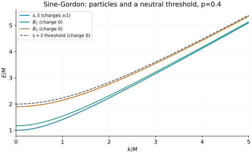
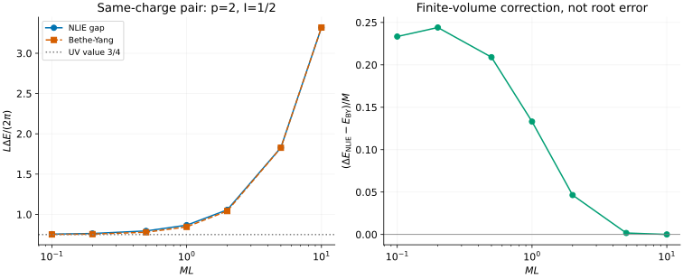

# Sine-Gordon: particles, thresholds and finite-volume gaps

[All tutorials](index.md) · [Particle guide](../sine-gordon-excitations.md) ·
[Exact finite-volume guide](../sine-gordon-excited.md)

A relativistic dispersion is simple once the particle mass is known. The
interesting questions are **which particles exist**, which scattering threshold
has the right charge, and how a level on a finite circle differs from the
infinite-volume result. This example answers all three using native exports.

## 1. Set the physical scale

The tools use velocity and Planck's constant equal to one. Their coupling is

```math
p=\frac{\beta^2}{8\pi-\beta^2},\qquad
E_a(k)=\sqrt{m_a^2+k^2}.
```

Here M, supplied by `--mass`, is the **physical soliton mass**, not the bare
coefficient of the cosine interaction. All plots below use M=1. The horizontal
momentum coordinate is a continuum momentum, not a lattice momentum modulo
$`2\pi`$: there is no Brillouin zone to fold.

For $`0\lt p\lt1`$, the soliton and antisoliton coexist with neutral bound
particles called breathers:

```math
m_s=m_{\bar s}=M,\qquad
m_{B_n}=2M\sin\frac{n\pi p}{2},\qquad np\lt1.
```

The inequality is strict. At p=0.4 there are B1 and B2; at p=0.5 there is only
B1, since B2 has reached the two-soliton threshold. At p=1 there are no stable
breathers. See [Fehér–Takács](../../CITATIONS.md#feher-takacs-2011), Eq. (2.2).
Do not count a threshold pole as an extra isolated particle.

## 2. Plot particles beside a continuum threshold

```sh
build/bethe-sine-gordon-dispersion --p 0.4 --mass 1 --points 65 \
  --max-momentum 5 --csv-table dispersion=sg-particles.csv
```



The blue line represents two degenerate species with opposite topological
charges, not a neutral particle. The breather rest energies are approximately
1.17557M and 1.90211M. Both lie below the displayed neutral pair threshold,
whose rest energy is 2M.

For specified particle content, the lower threshold is

```math
E_{a+b,\min}(k)=\sqrt{(m_a+m_b)^2+k^2}.
```

The minimizing particles share a **velocity**. With unequal masses they do not
share momentum equally: their momenta are proportional to their masses. There
is no finite upper edge. The plot deliberately draws a threshold line rather
than a filled, apparently bounded band.

The export includes all unordered stable-particle pairs. This figure selects
the soliton–antisoliton threshold, of charge zero; the equally high
soliton–soliton threshold has charge +2. Equal energies do not make the sectors
interchangeable. No form factors or operator-dependent intensities are supplied.

## 3. Put a same-charge pair on a circle

Now change to the repulsive coupling **p=2**, where there are no breathers.
Select total momentum zero and winding charge +2. The particles have opposite
rapidities but the **same** topological charge.

```sh
build/bethe-sine-gordon-bethe-yang --p 2 --length 1 --number 0.5 \
  --csv-table levels=sg-by.csv
build/bethe-sine-gordon-excited --p 2 --length 1 --number 0.5 \
  --tolerance 1e-7 --csv-table levels=sg-levels.csv \
  --csv-table source=sg-source.csv --csv-table gap=sg-gap.csv
```

The first command solves the asymptotic Bethe–Yang equation,

```math
ML\sinh\theta+\chi_p(2\theta)=2\pi I,\qquad
E_{\mathrm{BY}}=2M\cosh\theta,\qquad I=\tfrac12.
```

The half-odd label includes the constant minus sign in the same-charge
S-matrix. Replacing it by an integer or calling the pair neutral changes the
physical sector, not just a display convention.

The second command solves the finite-volume nonlinear integral equation
(NLIE), including the sea contribution and independently resolving the vacuum.
It exports the vacuum-relative gap

```math
\Delta E=E_{\mathrm{exc},C}-E_{\mathrm{vac},C},\qquad
E_{j,C}=E_j-L e_{\mathrm{bulk}}.
```

The common bulk subtraction cancels. The excited row's `casimir_energy` alone
is **not** the gap. At M=L=1 the excited Casimir energy is approximately
5.11055663, the vacuum energy is -0.33346197, and the gap is 5.44401860.
Bethe–Yang instead gives 5.31094355.



Markers are calculated volumes; connecting lines guide the eye. Bethe–Yang
becomes accurate at large ML, but a converged counting equation at small ML
does not make its omitted wrapping corrections small. Adding the vacuum energy
to a Bethe–Yang level does not recover the missing excited-state dressing.
The right panel shows a physical finite-volume correction, not the numerical
root residual.

For this I=1/2 branch the ultraviolet prediction is

```math
\frac{L\Delta E}{2\pi}\longrightarrow\frac{p+1}{2p}=\frac34
\quad(p=2).
```

This is a statement about a selected conformal sector, not the central charge.
The value at ML=0.1 is about 0.75518, still at a finite circumference.
The NLIE state selection and UV interpretation follow
[Feverati–Ravanini–Takács](../../CITATIONS.md#feverati-ravanini-takacs-1999),
Sec. 5.2.2. The implemented exact solver covers p>=1 and I=1/2 or 3/2,
not arbitrary neutral, moving, attractive or special-root states.

## 4. Compare with MPS calculations

For an infinite-system excitation ansatz, the first figure is a particle-line
benchmark. Match the lattice model's velocity, mass scale, continuum coupling
and excitation sector before comparing energies. The continuum momentum must
also be identified with the appropriate neighbourhood of the lattice spectrum.

For a finite periodic MPS, use the **gap** from the NLIE when its state family
matches the calculation. Winding charge +2 is not a neutral periodic-field
sector: the field winds by $`4\pi/\beta`$ around the circle. A boundary or charge
mismatch cannot be repaired with an energy offset.

At the free Dirac point p=1 there is a direct check:

```math
\Delta E=2\sqrt{M^2+(2\pi I/L)^2}.
```

The saved free-point exports recover this from both tools. Rescaling M to 2
and L to 1/2 keeps ML fixed: energies double, while $`LE_C`$ and
$`L\Delta E/(2\pi)`$ stay unchanged. Those checks distinguish physical units
from mesh accuracy. Native long-double and optional MPLAPACK fp128 can improve
arithmetic accuracy, but cannot remove lattice-spacing or asymptotic errors.

For the leading light-sector effective theory of the equal-mass two-flavour
Schwinger model, p=1/3 gives a triplet of mass M and a singlet of mass
$`\sqrt3 M`$. This is a useful further particle comparison, **not** an exact
solution of the full massive gauge theory; the p>=1 finite-volume tool above
does not cover it. See the [Schwinger discussion](../sine-gordon-excitations.md#the-two-flavour-schwinger-comparison).

## 5. Reproduce and validate

Download particle tables at [p=0.4](data/sg-particles-p0.4-dispersion.csv),
[p=0.5](data/sg-particles-p0.5-dispersion.csv), [p=1](data/sg-particles-p1-dispersion.csv)
and [M=2](data/sg-particles-scaled-dispersion.csv).
All finite-volume tables include provenance and separate convergence diagnostics:

| ML (M=1, p=2) | NLIE levels | Source | Gap | Bethe–Yang |
| ---: | --- | --- | --- | --- |
| 0.1 | [CSV](data/sg-nlie-l0.1-levels.csv) | [CSV](data/sg-nlie-l0.1-source.csv) | [CSV](data/sg-nlie-l0.1-gap.csv) | [CSV](data/sg-by-l0.1-levels.csv) |
| 0.2 | [CSV](data/sg-nlie-l0.2-levels.csv) | [CSV](data/sg-nlie-l0.2-source.csv) | [CSV](data/sg-nlie-l0.2-gap.csv) | [CSV](data/sg-by-l0.2-levels.csv) |
| 0.5 | [CSV](data/sg-nlie-l0.5-levels.csv) | [CSV](data/sg-nlie-l0.5-source.csv) | [CSV](data/sg-nlie-l0.5-gap.csv) | [CSV](data/sg-by-l0.5-levels.csv) |
| 1 | [CSV](data/sg-nlie-l1-levels.csv) | [CSV](data/sg-nlie-l1-source.csv) | [CSV](data/sg-nlie-l1-gap.csv) | [CSV](data/sg-by-l1-levels.csv) |
| 2 | [CSV](data/sg-nlie-l2-levels.csv) | [CSV](data/sg-nlie-l2-source.csv) | [CSV](data/sg-nlie-l2-gap.csv) | [CSV](data/sg-by-l2-levels.csv) |
| 5 | [CSV](data/sg-nlie-l5-levels.csv) | [CSV](data/sg-nlie-l5-source.csv) | [CSV](data/sg-nlie-l5-gap.csv) | [CSV](data/sg-by-l5-levels.csv) |
| 10 | [CSV](data/sg-nlie-l10-levels.csv) | [CSV](data/sg-nlie-l10-source.csv) | [CSV](data/sg-nlie-l10-gap.csv) | [CSV](data/sg-by-l10-levels.csv) |

Extra checks: free p=1 [levels](data/sg-free-nlie-levels.csv),
[source](data/sg-free-nlie-source.csv), [gap](data/sg-free-nlie-gap.csv),
[Bethe–Yang](data/sg-free-by-levels.csv); rescaled p=2, M=2, L=1/2
[levels](data/sg-scaled-nlie-levels.csv), [source](data/sg-scaled-nlie-source.csv),
[gap](data/sg-scaled-nlie-gap.csv).

From the repository root, using the [tutorial plotting dependencies](requirements.txt):

```sh
python3 scripts/plot_field_theory_tutorial.py --check
python3 scripts/plot_field_theory_tutorial.py
# Optional: regenerate both this and the Lee–Yang tutorial from native solvers.
python3 scripts/plot_field_theory_tutorial.py --solver-dir build
python3 -m unittest discover -s scripts -p 'test_tutorial_field_theory.py'
```

The [script](../../scripts/plot_field_theory_tutorial.py) reads exported energies
for every curve; only labelled theoretical limits are drawn independently.
It joins tables by run provenance, checks energy references and charge labels,
rejects missing or failed rows, and verifies mesh, cutoff, contour and source
diagnostics. The NLIE examples request an absolute tolerance of 1e-7 in
$`Y=LE_C`$ per state, not a universal 1e-7 error in a gap. The
[tests](../../scripts/test_tutorial_field_theory.py) additionally check a
documented independent p=2 oracle, free spectra, mass scaling, strict breather
thresholds and deliberately corrupted exports. No MPS data are synthesized.
