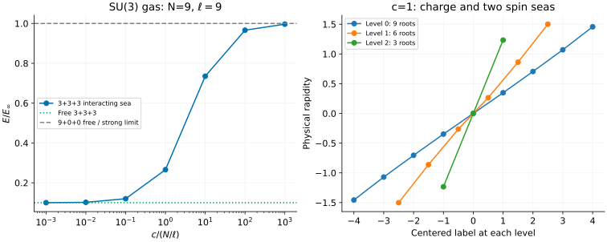

# SU(n) fermions: components are not Bethe levels

[All tutorials](index.md) · [Model guide](../su-fermions.md) · [Gaudin–Yang tutorial](gaudin-yang.md)

Adding internal components lets fermions share spatial orbitals without
violating antisymmetry within any one component. Contact repulsion then
couples the components. This tutorial follows a three-component gas and
shows how physical populations become a hierarchy of auxiliary Bethe roots.

This is a **continuum gas**, not the SU(3)/ULS permutation spin chain. We use
$`\kappa`$ for the component count, N for particle number, and $`\ell`$ for
the physical circumference.

## 1. Start with nine particles, not nine lattice sites

All masses and all intercomponent repulsions are equal:

```math
H=-\sum_j\partial_{x_j}^2+2c\sum_{i\lt j}\delta(x_i-x_j),\qquad
\frac{\hbar^2}{2m}=1,\qquad E=\sum_jk_j^2.
```

Same-component contact interactions vanish by antisymmetry. There are no
component-dependent fields, traps or chemical potentials. Choose populations
3,3,3 and circumference 9, so the total density is one:

```sh
bethe-sun-fermions-pbc --populations 3,3,3 --length 9 --c 1 \
  --csv-table states=sun-state.csv --csv-table components=sun-components.csv \
  --csv-table roots=sun-roots.csv
```

The energy is approximately 7.77546038 and momentum is zero. The general
solution is due to [Sutherland](../../CITATIONS.md#sutherland-1968); the finite
nested equations used here are Eqs. (2)–(3) of
[Lee–Guan–Batchelor](https://arxiv.org/abs/1011.0128). Although that paper also
develops thermodynamics, these examples solve finite-ring equations without
a thermodynamic or string approximation.

## 2. Repulsion raises the charge energy



The left panel uses seven native calculations from c=0.001 to 1000, with
dimensionless interaction $`\gamma=c/(N/\ell)`$. Its reference energy is

```math
E_\infty=\frac{\pi^2N(N^2-1)}{3\ell^2}
=\frac{80\pi^2}{27}\quad(N=\ell=9).
```

At c=0 the three independent three-particle seas have energy
$`8\pi^2/27\simeq2.92432723`$. The weak-coupling slope counts pairs of
**different** components:

```math
E-E_{\mathrm{free}}
=\frac{2c}{\ell}\sum_{a\lt b}N_aN_b+O(c^2)=6c+O(c^2).
```

At c=0.001 the shift is about 0.00599850. By c=1000 the energy is
29.14229213, close to the finite-ring strong-coupling limit. No power-law fit
or extrapolation supplies these points.

The 9,0,0 sector is an exact free-fermion reference at every c. Since N=9 is
odd, its periodic shell coincides with the charge shell of the displayed
strong-coupling limit. This is deliberately different from the even-N shell
subtlety in the [Gaudin–Yang example](gaudin-yang.md#2-increase-the-repulsion).

## 3. Follow the nesting without losing physical component labels

For sorted occupied populations $`N_1\ge\cdots\ge N_\kappa`$, the sea sizes are

```math
M_0=N,\qquad M_a=N_{a+1}+\cdots+N_\kappa.
```

Thus 3,3,3 produces **9 charge roots, 6 first-level spin roots and 3 second-level
spin roots**. Only level 0 contains the momenta whose squares enter E. Adding
all levels' squared rapidities would overcount auxiliary degrees of freedom.
The horizontal labels in the right panel belong to their respective seas;
a label at one level is not the identity of a particle at another.

Try an imbalanced input with an empty component:

```sh
bethe-sun-fermions-pbc --populations 1,0,5,3 --length 9 --c 1 --roots
```

The physical component table remains in **input order**:

| Input component | Population | Nesting rank |
| ---: | ---: | ---: |
| 0 | 1 | 2 |
| 1 | 0 | absent |
| 2 | 5 | 0 |
| 3 | 3 | 1 |

Rank zero is the reference component. Empty components have no Bethe sea;
they are not assigned a spurious zero rank. The sorted occupied list is
5,3,1, giving sea sizes 9,4,1 and energy 10.10040293. The saved `5,3,1` run
has exactly the same roots and energy. Equal populations are sorted stably.
The additional `3,1,1,1` example exercises four occupied components, with
sea sizes 6,3,2,1.

## 4. Supported shells and cross-model checks

Every occupied component must have an **odd** population on the interacting
centered branch. Hence `3,3,3` is supported and `2,2,2` is not. This is a
restriction of the implemented periodic shell, not of the physical model's
integrability. Zero populations are allowed. Exact c=0, single-occupied-component
and vacuum paths allow arbitrary nonnegative counts.

Free components occupy integer momentum modes; even populations use a
positive-current representative when the shell is degenerate. For example,
`2,0,2` at c=0 and circumference 1 has P=$`4\pi`$. Continuum momentum is not
folded into a lattice Brillouin zone.

The saved data include several checks useful before an MPS comparison:

- Populations `3,3` reproduce the separate Gaudin–Yang solver at the same
  circumference and coupling.
- Populations `1,1,1` form an antisymmetric internal singlet with a symmetric
  spatial ground state. Its charge roots and energy agree with three
  Lieb–Liniger bosons; the auxiliary roots still describe a different
  internal state, and generic observables need not agree.
- Doubling circumference and halving c at fixed populations preserves
  $`\gamma`$: all physical roots halve and E becomes one quarter.

Match the factor **2c**, physical density and component populations when
benchmarking a continuum discretization. The code does not supply arbitrary
excited states, unequal masses, unequal pair couplings or attractive branches.
If continuation stops early, an energy may belong to the last reached c:
the requested coupling, reached coupling, both residuals and success status
must agree before treating it as a target result.

## 5. Reproduce and validate

| c, populations 3,3,3 | State | Components | Roots |
| ---: | --- | --- | --- |
| 0.001 | [CSV](data/sun-c0.001-states.csv) | [CSV](data/sun-c0.001-components.csv) | [CSV](data/sun-c0.001-roots.csv) |
| 0.01 | [CSV](data/sun-c0.01-states.csv) | [CSV](data/sun-c0.01-components.csv) | [CSV](data/sun-c0.01-roots.csv) |
| 0.1 | [CSV](data/sun-c0.1-states.csv) | [CSV](data/sun-c0.1-components.csv) | [CSV](data/sun-c0.1-roots.csv) |
| 1 | [CSV](data/sun-c1-states.csv) | [CSV](data/sun-c1-components.csv) | [CSV](data/sun-c1-roots.csv) |
| 10 | [CSV](data/sun-c10-states.csv) | [CSV](data/sun-c10-components.csv) | [CSV](data/sun-c10-roots.csv) |
| 100 | [CSV](data/sun-c100-states.csv) | [CSV](data/sun-c100-components.csv) | [CSV](data/sun-c100-roots.csv) |
| 1000 | [CSV](data/sun-c1000-states.csv) | [CSV](data/sun-c1000-components.csv) | [CSV](data/sun-c1000-roots.csv) |

| Other calculation | State | Components | Roots or free modes |
| --- | --- | --- | --- |
| c=0, 3,3,3 | [CSV](data/sun-free-states.csv) | [CSV](data/sun-free-components.csv) | [modes](data/sun-free-free_modes.csv) |
| 9,0,0 | [CSV](data/sun-polarized-states.csv) | [CSV](data/sun-polarized-components.csv) | [modes](data/sun-polarized-free_modes.csv) |
| 5,3,1 | [CSV](data/sun-imbalanced-states.csv) | [CSV](data/sun-imbalanced-components.csv) | [roots](data/sun-imbalanced-roots.csv) |
| 1,0,5,3 | [CSV](data/sun-permuted-states.csv) | [CSV](data/sun-permuted-components.csv) | [roots](data/sun-permuted-roots.csv) |
| Rescaled 3,3,3 | [CSV](data/sun-scaled-states.csv) | [CSV](data/sun-scaled-components.csv) | [roots](data/sun-scaled-roots.csv) |
| 3,3 | [CSV](data/sun-two-states.csv) | [CSV](data/sun-two-components.csv) | [roots](data/sun-two-roots.csv) |
| 1,1,1 | [CSV](data/sun-singlet-states.csv) | [CSV](data/sun-singlet-components.csv) | [roots](data/sun-singlet-roots.csv) |
| 3,1,1,1 | [CSV](data/sun-four-states.csv) | [CSV](data/sun-four-components.csv) | [roots](data/sun-four-roots.csv) |
| Free even shell | [CSV](data/sun-free-shell-states.csv) | [CSV](data/sun-free-shell-components.csv) | [modes](data/sun-free-shell-free_modes.csv) |
| Vacuum | [CSV](data/sun-vacuum-states.csv) | [CSV](data/sun-vacuum-components.csv) | [empty modes](data/sun-vacuum-free_modes.csv) |

Reduction references: Gaudin–Yang [state](data/ref-gy6-states.csv),
[charge roots](data/ref-gy6-charge_roots.csv), [spin roots](data/ref-gy6-spin_roots.csv);
Lieb–Liniger [state](data/ref-ll3-states.csv) and [roots](data/ref-ll3-roots.csv).

With the [plotting dependencies](requirements.txt), from the source checkout:

```sh
python3 scripts/plot_multicomponent_tutorial.py --check
python3 scripts/plot_multicomponent_tutorial.py
# Optional: regenerate both multicomponent tutorials and their reference runs.
python3 scripts/plot_multicomponent_tutorial.py --solver-dir /path/to/bethe/bin
python3 -m unittest discover -s scripts -p 'test_tutorial_multicomponent.py'
```

The [script](../../scripts/plot_multicomponent_tutorial.py) checks every nested
equation, component mapping, sea size, energy reconstruction and continuation
status. It retains the native export provenance. The
[tests](../../scripts/test_tutorial_multicomponent.py) add reductions, scaling,
limiting slopes and corrupted-table checks. The default fp64 examples can be
repeated manually with native long-double or optional MPLAPACK fp128; changing
precision does not remove unsupported-shell restrictions.
