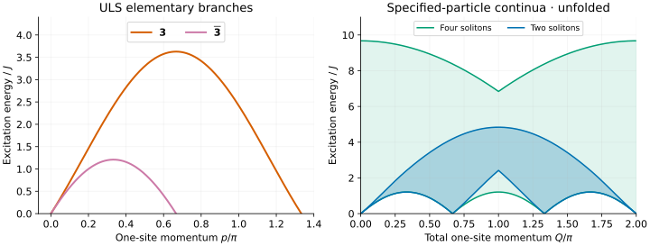
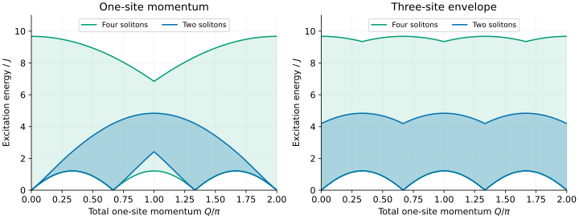

# ULS excitations: representations before curves

At the spin-1 Uimin–Lai–Sutherland (ULS) point, spin and quadrupole operators
belong to a common SU(3) multiplet. This makes a useful test for symmetry-resolved
MPS excitations—but the elementary curves are not themselves local-response
poles. We will plot the elementary branches, compare two- and four-soliton
continua, then fold the result for a three-site unit cell.

## 1. Match the spin-1 Hamiltonian

The tool uses the nearest-neighbour SU(3) permutation chain:

```math
\begin{aligned}
H_P&=J\sum_jP_{j,j+1},\\{}
P_{j,j+1}&=\mathbf S_j\cdot\mathbf S_{j+1}
+(\mathbf S_j\cdot\mathbf S_{j+1})^2-1.
\end{aligned}
```

Thus the ULS Hamiltonian with both spin-1 couplings equal to J differs by
JL on a periodic L-site chain. **The excitation gaps are identical.** This
tutorial uses J=1. If your bilinear–biquadratic Hamiltonian instead has
coefficients cos θ and sin θ at θ=π/4, use $`J=1/\sqrt{2}`$.
This is not the long-range SU(3) Haldane–Shastry model.

After [building](../building.md), export all branches:

```sh
bethe-su3-dispersion --exchange 1 --points 193 --csv su3-unfolded.csv
```

There is one table, `dispersion`. Branch names select **rows**, not additional
tables: `--branch bar3 --csv narrow.csv` selects just the narrow elementary band.

## 2. Identify the elementary excitations

| Branch | SU(3) representation | Range of $`p/\pi`$ | Energy column |
| --- | --- | --- | --- |
| `3` | Fundamental 3 | [0, 4/3] | `energy` |
| `bar3` | Antifundamental bar3 | [0, 2/3] | `energy` |
| `two-soliton` | One of each | [0, 2] | `lower`, `upper` |
| `four-soliton` | Two of each | [0, 2] | `lower`, `upper` |



[Open the full-size figure](figures/su3-spectrum.svg).

Both elementary branches are gapless at their endpoints, with endpoint speed
$`v=2\pi J/3`$. Their maxima differ by a factor of three: approximately
**3.627599 J** for the 3 and **1.209200 J** for the bar3. Do not interchange
the momentum ranges when matching an SU(3) representation in your calculation.

There is also a global constraint. On a periodic fundamental chain with L
divisible by three, the vacuum has zero SU(3) centre charge, or *triality*.
A single 3 or bar3 has nonzero triality and is not an isolated state of that
same balanced ring. A fractional/domain-wall ansatz can access elementary
sectors that an ordinary local excitation above the singlet does not.

## 3. Why four particles matter

The smallest neutral pair decomposes as

```math
3\otimes\bar3=1\oplus8.
```

The three physical spin operators and five quadrupoles form the adjoint 8.
Acting on the singlet vacuum, they select adjoint states, not the singlet
component of this pair. Under physical spin rotation, that adjoint contains
spin 1 and spin 2.

The blue region is the kinematic interval for one 3 and one bar3. The green
region is for two of each, which also allows adjoint channels. At total
momentum Q=π the two-particle lower edge is approximately **2.418399 J**, but
the four-particle lower edge is only **1.209200 J**. An adjoint MPS excitation
below the blue edge is therefore not automatically a disagreement with Bethe
ansatz: the two-particle edge is not the full sector threshold.

These are two **specified particle contents**, not an exhaustive enumeration
of neutral states. Three equal representations can also be neutral, and
larger particle numbers extend the spectrum. Neither plotted upper edge is
a bound on the complete spectrum.

The shading is not intensity. Symmetry permits an observable to couple to a
sector but does not guarantee nonzero weight at every momentum. In particular,
the Q=0 summed SU(3) generators annihilate the singlet, even though the
four-soliton kinematic interval has nonzero width there.

## 4. Compare a three-site unit cell

```sh
bethe-su3-dispersion --exchange 1 --points 193 --folded --csv su3-folded.csv
```



[Open the full-size folding comparison](figures/su3-folding.svg).

For a three-site cell the translation eigenphase is

```math
K=3Q\pmod{2\pi}.
```

The folded bounds take the envelope of Q, Q+2π/3 and Q+4π/3. The file keeps
the original Q grid, so the right panel displays three repetitions over
[0,2π]. For a plot against K/π, keep $`0\le Q/\pi\lt2/3`$ and multiply that
horizontal coordinate by three. The `cell_momentum` column supplies K directly.

`--folded` changes the continuum envelopes, **not** the elementary lines.
The broad fundamental line is not made into a single-valued cell band by
sorting its folded momentum. Keep distinct momentum images separate.

## 5. Reproduce the plots and check the comparison

Download [unfolded](data/su3-unfolded.csv) and [folded](data/su3-folded.csv) data.
Each file has 193 rows per branch and includes provenance and convergence
comments. The default fp64 arithmetic is sufficient for these figures;
long-double and optional fp128 are also available in the frontend.

```sh
# From the source checkout:
python3 -m venv .venv
. .venv/bin/activate
python3 -m pip install -r docs/tutorials/requirements.txt
python3 scripts/plot_spin1_tutorial.py
# Regenerate both the ULS and TB examples using freshly built executables:
python3 scripts/plot_spin1_tutorial.py --bin-dir /path/to/bethe/bin
python3 scripts/plot_spin1_tutorial.py --check
```

The [script](../../scripts/plot_spin1_tutorial.py) plots actual exported values;
its tests check representations, branch ranges, the unequal Q=π thresholds
and three-image folding. Failed energies must not be replaced by zero. Empty
cells in non-applicable columns—for example `energy` on a continuum row—are
intentional.

Finite rings have discrete levels and finite-size corrections, not these
continuous bands. Use the [finite-ring solver](../su3.md) for its supported
ground states and the [dispersion guide](../su3-dispersion.md) for formulas,
normalization checks and finite-size comparisons. That guide explains the
range convention used from [Vörös–Penc](../../CITATIONS.md#voros-penc-2021)
and representation assignment from
[Doikou–Nepomechie](../../CITATIONS.md#doikou-nepomechie-1998).

Next: [the spin-1 TB point](takhtajan-babujian.md), where elementary spinons
carry spin 1/2 and quadrupolar response needs at least four of them.
