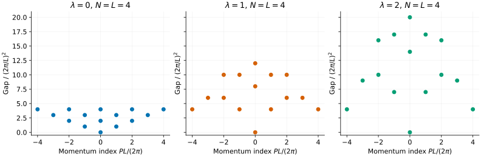
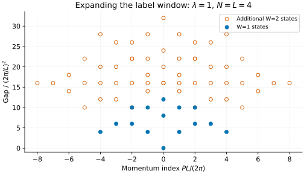

# Sutherland: the collision rule is part of the model

Can two Bose gases with a vanishing explicit potential have different spectra?
Yes: their allowed wavefunctions can obey different rules at particle
coincidences. The Sutherland model makes this distinction unusually concrete.
We will compare three collision exponents, identify a few excitations by their
integer labels, and see what a finite spectrum scan does—and does not—cover.

This is the **scalar continuum inverse-square gas**, not the SU(3) Uimin–Lai–
Sutherland spin chain. For that model, see the [ULS tutorial](su3-uls.md).

## 1. Specify the Hamiltonian and its collision branch

With $`\hbar=2m=1`$, periodic length $`L`$ and $`\lambda\geq0`$:

```math
H=-\sum_j\partial_{x_j}^2+
2\lambda(\lambda-1)\left(\frac{\pi}{L}\right)^2
\sum_{i\lt j}\frac{1}{\sin^2[\pi(x_i-x_j)/L]}.
```

Our solver selects periodic bosonic wavefunctions with collision behaviour
$`\Psi\sim|x_i-x_j|^\lambda`$. Thus `--lambda` specifies more than the
coefficient of the potential:

- $`\lambda=0`$: free bosons, with no forced zero at coincidence.
- $`\lambda=1`$: hard-core bosons, with a zero at coincidence—even though the
  displayed potential coefficient is again zero.
- $`\lambda=2`$: a stronger collision zero and a nonzero repulsive potential.

In particular, replacing $`\lambda`$ by $`1-\lambda`$ leaves the potential
coefficient unchanged but generally changes the collision branch. A coupling
coefficient alone is not a complete specification of this singular Hamiltonian.

## 2. Compare a small ring

Use four particles on a ring of length four and enumerate a small label window:

```sh
bethe-sutherland-pbc 4 --length 4 --lambda 1 --levels all --window 1
bethe-sutherland-pbc 4 --length 4 --lambda 1 --levels all --window 1 \
  --precision fp64 --format csv > sutherland-lambda1.csv
```



Each panel uses an actual frontend export: [lambda = 0](data/sutherland-lambda0.csv),
[lambda = 1](data/sutherland-lambda1.csv), [lambda = 2](data/sutherland-lambda2.csv).
The vertical axis is the gap **above each model's own ground state**, in units
of $`q^2`$, where $`q=2\pi/L`$. The horizontal axis is the integer $`P/q`$,
not a momentum reduced to a Brillouin zone.

The ground-state energies differ as well:

```math
E_0=\left(\frac{\pi}{L}\right)^2
\frac{\lambda^2 N(N^2-1)}{3}.
```

For this ring, $`E_0/q^2=5\lambda^2`$. In particular, hard-core and free
bosons differ both in ground energy and in many excitation gaps despite the
zero explicit potential coefficient in both cases.

## 3. Read a state label

A state has $`N`$ ascending integer labels $`n_0,\ldots,n_{N-1}`$. Repeated
and negative labels are allowed. The ground state has all labels zero. The
pseudomomenta and observables are

```math
k_j=q\left[n_j+\lambda\left(j-\frac{N-1}{2}\right)\right],
\qquad P=q\sum_j n_j,\qquad E=\sum_j k_j^2.
```

The pseudomomenta need not be single-particle orbital momenta. The collision
rule is already encoded in their spacing.

Two useful excitations at $`N=4`$ are:

| Labels | $`P/q`$ | $`(E-E_0)/q^2`$ | Interpretation |
| --- | --- | --- | --- |
| `0 0 0 1` | 1 | $`1+3\lambda`$ | Raise the largest label |
| `1 1 1 1` | 4 | 4 | Boost the whole ground state |

The first gap depends on the collision exponent; the common boost costs the
same amount for all three exponents. You can select a state directly:

```sh
bethe-sutherland-pbc 4 --length 4 --lambda 2 --labels 0,0,0,1
```

Doubling $`L`$ at fixed particle number, exponent and labels halves all momenta
and quarters all energies. The saved [length-eight export](data/sutherland-length8.csv)
checks that scaling. This is a finite-size change at fixed $`N`$, not a
thermodynamic limit at fixed density.

## 4. What does “all” mean?

`--levels all --window 1` includes all ascending labels drawn from
`-1, 0, 1`: fifteen states for four particles. It does **not** mean every
excitation of the model. The full spectrum is infinite.

Enlarge the window:

```sh
bethe-sutherland-pbc 4 --length 4 --lambda 1 --levels all --window 2 \
  --precision fp64 --format csv > sutherland-window2.csv
```



The [larger export](data/sutherland-window2.csv) contains seventy states. Blue
points are the original window; orange rings mark additional label sequences.
Several distinct states can share a plotted energy and momentum, so the
number of visible dots is not the state count.

For a symmetric window $`[-W,W]`$, the number of label sequences is

```math
\binom{N+2W}{N}.
```

It grows quickly. `--levels COUNT` limits the output but still searches the
specified window; `--max-states` guards the enumeration size. A successful
scan certifies coverage **inside that window**, not a globally complete
low-energy spectrum. Never silently interpret a truncated scan as an absence
of states elsewhere.

## 5. Use this as a numerical benchmark

The solver applies exact spectral rules, evaluated in the selected floating-
point precision. The CSV status `exact spectral rules` does not mean infinite-
precision arithmetic. fp64 is the default; long-double and fp128 are also
supported where available.

For a continuum MPS or a discretized calculation, check the collision branch
as carefully as the written potential. A naive zero-potential discretization
does not enforce the hard-core branch automatically. Compare gaps at matched
particle number and circumference, and do not fold these physical continuum
momenta as if there were an underlying lattice.

These tables contain energies and momenta, not wavefunctions, form factors or
spectral weights. The [reference guide](../sutherland.md) gives the domain
conventions, numerical limits and further state-selection examples.

## 6. Reproduce and check

With the optional [plotting environment](xxz-spinons.md#5-reproduce-the-figures):

```sh
python3 scripts/plot_sutherland_tutorial.py
# Also regenerate the five saved exports:
python3 scripts/plot_sutherland_tutorial.py \
  --solver bethe-sutherland-pbc
python3 scripts/plot_sutherland_tutorial.py --check
python3 -m unittest discover -s scripts -p 'test_tutorial_sutherland.py'
```

The checks verify every label in the accepted window, momentum units, energy
references, length scaling, reflection symmetry and the two explicit gaps
above. Failed aggregate status or missing states are rejected even though
this exact-rule frontend has no iterative status column on each row.

## Further reading

See [Sutherland's original paper](../../CITATIONS.md#sutherland-1971) and the
[Gurappa–Panigrahi spectral construction](../../CITATIONS.md#gurappa-panigrahi-1999).
Our [model guide](../sutherland.md) states exactly which scalar collision
branch and boundary conditions this implementation selects.
