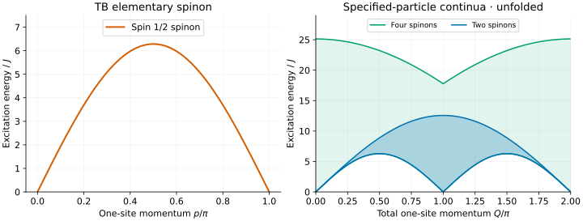
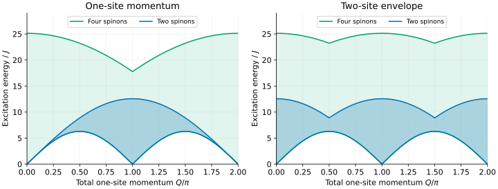

# TB spinons: the same edge can hide a different sector

The spin-1 Takhtajan–Babujian (TB) point is another useful benchmark for MPS
excitation calculations. Its elementary dispersion is a sine curve, but
identifying the physical excitation takes more than rescaling a spin-1/2
Heisenberg result. This tutorial separates the energy scale, total-spin
selection rules and two-/four-spinon kinematics.

## 1. Fix the normalization first

We use spin-1 operators and

```math
H=J\sum_j\left[\mathbf S_j\cdot\mathbf S_{j+1}
-(\mathbf S_j\cdot\mathbf S_{j+1})^2\right],\qquad J=1.
```

The two-site energies in total-spin sectors 0, 1 and 2 are −6J, −2J and 0.
This is a quick normalization check in an independent MPS implementation.
For coefficients cos θ and sin θ at θ=−π/4, choose $`J=1/\sqrt{2}`$ instead.
Beware the J/4 prefactor in [Vlijm–Caux](../../CITATIONS.md#vlijm-caux-2014):
their J=4 corresponds to our J=1.

After [building](../building.md), run

```sh
bethe-tb-dispersion --exchange 1 --points 193 --csv tb-unfolded.csv
```

The single `dispersion` table contains `spinon`, `two-spinon` and `four-spinon`
rows. Plot `energy` for the first and `lower`/`upper` for the other two.
The grids are uniform in physical momentum, not in rapidity.

## 2. Read the elementary line

```math
\epsilon(p)=2\pi J\sin p,\qquad0\le p\le\pi.
```



[Open the full-size figure](figures/tb-spectrum.svg).

The endpoints are gapless and the maximum is **2πJ**, approximately 6.283185 J.
Each elementary spinon carries spin **1/2**, although the physical sites have
spin 1. A single spinon cannot be an isolated eigenstate of an ordinary
periodic integer-spin chain; use an appropriate fractional/domain-wall sector
when comparing the elementary line to an ansatz.

## 3. Match the operator to the particle content

Starting from a singlet ground state:

| Operator | Selected total spin | Smallest spinon content allowed by spin |
| --- | --- | --- |
| Scalar bond or dimer operator | 0 | Two |
| Local spin operator | 1 | Two |
| Rank-two quadrupole | 2 | Four |

Two spin-1/2 objects can form S=0 or 1, but not S=2. Four allow all three.
This is why a quadrupolar MPS branch needs the four-spinon comparison, even
though the two- and four-spinon **lower** edges coincide:

```math
E_{2,-}(Q)=E_{4,-}(Q)=2\pi J|\sin Q|.
```

Soft spectator spinons can preserve the minimum energy while changing the
allowed spin sector. Equal lower curves do not mean equal state counting,
matrix elements or excitation content.

The upper edges illustrate a separate point. At Q=0 the two-spinon interval
collapses to zero, whereas four spinons can have total constituent momentum
2π and hence Q=0 modulo 2π. Their maximum energy is **8πJ**. Ignoring that
momentum alias would incorrectly remove a large kinematic interval.

Neither upper edge limits arbitrarily many spinons. Nor does shading show
spectral weight: the Q=0 total-spin operator annihilates the singlet, despite
the allowed four-spinon energy interval.

## 4. Fold for a two-site cell

```sh
bethe-tb-dispersion --exchange 1 --points 193 --folded --csv tb-folded.csv
```



[Open the full-size folding comparison](figures/tb-folding.svg).

Translation by two sites measures $`K=2Q\pmod{2\pi}`$. The folded envelopes
combine Q and Q+π, retaining Q/π on the plotted horizontal axis. The right
panel therefore shows two copies of the reduced zone. Keep
$`0\le Q/\pi\lt1`$ and double that coordinate to plot a single zone against K/π.

The lower edge is unchanged; the upper edges change. The elementary spinon
line is unchanged by `--folded`. Zone folding here is not evidence for a
gapped or spontaneously dimerized vacuum at the critical TB point.

## 5. What this does—and does not—test in an MPS calculation

Matching the elementary energy scale and continuum bounds is a useful first
check. It does not make TB the XXX chain with a different exchange: the
low-energy theories and spinon state counting differ. TB has SU(2) level-2
critical structure, with central charge 3/2. The present plots do not infer
finite-size multiplicities from the sine dispersion.

A small ring also need not have a zero staggered gap. It has finite-size
levels and logarithmic corrections; a positive finite-ring gap is not a
thermodynamic mass. The [finite-ring tool](../takhtajan-babujian.md) solves its
supported ground states with finite complex-root deviations retained. It is
not an excited-state enumeration based on ideal strings.

## Reproduce the figures

Download [unfolded](data/tb-unfolded.csv) and [folded](data/tb-folded.csv) exports.
The [shared spin-1 plotting script](../../scripts/plot_spin1_tutorial.py) also
reproduces the [ULS tutorial](su3-uls.md). Using the Python environment described
there:

```sh
# From the source checkout:
python3 scripts/plot_spin1_tutorial.py
python3 scripts/plot_spin1_tutorial.py --check
python3 -m unittest discover -s scripts -p 'test_tutorial_spin1.py'
```

The checks need neither Matplotlib nor a C++ build. They test the 2πJ scale,
shared lower edges, four-spinon Q=0 upper edge and two-image folding, as well
as schema, status, spin labels and momentum units. Numerical exports retain
their original precision; these plotting examples use fp64.

For formulas, finite-size checks and precision limits, see the
[TB dispersion guide](../tb-dispersion.md). Its references include
[Vlijm–Caux](../../CITATIONS.md#vlijm-caux-2014) for normalization and spinon
construction, and [Frahm–Stahlsmeier](../../CITATIONS.md#frahm-stahlsmeier-1998)
for the additional state-counting structure.
