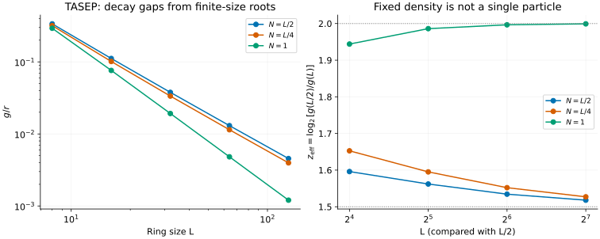
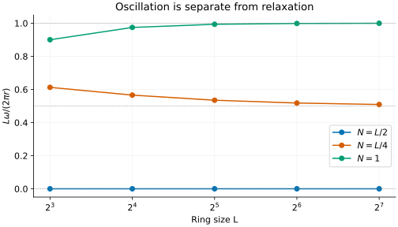

# TASEP: relaxation, oscillation and finite-size scaling

[All tutorials](index.md) · [Model guide](../tasep.md) · [ASEP tutorial](asep.md)

Bethe ansatz also solves stochastic generators. In the totally asymmetric
simple exclusion process, particles hop clockwise around a ring, but cannot
land on occupied sites. The interesting spectrum describes how a probability
distribution relaxes, rather than the energies of a quantum Hamiltonian.

This tutorial extracts a relaxation time, distinguishes it from an oscillation
frequency, and compares fixed-density rings with a single-particle limit.
All plotted points come from `bethe-tasep-pbc` exports.

## 1. Read the eigenvalue with the right sign

There are L sites, N particles and right-hop rate r. The convention is

```math
\frac{dP}{dt}=MP,\qquad
\lambda=-g+i\omega,\qquad g\gt0,\quad\omega\ge0.
```

Columns of M sum to zero; off-diagonal entries are allowed transition rates.
The stationary eigenvalue is zero. A nonstationary eigenmode evolves as
$`e^{-gt}e^{i\omega t}`$. The conjugate partner makes a real oscillatory
contribution to P. Its decay time is $`\tau=1/g`$, not $`1/|\lambda|`$.
The frequency is angular frequency, in radians per unit time; divide by
$`2\pi`$ for cycles per unit time.

```sh
bethe-tasep-pbc 16 --particles 4 --rate 1 \
  --csv-table relaxation=tasep-mode.csv --csv-table roots=tasep-roots.csv
```

The result has approximately

```math
\lambda=-0.10133095+0.22216778i,\qquad
\tau\simeq9.87.
```

Do not add the imaginary part to the positive gap. Nor is `frequency` a
momentum column: the tool selects the nonnegative-frequency representative
without assigning a directed momentum in the user's original particle sector.
Both real and imaginary parts have inverse-time units, not quantum-energy units.

## 2. Grow the ring at fixed density

Run half-filled and quarter-filled rings of sizes 8, 16, 32, 64 and 128:

```sh
for L in 8 16 32 64 128; do
  bethe-tasep-pbc "$L" --particles "$((L/2))" --rate 1 \
    --csv-table relaxation="half-${L}.csv"
done
```

The reproduction script also runs quarter filling and N=1, exporting roots
alongside the mode. It validates those roots before saving any regenerated data.



For fixed density $`0\lt\rho=N/L\lt1`$, the large-L relaxation gap scales as
$`g\propto L^{-3/2}`$, the one-dimensional Kardar–Parisi–Zhang dynamical
exponent. The right panel uses successive calculated sizes,

```math
z_{\mathrm{eff}}(L)=\frac{\log[g(L/2)/g(L)]}{\log2},
```

not a multi-parameter fit. At L=128 it gives about 1.518 for half filling and
1.527 for quarter filling. These are finite-size estimates approaching 3/2,
not claims that the exponent has already reached its limit.
The periodic gap analysis is due to
[Gwa–Spohn](../../CITATIONS.md#gwa-spohn-1992); the arbitrary-density result is
derived by [Golinelli–Mallick](../../CITATIONS.md#golinelli-mallick-2005).
The frontend solves their finite-size relaxation branch rather than inserting
an asymptotic power law into the plotted points.

Holding N=1 fixed is a **different limit**: the density tends to zero. The
single particle makes a directed random walk, with exact leading eigenvalue

```math
\lambda=r\left(e^{2\pi i/L}-1\right),\qquad
g=2r\sin^2\frac\pi L\sim\frac{2\pi^2r}{L^2}.
```

That is why the green curve approaches exponent 2, about 1.99913 in the last
size ratio. Exclusion-driven collective relaxation and dilute one-particle
diffusive decay should not be compared as if they had the same size scaling.

## 3. Separate decay from drift



The large-ring fixed-density prediction is

```math
\omega\sim\frac{2\pi r}{L}|1-2\rho|.
```

At quarter filling the displayed rescaled frequency approaches 1/2; at half
filling the selected leading eigenvalue is real. The single-particle curve
instead follows the exact sine in the preceding formula and tends to 1.
The horizontal guides label limits, not fitted curves.

A nonzero frequency means the mode oscillates while decaying. It does not
mean the stationary state oscillates, and its absence does not mean the
relaxation gap vanishes. The half-filled gap in the first figure is positive
at every displayed finite size.

## 4. Symmetries, roots and tensor-network comparisons

Doubling r doubles g and the frequency and halves the relaxation time. The
saved r=2 example checks this directly. Particle–hole symmetry also makes
the reported mode at N=12 agree with N=4 on a 16-site ring. This statement
uses the nonnegative-frequency convention; it is not a statement about the
sign of a directed travelling mode.

The optional roots are **fugacities**, not physical momenta:

```math
Z_j=2/z_j-1,\qquad
n=\min(N,L-N),\qquad
\lambda=\frac r2\sum_{j=1}^{n}(Z_j-1).
```

Thus the N=12 export has four roots. The plotting script reconstructs the
eigenvalue, checks the original fugacity equations and the first-harmonic
translation factor. A small residual supports the selected solution; it
does not prove completeness of a non-Hermitian spectrum.

For a tensor-network calculation of this generator, match periodic boundaries,
particle number, hopping rate and the `dP/dt=M P` sign convention. If the code
instead diagonalizes H=-M, negate the complex eigenvalue before comparing.
An ordinary Hermitian variational energy minimization is not automatically a
solver for this nonsymmetric generator. These tools supply neither left/right
eigenvectors nor mode amplitudes in a chosen observable.

Finally, N=0 and N=L each have just one configuration. The calculation succeeds
with `has_mode=false` and missing gap/frequency cells. That is **absence of a
nonstationary mode**, not a zero relaxation gap or a failed solve. Conversely,
an exhausted iteration budget exits with failure and must not be plotted.

## 5. Reproduce and check

Each link below is an original export with provenance and numerical status:

| L | Half filling: mode / roots | Quarter filling: mode / roots | One particle: mode / roots |
| ---: | --- | --- | --- |
| 8 | [mode](data/tasep-half-l8-relaxation.csv) / [roots](data/tasep-half-l8-roots.csv) | [mode](data/tasep-quarter-l8-relaxation.csv) / [roots](data/tasep-quarter-l8-roots.csv) | [mode](data/tasep-single-l8-relaxation.csv) / [roots](data/tasep-single-l8-roots.csv) |
| 16 | [mode](data/tasep-half-l16-relaxation.csv) / [roots](data/tasep-half-l16-roots.csv) | [mode](data/tasep-quarter-l16-relaxation.csv) / [roots](data/tasep-quarter-l16-roots.csv) | [mode](data/tasep-single-l16-relaxation.csv) / [roots](data/tasep-single-l16-roots.csv) |
| 32 | [mode](data/tasep-half-l32-relaxation.csv) / [roots](data/tasep-half-l32-roots.csv) | [mode](data/tasep-quarter-l32-relaxation.csv) / [roots](data/tasep-quarter-l32-roots.csv) | [mode](data/tasep-single-l32-relaxation.csv) / [roots](data/tasep-single-l32-roots.csv) |
| 64 | [mode](data/tasep-half-l64-relaxation.csv) / [roots](data/tasep-half-l64-roots.csv) | [mode](data/tasep-quarter-l64-relaxation.csv) / [roots](data/tasep-quarter-l64-roots.csv) | [mode](data/tasep-single-l64-relaxation.csv) / [roots](data/tasep-single-l64-roots.csv) |
| 128 | [mode](data/tasep-half-l128-relaxation.csv) / [roots](data/tasep-half-l128-roots.csv) | [mode](data/tasep-quarter-l128-relaxation.csv) / [roots](data/tasep-quarter-l128-roots.csv) | [mode](data/tasep-single-l128-relaxation.csv) / [roots](data/tasep-single-l128-roots.csv) |

Additional checks: r=2 [mode](data/tasep-scaled-relaxation.csv) / [roots](data/tasep-scaled-roots.csv);
N=12 [mode](data/tasep-holes-relaxation.csv) / [roots](data/tasep-holes-roots.csv);
N=0 [mode](data/tasep-empty-relaxation.csv) / [empty roots](data/tasep-empty-roots.csv);
N=L [mode](data/tasep-full-relaxation.csv) / [empty roots](data/tasep-full-roots.csv);
L=5, N=2 [mode](data/tasep-small-relaxation.csv) / [roots](data/tasep-small-roots.csv).

From the source checkout, with the [plotting dependencies](requirements.txt):

```sh
python3 scripts/plot_exclusion_tutorial.py --check
python3 scripts/plot_exclusion_tutorial.py
# Optional: regenerate both TASEP and ASEP examples with native executables.
python3 scripts/plot_exclusion_tutorial.py --solver-dir /path/to/bethe/bin
python3 -m unittest discover -s scripts -p 'test_tutorial_exclusion.py'
```

The [shared script](../../scripts/plot_exclusion_tutorial.py) rejects incomplete
rows, wrong signs, inconsistent roots and mismatched provenance. The
[tests](../../scripts/test_tutorial_exclusion.py) check analytic limits, rate and
particle–hole symmetry, and a separate ten-configuration Markov matrix for
L=5, N=2. They also ensure that empty sectors cannot silently become zero-gap
points. Plots use native fp64 results; long-double and optional MPLAPACK fp128
are available through the frontends when more precision is needed.
