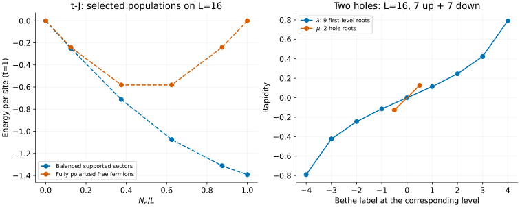

# Supersymmetric t–J: holes, spin and the Heisenberg limit

[All tutorials](index.md) · [Model guide](../tj.md) · [XXX tutorial](xxx.md)

The local t–J Hilbert space contains a hole, an up electron or a down electron:
**double occupancy is absent**. That makes the model natural for projected
fermionic MPS. This example benchmarks selected populations on a finite ring,
then checks the no-hole reduction and the meaning of the nested roots.

## 1. Match the Hamiltonian before comparing energies

The integrable point implemented here has t=1 and J=2:

```math
H=-\sum_{j,\sigma}\mathcal P
\left(c^\dagger_{j,\sigma}c_{j+1,\sigma}+\mathrm{h.c.}\right)\mathcal P
+2\sum_j\left(\mathbf S_j\cdot\mathbf S_{j+1}-\frac{n_jn_{j+1}}4\right).
```

The projection removes doubly occupied sites. There is no chemical potential
or magnetic field. The density interaction is included: removing it changes
the model, not merely the output notation. Fermions have periodic boundary
conditions, including the Fock-space sign of hopping across the boundary.
The tool requires at least three sites and does not accept arbitrary J/t.

```sh
build/bethe-tj-pbc 16 --particles 14 --sz 0 \
  --csv-table states=tj-state.csv --csv-table first_roots=tj-first.csv \
  --csv-table second_roots=tj-second.csv
```

This fixes seven electrons of each spin and two holes. Its energy is about
-20.98787126, or -1.311741954 per site. It is a minimum **within those fixed
populations**, not a minimization over particle number.

## 2. Compare selected fillings



The blue markers use N_e=0, 2, 6, 10, 14 and 16. The orange markers have the
same electron counts but all spins aligned. Dashed lines only connect the
chosen populations; they do not fill in uncalculated sectors or define a
thermodynamic equation of state.

For a **doped mixed-spin** calculation, the current branch requires both spin
populations odd. Thus the 3+3 sector at N_e=6 is supported, but 2+2 at N_e=4
is not. The missing balanced points at 4, 8 and 12 are an implementation
restriction, not forbidden physical states or discontinuities in the energy.

There are two exceptions:

- **No holes:** all physical spin populations are supported through the XXX solver.
- **Vacuum or full polarization:** exact periodic free-fermion occupations work
  at every particle count.

For polarized states, the exchange and density terms cancel and the energy is
$`E=-2\sum_{k\,\mathrm{occupied}}\cos k`$. Even electron counts select a
positive-current free shell when there is a choice. The polarized curve is a
different spin sector, not an excited dispersion at fixed balanced populations.
No spin or charge excitation lines are produced by this frontend yet.

## 3. Why are there nine roots for fourteen electrons?

The implementation uses the Sutherland grading of the nested Bethe ansatz,
as given by [Essler–Korepin](../../CITATIONS.md#essler-korepin-1992), Eq. (3.73).
After choosing the majority spin as reference, the root counts are

```math
M_1=N_h+N_{\mathrm{minority}},\qquad M_2=N_h.
```

For L=16, N_e=14, these are nine first-level lambda roots and two second-level
mu roots, exactly as in the right panel. Neither count equals the total number
of electrons. There is no mu–mu self-scattering; copying another model's
nested equations would give the wrong system.

With the Hamiltonian above, the energy is

```math
E=2N_h-\sum_{j=1}^{M_1}\frac1{\lambda_j^2+1/4}.
```

The reproduction script evaluates this from the exported rapidities and
checks both original rational equations. Lambda is the conventional rapidity,
not the XXX frontend's coordinate z=2 lambda. The paper also uses a shifted
supersymmetric Hamiltonian,

```math
H_{\mathrm{susy}}=H+2N_e-L.
```

When comparing across fillings, forgetting this shift changes the slope of
the energy curve. It cannot be repaired with one particle-independent offset.

## 4. Remove all holes: energy agrees with XXX, momentum needs care

At unit filling hopping is blocked and every bond has $`n_jn_{j+1}=1`$:

```math
H_{tJ}=2H_{\mathrm{XXX}}-\frac L2.
```

For the four-site singlet, $`E_{\mathrm{XXX}}=-2`$ and the t–J result is -6.
The six-site singlet gives $`E_{tJ}=-5-\sqrt{13}\simeq-8.60555128`$.
Both are saved as normalization checks. The second-level table has no rows
because there are no holes; first-level spin roots remain.

The **fermionic** translation operator differs from a spin permutation. Moving
an occupied site around a fully filled ring gives the sign $`(-1)^{L-1}`$.
Thus even L requires an additional $`\pi`$ relative to the XXX spin momentum.
The four-site t–J singlet reports P=$`\pi`$, not the spin chain's P=0. At L=6
the XXX singlet has spin momentum $`\pi`$, so the fermionic state reports zero
modulo $`2\pi`$. A correct energy is not sufficient to verify momentum conventions.

For an MPS benchmark, match the projected local basis, density interaction,
boundary parity convention, population and translation operator. This is a
finite-ring calculation; it does not remove finite-size or finite-bond-dimension
errors from an iMPS comparison. Spin reversal preserves energies but does not
justify changing a requested spin sector to evade the shell restriction.

## 5. Reproduce and validate

Balanced examples (all L=16):

| N_e | State | First roots | Second roots |
| ---: | --- | --- | --- |
| 2 | [CSV](data/tj-balanced-n2-states.csv) | [CSV](data/tj-balanced-n2-first_roots.csv) | [CSV](data/tj-balanced-n2-second_roots.csv) |
| 6 | [CSV](data/tj-balanced-n6-states.csv) | [CSV](data/tj-balanced-n6-first_roots.csv) | [CSV](data/tj-balanced-n6-second_roots.csv) |
| 10 | [CSV](data/tj-balanced-n10-states.csv) | [CSV](data/tj-balanced-n10-first_roots.csv) | [CSV](data/tj-balanced-n10-second_roots.csv) |
| 14 | [CSV](data/tj-balanced-n14-states.csv) | [CSV](data/tj-balanced-n14-first_roots.csv) | [CSV](data/tj-balanced-n14-second_roots.csv) |
| 16 | [CSV](data/tj-balanced-n16-states.csv) | [CSV](data/tj-balanced-n16-first_roots.csv) | [empty CSV](data/tj-balanced-n16-second_roots.csv) |

The vacuum uses a [state](data/tj-balanced-n0-states.csv) and
[empty free-mode table](data/tj-balanced-n0-free_modes.csv), not nested roots.

| Polarized N_e | State | Occupied integer modes |
| ---: | --- | --- |
| 0 | [CSV](data/tj-polarized-n0-states.csv) | [empty CSV](data/tj-polarized-n0-free_modes.csv) |
| 2 | [CSV](data/tj-polarized-n2-states.csv) | [CSV](data/tj-polarized-n2-free_modes.csv) |
| 6 | [CSV](data/tj-polarized-n6-states.csv) | [CSV](data/tj-polarized-n6-free_modes.csv) |
| 10 | [CSV](data/tj-polarized-n10-states.csv) | [CSV](data/tj-polarized-n10-free_modes.csv) |
| 14 | [CSV](data/tj-polarized-n14-states.csv) | [CSV](data/tj-polarized-n14-free_modes.csv) |
| 16 | [CSV](data/tj-polarized-n16-states.csv) | [CSV](data/tj-polarized-n16-free_modes.csv) |

Additional analytic and spin-reversal checks:

| Case | State | First roots | Second roots |
| --- | --- | --- | --- |
| Four-site no-hole singlet | [CSV](data/tj-four-noholes-states.csv) | [CSV](data/tj-four-noholes-first_roots.csv) | [empty CSV](data/tj-four-noholes-second_roots.csv) |
| Six-site no-hole singlet | [CSV](data/tj-six-noholes-states.csv) | [CSV](data/tj-six-noholes-first_roots.csv) | [empty CSV](data/tj-six-noholes-second_roots.csv) |
| L=5, 3 up + 1 down | [CSV](data/tj-imbalanced-states.csv) | [CSV](data/tj-imbalanced-first_roots.csv) | [CSV](data/tj-imbalanced-second_roots.csv) |
| L=5, 1 up + 3 down | [CSV](data/tj-reversed-states.csv) | [CSV](data/tj-reversed-first_roots.csv) | [CSV](data/tj-reversed-second_roots.csv) |

With the [plotting dependencies](requirements.txt), from the repository root:

```sh
python3 scripts/plot_fermion_tutorial.py --check
python3 scripts/plot_fermion_tutorial.py
# Optional: regenerate this and the Gaudin–Yang tutorial together.
python3 scripts/plot_fermion_tutorial.py --solver-dir build
python3 -m unittest discover -s scripts -p 'test_tutorial_fermion.py'
```

The [script](../../scripts/plot_fermion_tutorial.py) joins tables by provenance,
checks populations and branch-specific schemas, reconstructs energies, and
tests rational equations and no-hole fermionic momentum. The
[regressions](../../scripts/test_tutorial_fermion.py) additionally check the exact
L=5 imbalanced energy $`-3-\sqrt5`$, the two-electron energy -4, free limits,
spin reversal and corrupted exports. The broader C++ suite independently
compares supported small chains with projected-Fock-space diagonalization.
Numerical failures may retain an unconverged estimate: reject their status
rather than plotting it. fp64 is used here; native long-double and optional
MPLAPACK fp128 are available without changing the equations or supported sectors.
