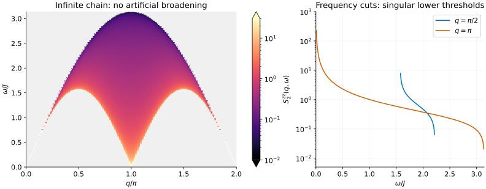

# The infinite-chain XXX two-spinon spectrum

The [finite-ring tutorial](xxx-structure-factor.md) turns individual transition
weights into a broadened spectrum. Here we can remove both the finite ring and
the plotting broadening: the infinite-chain two-spinon contribution is known
directly as a continuous function of momentum and frequency.

For an iMPS calculation, this is a useful reference for **where spectral weight
lives**, not just which energies are kinematically allowed.

## A continuum with intensity



The Hamiltonian is $`H=\sum_j\mathbf S_j\cdot\mathbf S_{j+1}`$, with lattice
spacing and $`J`$ set to one. The heat map shows $`S^{zz}_2(q,\omega)`$ on a
logarithmic color scale. It uses **no artificial broadening**. White guides mark
the lower and upper two-spinon boundaries. Color clipping is only for visibility;
the underlying values are unchanged.

Notice the bright lower edge and the fading upper edge. The density of available
states alone would diverge at the upper edge, but the transition matrix elements
vanish strongly enough that the physical two-spinon intensity goes to zero there.
The right panel shows two frequency cuts from the same data. At $`q=\pi`$, the
lower edge is at zero energy and the density diverges as that edge is approached.
An exactly singular sample is masked, not replaced by a finite value.

## Generate the data

After [building or installing](../building.md), run:

```sh
bethe-xxx-structure-factor-thermo --momentum-points 129 --points 401 \
  --threads 4 --csv spectrum.csv --csv-table continuum=edges.csv
```

From a build directory, prefix the executable with `./`. Momentum is in
radians per site; the figure divides it by $`\pi`$ only for presentation.
The grid spans $`[0,2\pi]`$ and $`[0,\pi]`$. Its repeated momentum endpoint
is a periodic plotting seam, not another physical momentum.

For a denser single cut or one point:

```sh
bethe-xxx-structure-factor-thermo --momentum 1.5 --points 2001 --csv cut.csv
bethe-xxx-structure-factor-thermo --momentum 1.5 --omega 1.8 --precision long-double
```

The second command gives approximately $`S^{zz}_2=0.87313045511634`$.
`--channel raising` doubles the density by SU(2) symmetry. `--exchange J`
rescales the frequency axis by $`J`$ and density by $`1/J`$.

## What to compare with an iMPS spectrum

- Match the Hamiltonian, spin normalization and Fourier convention first.
  This tool reports $`S`$, with the finite-system convention
  $`S=2\pi\sum_n w_n\delta(\omega-\Delta E_n)`$.
- This is **two-spinons only**. The full local-spin spectrum has additional
  four-, six-, and higher-spinon contributions, including weight above the
  two-spinon upper boundary. An iMPS result need not vanish there.
- Do not multiply these intensities to force the full sum rule. The exact
  two-spinon result accounts for about 72.89% of the full integrated weight
  and 71.30% of the first moment. The much larger finite-ring fractions in
  the earlier tutorial are not thermodynamic identities.
- For a time-evolution spectrum with a finite time window, apply the same
  resolution kernel to a properly integrated reference. Simply comparing peak
  heights to this unbroadened singular function is misleading.
- A singular point is not a quadrature weight. In particular, integrating the
  raw heat-map samples with a rectangular rule is not a reliable normalization
  check. At precisely $`q=\pi`$, even the zeroth frequency moment diverges;
  finite momentum resolution matters.

The [model guide](../xxx-structure-factor-thermo.md) explains the formula,
numerical error estimates, status fields and planned four-spinon extension.

## Reproduce the figure

The checked exports are
[spectral density](data/xxx-thermo-spectrum.csv) and
[continuum edges](data/xxx-thermo-continuum.csv).
From the source directory, with NumPy and Matplotlib installed:

```sh
python3 scripts/plot_xxx_thermodynamic_structure_factor_tutorial.py
```

To regenerate the data as well, put the built executable on `PATH` and run:

```sh
python3 scripts/plot_xxx_thermodynamic_structure_factor_tutorial.py \
  --solver bethe-xxx-structure-factor-thermo
```

The script checks numerical statuses, provenance, continuum support, grid
ordering and momentum-reflection symmetry before drawing the plot.
Literature is available with `--references` and in [CITATIONS.md](../../CITATIONS.md).
