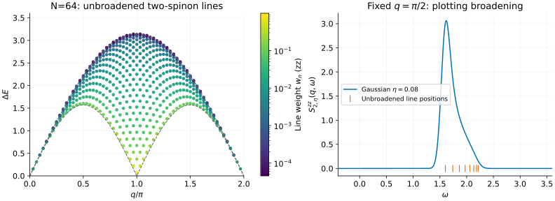
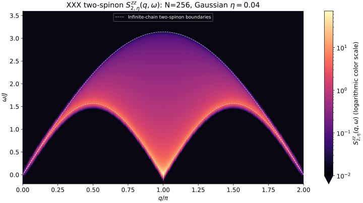

# XXX: from excitation energies to spectral weight

An energy level tells us where a response *could* appear. Its form factor
tells us how strongly the chosen operator excites it. This tutorial adds that
missing information to the [finite-ring XXX scans](xxx.md), using the
zero-field two-spinon triplet family.

## 1. Export a finite-ring spectrum

```sh
bethe-xxx-structure-factor 64 --csv xxx-spectrum.csv \
  --csv-table moments=xxx-moments.csv
```

The default channel is $`S^{zz}`$, with spin-1/2 operators,
$`H=\sum_j\mathbf S_j\cdot\mathbf S_{j+1}`$, periodic boundaries, and J=1.
All 528 states in the supported family are included. Each exported row is a
delta-function line:

```math
S^{zz}_2(q,\omega)=2\pi\sum_n w_n(q)\delta(\omega-\Delta E_n),
\qquad \Delta E_n=E_n-E_0.
```

`q` is the momentum transferred by the operator, **not** an absolute excited
state momentum. `weight` is w, without the factor $`2\pi`$. A line has no
height until we choose a broadening kernel or bin width.



The left panel shows the unbroadened lines with color encoding their weights.
The dashed curves are infinite-chain two-spinon boundaries,
$`\omega_L=(\pi/2)|\sin q|`$ and $`\omega_U=\pi|\sin(q/2)|`$, provided as
kinematic guides, not finite-N bounds. The right panel uses the exact finite
momentum q=π/2, so it does not mix neighboring momentum bins.

Downloads: [N=64 spectrum](data/xxx-dsf-n64-spectrum.csv) and
[moment sums](data/xxx-dsf-n64-moments.csv).

## 2. Broaden only when plotting

For the right-hand plot we use a normalized Gaussian of width η=0.08:

```math
G_\eta(x)=\frac{e^{-x^2/(2\eta^2)}}{\sqrt{2\pi}\eta},
\qquad
S^{zz}_{2,\eta}(q,\omega)=2\pi\sum_n w_n G_\eta(\omega-\Delta E_n).
```

Changing η changes the visual resolution, not the underlying line weights.
The plotting script includes negative frequencies in the displayed Gaussian
tails and enough range above the last line; broadening is not a physical
negative-frequency response. There is no broadening option in the solver.

For an MPS dynamical spectrum, match the Fourier normalization, Hamiltonian,
chain length and boundary condition before comparing areas or peak heights.
For iMPS, these finite-ring data are useful checks, but increasing N is a
separate convergence study. The continuum boundaries alone do not determine
intensities, and multiparticle states outside this family are still absent.
The separate [thermodynamic tutorial](xxx-structure-factor-thermo.md) now provides
the exact infinite-chain two-spinon density without artificial broadening.

## 3. The whole momentum–frequency plane

For a more resolved demonstration, increase the ring to **N=256** and include
all **8,256 two-spinon states**:

```sh
bethe-xxx-structure-factor 256 --csv xxx-n256-spectrum.csv \
  --csv-table moments=xxx-n256-moments.csv
```



[Open the full-resolution figure](figures/xxx-structure-factor-heatmap.svg) ·
[Download spectral lines](data/xxx-dsf-n256-spectrum.csv) ·
[Download moment sums](data/xxx-dsf-n256-moments.csv)

This is the **entire momentum range of the two-spinon contribution**, not the
complete many-spinon spectral function. It uses the same normalized Gaussian
as above, now with $`\eta=0.04J`$ (standard deviation; FWHM ≈0.094J). We sample
frequency every 0.002J and keep all 256 exact momenta, spaced by
$`\Delta q=2\pi/256`$. There is **no momentum broadening or interpolation**:
each narrow column shows one finite-ring momentum. The q=0 column is repeated
at 2π only to close the periodic plotting edge, not counted twice in any sum.

The logarithmic color scale reveals weak spectral weight inside the continuum
without losing the strong lower-edge response. Intensities below 0.01 use the
dark background; this is only a display threshold, not a cut on exported
weights. White dashed curves mark the infinite-chain two-spinon boundaries.
The blurred intensity outside them, including negative frequencies near q=π,
comes from Gaussian tails and finite-size effects—not additional states.

Compared with N=64, this gives four times the momentum resolution and halves
the broadening. Making η still smaller mainly exposes individual finite-ring
lines; a denser image grid alone cannot create better physical resolution.
For larger rings, `--threads N` parallelizes both root solving and form factors
using Uni20's scheduler. See [parallel calculations](../xxx-structure-factor.md#parallel-calculations)
for an N=512 command and the library interface. The published N=256 image
does not depend on the worker count.
The N=256 family captures **94.89% of the integrated weight** and **92.75% of
the first moment**. These are the actual finite-ring fractions, without
renormalization; they need not match the N=64 percentages below.

## 4. Read coverage, not just convergence

The full zz integrated sum rule is

```math
\frac1N\sum_q\int\frac{d\omega}{2\pi}S^{zz}(q,\omega)=\frac14.
```

The N=64 export gives about 97.71% of this full weight, and 96.22% of the
full first-frequency moment. The `moments` table shows where that first-moment
coverage varies with momentum. **Successful convergence means every state
in the requested family succeeded, not that the full DSF has been obtained.**
Missing weight must not be hidden by rescaling the curves. Thermodynamic
two-spinon percentages are not finite-N normalization conditions either.

Try an independent small example:

```sh
bethe-xxx-structure-factor 4 --channel raising --diagnostics
```

In this channel the weights at q=π/2, π, 3π/2 are 1/3, 4/3, 1/3. Dividing
by N gives 1/2, so this small ring exhausts the raising-channel sum rule.
The zz weights are exactly half as large. That complete small example should
not be generalized to arbitrary ring lengths.

## 5. Reproduce or inspect the calculation

From the source checkout with the [plotting environment](contributing.md#plotting-environment):

```sh
python3 scripts/plot_xxx_structure_factor_tutorial.py
python3 scripts/plot_xxx_structure_factor_tutorial.py --solver bethe-xxx-structure-factor
# Regenerate only the larger-ring heat map:
python3 scripts/plot_xxx_structure_factor_tutorial.py --heatmap-only --solver bethe-xxx-structure-factor
```

The first command reads the checked-in exports; the second replaces them
with fresh N=64 and N=256 runs and reproduces both figures. The reference
N=256 run took about three minutes on the development desktop; plotting saved data requires
no Bethe solves. The parser checks channel,
normalization, complete candidate counts, momentum selection, positive weights,
sum-rule coverage and agreement between line sums and moment tables.

For selected-precision root/form-factor diagnostics and a derivation of the
normalization, see the [structure-factor guide](../xxx-structure-factor.md).
`--references` lists the determinant and sum-rule literature. The calculation
uses the normalized form factors of
[Caux, Hagemans and Maillet](https://arxiv.org/abs/cond-mat/0506698);
it does not use continuum weights as substitutes for finite-state matrix elements.
