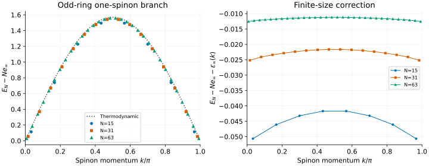
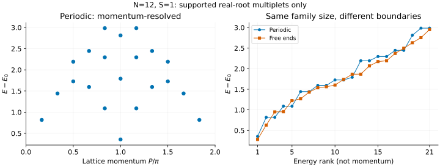

# XXX: finite spinons and the meaning of an excitation scan

An infinite-chain dispersion is a useful target, but a finite MPS calculation
has a particular length, boundary condition and energy reference. This
tutorial connects those choices to concrete Bethe results for the spin-1/2
Heisenberg chain. First we approach the single-spinon curve using odd rings;
then we compare a restricted triplet family with periodic and free ends.
The [spectral-weight tutorial](xxx-structure-factor.md) continues from these
energies to operator intensities and dynamical sum rules.

## 1. Start with the same Hamiltonian

We use spin operators, not Pauli matrices, with lattice spacing one and
antiferromagnetic exchange $`J=1`$:

```math
H_{\mathrm{PBC}}=\sum_{j=0}^{N-1}\mathbf S_j\cdot\mathbf S_{(j+1)\bmod N},
\qquad
H_{\mathrm{OBC}}=\sum_{j=0}^{N-2}\mathbf S_j\cdot\mathbf S_{j+1}.
```

There are no boundary fields. A factor of four separates this normalization
from the same expression written with Pauli matrices. As a small-system check:

```sh
bethe-xxx-pbc 4
bethe-xxx-obc 4
```

The ground energies are $`-2`$ and $`-3/4-\sqrt{3}/2`$, respectively. Removing
a bond changes the ground state too: the open-chain energy is not obtained
by subtracting a fixed bond energy from the periodic result.

## 2. Extract a single spinon from an odd ring

An odd ring can carry a spin-1/2 excitation. The supported one-spinon family
has $`M=(N-1)/2`$ real roots filling all but one of $`M+1`$ allowed Bethe slots.
The missing slot, or hole, labels the branch.

```sh
bethe-xxx-pbc 31 --spinons
bethe-xxx-pbc 31 --spinons --precision fp64 \
  --csv-table states=xxx-states.csv --csv-table spinons=xxx-spinons.csv
```

The two exported tables join through `state_id`. `states` contains the total
energy and lattice momentum; `spinons` contains the hole coordinate and the
energy suited to a thermodynamic comparison:

```math
e_\infty=\frac14-\log2,\qquad
k=\frac\pi2-\frac{2\pi I_h}{N},\qquad
\epsilon_N(k)=E_N-Ne_\infty.
```



The plotted points come from N=15, 31 and 63 exports. The dotted reference
uses the frontend's thermodynamic column,
$`\epsilon_\infty(k)=(\pi/2)\sin k`$. The right panel magnifies the difference:
the finite-size correction decreases along this size sequence but is not a
solver error. Increasing arithmetic precision will not remove it.

Download the paired tables:

| Ring | Total states and diagnostics | Spinon coordinates |
| --- | --- | --- |
| N=15 | [states](data/xxx-n15-states.csv) | [spinons](data/xxx-n15-spinons.csv) |
| N=31 | [states](data/xxx-n31-states.csv) | [spinons](data/xxx-n31-spinons.csv) |
| N=63 | [states](data/xxx-n63-states.csv) | [spinons](data/xxx-n63-spinons.csv) |

### Two easy ways to compare the wrong curves

**Subtracting the finite odd-ring ground energy.** That ground state already
contains a spinon. Subtracting it forces the lowest finite branch energy to
zero and changes the comparison. Here we subtract the extensive bulk energy
$`Ne_\infty`$ instead; the finite-ring endpoints need not be zero.

**Treating spinon momentum as lattice momentum.** They are related by

```math
P=\pi M+\frac\pi2-k\pmod{2\pi}.
```

The allowed $`k`$ values start at $`\pi/(2N)`$, end at
$`\pi-\pi/(2N)`$, and have spacing $`2\pi/N`$. When comparing an iMPS domain-wall
excitation, align its momentum origin and unit-cell convention; do not simply
replace `k` by the lattice `p` column. See the
[XXZ tutorial](xxz-spinons.md) for unit-cell folding and continuum thresholds.

## 3. Compare triplets with periodic and free ends

On an even chain, select the real-root highest-weight family at total spin
$`S=1`$:

```sh
bethe-xxx-pbc 12 --excitations all --spin 1 --format csv > xxx-pbc.csv
bethe-xxx-obc 12 --excitations all --spin 1 --format csv > xxx-obc.csv
```



Downloads: [periodic scan](data/xxx-n12-pbc.csv), [free-end scan](data/xxx-n12-obc.csv).
Unlike the odd-ring spinon plot, these `gap` columns subtract the **global
ground energy of the same finite chain and boundary condition**.

The left panel plots lattice momentum for the periodic chain. Free ends have
no conserved translation momentum, so the right panel compares **energy
rank**, not momentum. Equal ranks do not identify the same physical state
under the change of boundary conditions. Lines there only guide the eye.

## 4. “All” still names a restricted family

Both scans return 21 converged multiplets, not the full triplet spectrum.
The implemented real-root window has

```math
M=N/2-S,\qquad \text{candidates}=\binom{N-M}{M}.
```

At $`N=12,S=1`$, this is $`\binom{7}{5}=21`$. By contrast, counting spin words
gives $`\binom{12}{5}-\binom{12}{4}=297`$ triplet multiplets in the full
Hilbert space. Each multiplet has three spin projections; the scan represents
it once at $`S^z=S`$.

For the periodic chain this window is the conventional two-spinon triplet
family. Other triplets and excited singlets require states outside it, such
as complex-root families. In particular, changing `--spin` to zero does not
request all singlet excitations: the current even-chain real-root window then
contains only the ground-state configuration.

Check `Candidates`, `Converged candidates`, `Ground status` and the overall
`Outcome`. A failed candidate makes the scan incomplete even if every row
that survived is individually converged. A failed ground reference means the
gaps are unavailable. Asking for `--excitations 5` still solves the whole
chosen family before selecting its lowest five results.

This differs from [Haldane–Shastry](haldane-shastry.md), where `--levels all`
can describe a complete finite spectrum through exact motif multiplicities.

## 5. Reproduce and validate

After preparing the optional [plotting environment](xxz-spinons.md#5-reproduce-the-figures):

```sh
python3 scripts/plot_xxx_tutorial.py
# Regenerate all exports from a directory containing both XXX executables:
python3 scripts/plot_xxx_tutorial.py --build-dir /path/to/bethe/bin
python3 scripts/plot_xxx_tutorial.py --check
python3 -m unittest discover -s scripts -p 'test_tutorial_xxx.py'
```

The tests check the table joins, momentum convention, bulk subtraction,
finite-size trend and scan completeness within the stated family. Additional
N=4 exports ([periodic](data/xxx-n4-pbc.csv), [free ends](data/xxx-n4-obc.csv))
check exact ground energies and the one-magnon spectrum. fp64 is sufficient
here; long-double and fp128 can test arithmetic accuracy separately from
finite-size effects.

## Further reading

[Karbach–Hu–Müller](../../CITATIONS.md#karbach-1998) is a pedagogical introduction
to finite and infinite-chain Bethe calculations. The odd-chain hole convention
is documented with [Groha–Essler](../../CITATIONS.md#groha-2017); this tutorial
uses only the unperturbed integrable chain, not its decay-rate calculation.
For the thermodynamic branch, see
[Caux's XXX spinon notes](../../CITATIONS.md#caux-xxx-spinons).
Implementation details are in [XXX states](../xxx.md),
[open chains](../open-chains.md) and [excitation scans](../excitations.md).
