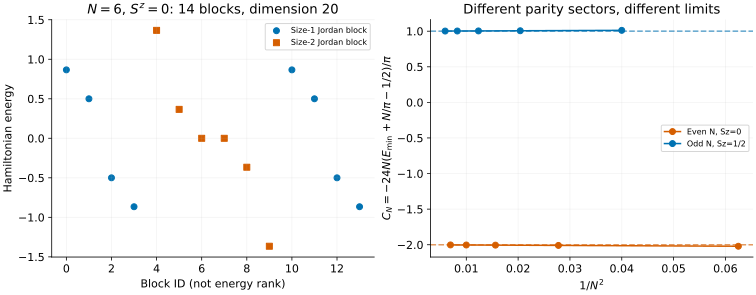

# Non-Hermitian XXZ: energies are not enough

[All tutorials](index.md) · [Model guide](../xxz-nonhermitian.md) · [Potts tutorial](potts.md)

A real list of energies does not make a Hamiltonian Hermitian. This example
first solves a restricted real-root family with imaginary boundary fields,
then visits an exactly enumerated endpoint where some equal eigenvalues
belong to **Jordan blocks**, not independent eigenvectors.

## 1. Keep the imaginary end fields

With spin-half operators and J=1, the open-chain Hamiltonian is

```math
H=\sum_{j=1}^{N-1}\left(S_j^xS_{j+1}^x+S_j^yS_{j+1}^y+
\Delta S_j^zS_{j+1}^z\right)
+\frac{i\sqrt{1-\Delta^2}}2(S_1^z-S_N^z).
```

This is **not** the Hermitian free-end XXZ chain. Omitting the imaginary
fields changes the problem. There is no translation momentum on this open
chain. The source normalization is one quarter of the Pauli Hamiltonian in
[Gainutdinov et al.](../../CITATIONS.md#gainutdinov-hao-nepomechie-sommese-2015),
with the boundary sign reversed; spatial reflection reverses that sign
without changing the energies.

For a small regular-root scan, choose N=8, Δ=0.6 and four through-lines:

```sh
bethe-xxz-qg-obc 8 --delta 0.6 --through-lines 4 --excitations all \
  --csv-table levels=qg-levels.csv --csv-table reference=qg-sea.csv \
  --csv-table roots=qg-roots.csv
```

Here $`\ell=N-2M=4`$ means M=2 Bethe roots and the representative has
$`S^z=\ell/2=2`$. Through-lines label the Temperley–Lieb sector, not ordinary
SU(2) spin or a promised root-of-unity degeneracy. The allowed finite-real
window has five slots, so this scan returns $`\binom52=10`$ levels.
The full fixed-$`S^z`$ spin space has dimension $`\binom82=28`$.

The sea energy is approximately -1.74502170 and the first returned gap is
0.35518911. `gap_from_sea` subtracts the selected consecutive-label sea,
not an independently established global ground state. `all` exhausts this
regular window only; it does not supply missing complex roots or descendants.
The [model guide](../xxz-nonhermitian.md#regular-state-excitation-scans) explains
failed-candidate accounting and the bounded scan.

## 2. At Δ=0, switch from Bethe roots to Jordan blocks

The endpoint has a separate exact construction:

```sh
bethe-xxz-qg-obc 6 --delta 0 --sz 0 --csv-table blocks=qg-blocks.csv
```

It lists the **complete fixed-magnetization Hamiltonian spectrum and block
sizes**. The regular `--through-lines`, `--excitations` and `--roots` options
do not apply here. `--sz` keeps its sign; it is not folded to an absolute value.



The left panel has 14 rows but a sector dimension of 20: eight size-one blocks
and six size-two blocks. Each square denotes **one** eigenvector plus one
generalized eigenvector, not two ordinary eigenvectors. Coincident energies
in different rows must not be merged. Block ID is an enumeration label, not
an energy rank or a momentum.

The simplest example is N=2, $`S^z=0`$. In the ordered basis
$`|\downarrow\uparrow\rangle,|\uparrow\downarrow\rangle`$,

```math
H=\frac12\begin{pmatrix}-i&1\\{}1&i\end{pmatrix},\qquad
H\ne0,\qquad H^2=0.
```

There are two algebraic zero eigenvalues, but only one eigenvector. If
$`Hw=0`$ and $`Hv=w`$, then $`e^{-itH}v=v-itw`$: the generalized vector
produces a polynomial time factor invisible in an energy list. This is not
unitary dynamics. The frontend gives block sizes, **not** the spin-basis
vectors w and v.

For numerical comparisons use a general complex eigensolver, never a
self-adjoint solver. Near a defective eigenvalue, tiny numerical perturbations
can split the reported eigenvalues. The optional check below compares
nullities of $`H-E`$, $`(H-E)^2`$ and $`(H-E)^3`$, rather than trying to infer
Jordan structure from tiny eigenvalue separations.

## 3. Count the sector before interpreting its spectrum

The endpoint maps to fermions with one-particle energies
$`\cos(\pi k/N)`$, k=1,…,N-1, and an additional zero mode. For even N,
k=N/2 collides with that extra zero and forms a size-two block.

For each subset of nonzero modes, let z denote zero-space occupation:

| Chain | Allowed z | Block size |
| --- | --- | --- |
| Odd N | 0 or 1 | 1 |
| Even N | 0 or 2 | 1 |
| Even N | 1 | 2 |

The number of down spins is the number of occupied nonzero modes plus z.
The block energy is the sum of their cosines. Summing **block sizes**, rather
than counting rows or distinct energies, must give $`\binom NM`$.
The odd/even diagonalizability distinction agrees with
[Gainutdinov et al., Appendix D](https://arxiv.org/html/1505.02104).

For N=7, $`S^z=1/2`$, all 35 blocks have size one. At N=6, $`S^z=\pm1`$,
the two signed sectors have equal spectra; the fully polarized sectors each
contain a single zero-energy block. These cases are included in the downloads.
Endpoint enumeration is bounded by `--max-blocks` and `--max-mode-entries`;
budget refusal is an error, not a partially complete spectrum.

## 4. A negative Casimir coefficient needs a sector label

The right panel uses the minimum energy from each exported sector, with even
N at $`S^z=0`$ and odd N at $`S^z=1/2`$. They obey the finite sums

```math
\begin{aligned}
E_{\min}^{\mathrm{even}}&=\frac{1-\cot(\pi/(2N))}{2}
=-\frac N\pi+\frac12+\frac{\pi}{12N}+O(N^{-3}),\\{}
E_{\min}^{\mathrm{odd}}&=\frac{1-\csc(\pi/(2N))}{2}
=-\frac N\pi+\frac12-\frac{\pi}{24N}+O(N^{-3}).
\end{aligned}
```

Subtracting the bulk and boundary terms defines

```math
C_N=-\frac{24N}{\pi}\left(E_{\min}+\frac N\pi-\frac12\right).
```

The even sequence approaches **-2**, the odd sequence **+1**. At N=12 and
13 the values are -2.00228837 and 1.00170596. Both come from the same boundary
Hamiltonian; combining parities into one fit would be misleading.

In a boundary-CFT interpretation with velocity one, this coefficient measures
$`c_{\mathrm{eff}}=c-24h_{\min}`$, not c without identifying the boundary
sector and its lowest conformal weight. The open-chain factor 24 also differs
from the periodic factor 6 in the [Potts example](potts.md). This plot is a
checked finite-size diagnostic, not a determination of all conformal towers
or a replacement for root-of-unity representation theory.

For non-Hermitian MPS work, energies and right-state residuals are only part
of validation. Left/right eigenvectors, their normalization and generalized
eigenvectors can matter for observables; this energy frontend does not supply
them. A small residual alone cannot certify a well-conditioned eigenbasis.

## 5. Reproduce and validate

Regular scans at N=8, Δ=0.6:

| Through-lines | Ranked levels | Sea reference | Joined roots |
| ---: | --- | --- | --- |
| 4 (two roots) | [CSV](data/qg-scan-levels.csv) | [CSV](data/qg-scan-reference.csv) | [CSV](data/qg-scan-roots.csv) |
| 6 (one root) | [CSV](data/qg-one-levels.csv) | [CSV](data/qg-one-reference.csv) | [CSV](data/qg-one-roots.csv) |

Complete endpoint sectors:

| Sequence | `blocks` exports |
| --- | --- |
| Even N, Sz=0 | [2](data/qg-free-n2-blocks.csv), [4](data/qg-free-n4-blocks.csv), [6](data/qg-free-n6-blocks.csv), [8](data/qg-free-n8-blocks.csv), [10](data/qg-free-n10-blocks.csv), [12](data/qg-free-n12-blocks.csv) |
| Odd N, Sz=1/2 | [5](data/qg-free-n5-blocks.csv), [7](data/qg-free-n7-blocks.csv), [9](data/qg-free-n9-blocks.csv), [11](data/qg-free-n11-blocks.csv), [13](data/qg-free-n13-blocks.csv) |
| N=6 signed sectors | [Sz=+1](data/qg-free-plus-blocks.csv), [Sz=-1](data/qg-free-minus-blocks.csv), [Sz=+3](data/qg-free-up-blocks.csv), [Sz=-3](data/qg-free-down-blocks.csv) |

With the [plotting dependencies](requirements.txt), from the source checkout:

```sh
python3 scripts/plot_potts_qg_tutorial.py --check
python3 scripts/plot_potts_qg_tutorial.py
# Optional: regenerate both this and the Potts tutorial.
python3 scripts/plot_potts_qg_tutorial.py --solver-dir /path/to/bethe/bin
# Optional independent matrix checks; requires NumPy.
python3 scripts/plot_potts_qg_tutorial.py --check --oracle
python3 -m unittest discover -s scripts -p 'test_tutorial_potts_qg.py'
```

The [script](../../scripts/plot_potts_qg_tutorial.py) validates regular roots
in both logarithmic and complex equations, joins them to ranked states and
checks every endpoint mode subset and sector dimension. The optional oracle
checks spin matrices through N=7, including Jordan nullities, and both regular
N=8 scans. [Regression tests](../../scripts/test_tutorial_potts_qg.py) also
reject missing blocks, incorrect sizes, wrong joins and failed metadata.
These fp64 examples can be repeated in native long-double or optional fp128;
extra precision does not turn a defective Hamiltonian into a diagonalizable one.
