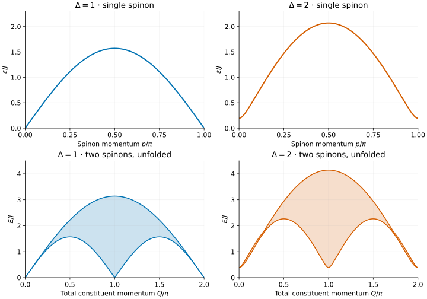
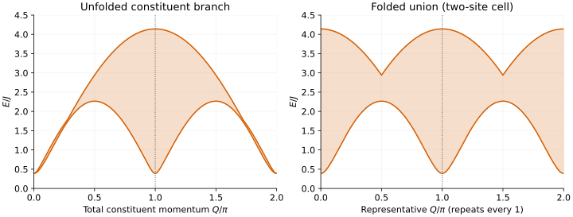

# XXZ spinons and two-spinon continua

This tutorial produces reference curves for an infinite spin-1/2 XXZ chain,
then shows how to compare them with an MPS excitation calculation. We compare
the gapless Heisenberg point with a gapped antiferromagnet. No finite-size
extrapolation is required.

You can read the plots immediately. To reproduce the data, [build Bethe](../building.md)
with `bethe-xxz-dispersion`; the default fp64 build suffices here. Python and
Matplotlib are optional, used only to redraw the figures.

## 1. Fix the normalization

We use zero magnetic field, zero temperature, and exchange $`J=1`$:

```math
H=J\sum_j\left(S_j^xS_{j+1}^x+S_j^yS_{j+1}^y+
\Delta S_j^zS_{j+1}^z\right),\qquad S^\alpha=\sigma^\alpha/2.
```

The plotted energies are **excitation energies above the thermodynamic ground
state**, in units of J. They are not the ground-state energy per site reported
in the command's overview. If your Hamiltonian uses Pauli matrices instead of
spin operators, account for the factor of four before comparing energies.

The lattice spacing is one. The elementary spinon momentum is p; the two-spinon
total constituent momentum is Q. Both are measured in radians per site, but
their exported ranges differ.

## 2. Export the curves

Run from the repository root, replacing `build/` with your build directory:

```sh
build/bethe-xxz-dispersion --delta 1 --points 401 --csv xxz-delta1.csv
build/bethe-xxz-dispersion --delta 2 --points 401 --csv xxz-delta2.csv
```

The default `--branch all` exports both families in the `dispersion` table.
Each file contains 401 spinon rows and 401 two-spinon rows. Lines starting
with `#` record the Hamiltonian, conventions, precision, source revisions,
command, convergence and timing. Keep them with the data.

| `branch` | Horizontal coordinate | Populated energy columns |
| --- | --- | --- |
| `spinon` | `p_over_pi`, from 0 to 1 | `energy` |
| `two-spinon` | `p_over_pi`, now Q/π, from 0 to 2 | `lower`, `upper` |

Empty energy cells in the other columns are intentional. Do not treat them
as zeros. Check the process exit status, final success metadata and each row's
`status` before plotting. For larger workflows, `--csv-table dispersion=FILE`
selects this same table explicitly; see [export options](../output.md).

## 3. Read the spectrum



[Open the full-size figure](figures/xxz-spinons.svg).

At $`\Delta=1`$, the elementary line is

```math
\epsilon(p)=\frac{\pi J}{2}\sin p,\qquad 0\le p\le\pi.
```

It is gapless at both endpoints and reaches $`\pi J/2`$ in the middle. This is
a useful first normalization check on both the exported data and an MPS result.

At $`\Delta=2`$, the single-spinon gap is approximately **0.194901 J** and
the maximum energy is **2.070496 J**. The minimum two-spinon energy is twice
the single-spinon gap, approximately **0.389802 J**. All curves in the figure
come from the exported data, not a separate Python implementation of the formulas.

The shaded regions contain the energies obtained by adding two spinon energies
at fixed total constituent momentum:

```math
E=\epsilon(p_1)+\epsilon(p_2),\qquad
Q=p_1+p_2\pmod{2\pi},\qquad 0\le p_1,p_2\le\pi.
```

**Shading means kinematic support, not spectral intensity.** It does not show
matrix elements, selection rules, or higher-particle continua. In particular,
the unfolded constituent branch shown here should not be identified without
qualification with the support of a particular dynamical structure factor.

## 4. Match a two-site MPS unit cell

For $`\Delta\gt1`$, the two Néel vacua are related by translation by one site.
A single spinon connects different vacua on its left and right. It belongs in
a **domain-wall (topological) excitation ansatz** and carries
$`S^z=\pm1/2`$. A local excitation above one fixed vacuum has the same vacuum
at both ends; the two-spinon sector, with $`S^z=-1,0,+1`$, is a natural reference.
These are spin-projection labels, not generic SU(2) total-spin labels.

Translation by a two-site unit cell measures only

```math
q_{\mathrm{cell}}=2p\pmod{2\pi}
```

(replace p with Q for a pair). Thus momenta separated by π are identified.
The spinon interval already spans one cell Brillouin zone. For the pair,
ask for the union with the π-shifted translation branch:

```sh
build/bethe-xxz-dispersion --delta 2 --points 401 --folded --csv xxz-delta2-folded.csv
```



[Open the full-size folding comparison](figures/xxz-folding.svg).

The right panel still uses the exported representative Q/π on [0,2], so it
shows **two copies** of the reduced zone. For an MPS plot against
$`q_{\mathrm{cell}}/\pi`$, take just $`0\le Q/\pi\lt1`$ and multiply that
horizontal coordinate by two. Do not sort all exported rows by
`cell_momentum` and connect them: the repeated representatives can produce
misleading lines.

Folding the energy envelope does **not** make an observable's spectral weight
π-periodic. One-site translation sectors may carry different or vanishing
matrix elements. In the gapless chain, the same operation is ordinary zone
folding, not evidence for two symmetry-broken vacua.

Before comparing an MPS result, check:

- Spin versus Pauli normalization and the exchange J.
- Excitation energy versus bulk energy density.
- Momentum in radians/site versus translation phase per unit cell.
- Domain-wall versus same-vacuum excitation sector.
- Continuum edges versus isolated modes or spectral weight.

## 5. Reproduce the figures

The checked-in inputs are [Δ=1](data/xxz-delta1.csv),
[Δ=2](data/xxz-delta2.csv), and [Δ=2 folded](data/xxz-delta2-folded.csv).
The [plotting script](../../scripts/plot_xxz_tutorial.py) validates their schema,
momentum grids and convergence before drawing either figure.

```sh
python3 -m venv build_codex/tutorial-venv
build_codex/tutorial-venv/bin/pip install -r docs/tutorials/requirements.txt
# Redraw using the committed CSVs; no C++ build is needed:
build_codex/tutorial-venv/bin/python scripts/plot_xxz_tutorial.py
# Or replace those CSVs with fresh solver output, then redraw:
build_codex/tutorial-venv/bin/python scripts/plot_xxz_tutorial.py --solver build/bethe-xxz-dispersion
```

Regeneration intentionally updates the provenance and timing comments. The
script converts numbers to Python float only for plotting; the solvers and
their original exports retain the requested arithmetic precision. fp64 is
adequate at Δ=1 and 2. Much closer to the massive-side transition, the gap
becomes exponentially small: consider `--precision long-double` or an
fp128-enabled build, and inspect the reported numerical status.

## Further reading

The [XXZ dispersion guide](../xxz-dispersion.md) gives the formulas, numerical
limits and precise translation-sector conventions. The relevant references
include [Caux–Mossel–Pérez Castillo](../../CITATIONS.md#caux-mossel-perez-castillo-2008)
and [Zauner-Stauber et al.](../../CITATIONS.md#zauner-stauber-2018);
`bethe-xxz-dispersion --references` prints the tool's bibliography.
[The integrability.org notes](https://integrability.org/) provide broader
Bethe-ansatz background.

Next: use the same export-and-plot workflow for
[Hubbard spinons and holons](hubbard-half-filled.md), where particle number
and the interaction-energy convention also matter.
