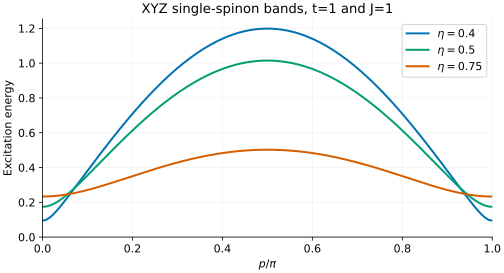
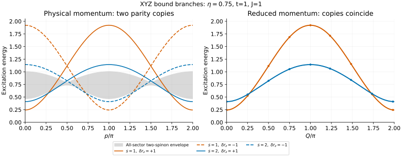

# XYZ: gapped spinons and bound branches

The XYZ chain is a useful next step beyond XXZ for an excitation ansatz: it
has domain walls, bound excitations and discrete symmetry labels, but no
conserved total $`S^z`$. This tutorial shows how to specify the couplings and
compare its thermodynamic lines without confusing a momentum copy with a new
particle or a continuum envelope with an operator-resolved spectrum.

## 1. Turn the input parameters into physical couplings

The frontend uses two elliptic parameters, `--eta` and `--t`, and an overall
energy scale `--exchange J`:

```math
H=J\sum_j\left(J_x S_j^xS_{j+1}^x+J_y S_j^yS_{j+1}^y+J_z S_j^zS_{j+1}^z\right).
```

These are spin-1/2 operators, $`S=\sigma/2`$, at zero field and temperature.
The dimensionless couplings $`J_x,J_y,J_z`$ are theta-function ratios, defined
in the [reference guide](../xyz-dispersion.md#hamiltonian-and-scope). `t` is a
theta parameter, **not time, temperature or hopping**. `eta` is not an XXZ
anisotropy that can be substituted directly for $`\Delta`$.

Start with:

```sh
build_codex/bethe-xyz-dispersion --eta 0.75 --t 1 --points 129
build_codex/bethe-xyz-dispersion --eta 0.75 --t 1 --points 129 \
  --precision fp64 --format csv > xyz.csv
```

The exported metadata gives the actual couplings. For the examples here,
$`t=J=1`$:

| eta | Jx | Jy | Jz | Download |
| --- | --- | --- | --- | --- |
| 0.4 | 1.171134 | 0.856085 | 0.306933 | [CSV](data/xyz-eta04.csv) |
| 0.5 | 1.189207 | 0.840896 | 0 | [CSV](data/xyz-xy.csv) |
| 0.75 | 1.094588 | 0.920435 | −0.704471 | [CSV](data/xyz-eta075.csv) |

Use the full-precision metadata for numerical comparisons; the table is
rounded for readability. Varying eta changes several couplings together.
This frontend covers the region $`J_x\gt J_y\gt|J_z|`$, not arbitrary exchange
triples or a general coupling-inversion problem.

## 2. A single spinon is a domain wall



The ordered chain has two x-Néel vacua. A single spinon connects different
vacua at its two ends; its energy is appropriate for a domain-wall excitation
ansatz. It is not the lowest local excitation within one fixed vacuum.

The curve has the form

```math
\epsilon(p)=\sqrt{m^2\cos^2p+I^2\sin^2p},\qquad 0\le p\le\pi,
```

where the metadata supplies the single-spinon gap $`m`$ and band maximum $`I`$.
The plot reads the frontend's energies rather than reconstructing them from
this formula. Our tests use the formula as a separate consistency check.

The middle example, eta=0.5, is an anisotropic XY chain with $`J_z=0`$. It is
still gapped because $`J_x\ne J_y`$. The independent XY relations
$`m=J(J_x-J_y)/2`$ and $`I=J(J_x+J_y)/2`$ provide a useful normalization test.

Changing only `--exchange` multiplies all energies by the same factor and
leaves momenta and dimensionless couplings unchanged. The saved
[J=2 export](data/xyz-exchange2.csv) checks this against the eta=0.75 example.

## 3. Select a bound branch—and check that it exists

A positive integer index $`s`$ is present only when

```math
s(1-\eta)\lt\eta.
```

At eta=0.75, the allowed indices are 1 and 2. Index 3 sits exactly at a merger
and is excluded. At eta=0.5, even index 1 is at its merger: there is no isolated
bound branch. `--branch all` omits nonexistent branches; a bound-only request
in a region without one is an input error.

```sh
build_codex/bethe-xyz-dispersion --eta 0.75 --t 1 --branch bound --bound-state 1
```



Each bound index appears in two relative z-parity channels. Their physical
momenta differ by pi, but their **reduced-momentum dispersions coincide**:

```math
\delta r_x=(-1)^s,\qquad \delta r_z=\pm1,\qquad
Q=p-\pi\frac{1-\delta r_z}{2}\pmod{2\pi}.
```

The left panel uses `p`, with solid and dashed curves for the two z-parity
copies. The right uses `reduced_q`; the dashed curves with markers lie on
their solid partners. These are parity ratios relative to a chosen vacuum,
not absolute parity labels of a finite ring. Do not assign $`S^z`$ labels to
generic XYZ branches.

For a two-site MPS cell the translation phase is
$`k_{\mathrm{cell}}=2p\pmod{2\pi}`$. It agrees for corresponding points in the
two copies. It is **not** the same coordinate as $`Q`$, and folding momentum
does not erase their discrete symmetry labels.

## 4. Interpret the continuum shading carefully

The grey region is the exported all-sector two-spinon envelope, including
pi-shifted translation copies. It is not resolved by parity and does not
supply spectral weights. An excitation in a particular operator channel
need not see every scattering state inside it.

At eta=0.75 and $`Q=0`$, the first two bound gaps are approximately 0.243787
and 0.409824, below $`2m\simeq0.466366`$. The single-spinon gap is smaller,
$`m\simeq0.233183`$, but belongs to a different asymptotic-vacuum sector.
These are three different quantities—not alternative estimates of one gap.

Elsewhere a bound curve can lie inside or above the all-sector envelope.
“Bound” does not mean below that envelope at every physical momentum. Neither
overlap nor its absence in this plot determines a decay rate or an operator's
spectral intensity.

Also, these are **thermodynamic** formulas. Finite-ring parity partners can
split, and the nearly degenerate ground-state combinations have a finite-size
splitting of their own. Neither effect is included in this plot. See the
[reference guide's finite-size checks](../xyz-dispersion.md#library-and-validation)
before comparing with a short periodic MPS.

## 5. Reproduce and check

With the optional [plotting environment](xxz-spinons.md#5-reproduce-the-figures):

```sh
build_codex/docs-venv/bin/python scripts/plot_xyz_tutorial.py
# Regenerate the four frontend exports too:
build_codex/docs-venv/bin/python scripts/plot_xyz_tutorial.py \
  --solver build_codex/bethe-xyz-dispersion
python3 scripts/plot_xyz_tutorial.py --check
python3 -m unittest discover -s scripts -p 'test_tutorial_xyz.py'
```

The checks cover every branch grid, nullable columns, status, momentum shift,
parity, strict merger condition, XY limit and exchange scaling. Failed rows
must stay missing, not become zero-energy lines. Native long-double and fp128
are available where supported; exceptionally small gaps can require more
range or precision than the fp64 examples used here.

## Further reading

The spinon and bound branches follow
[Johnson–Krinsky–McCoy, Sec. VII](../../CITATIONS.md#johnson-krinsky-mccoy-1973).
Their Hamiltonian and axis conventions differ from ours; the
[convention audit](../xyz-dispersion.md#convention-audit-and-elementary-band)
records the conversion. For the simpler XXZ setting, return to the
[spinon and continuum tutorial](xxz-spinons.md).
